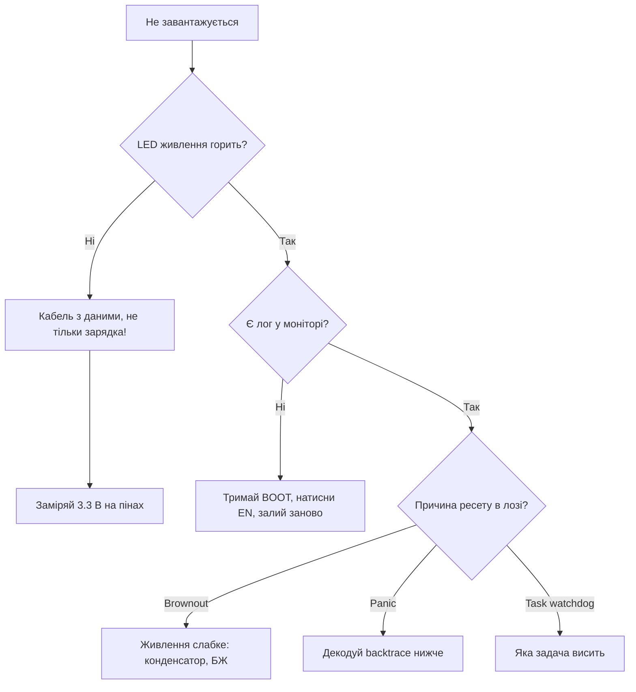
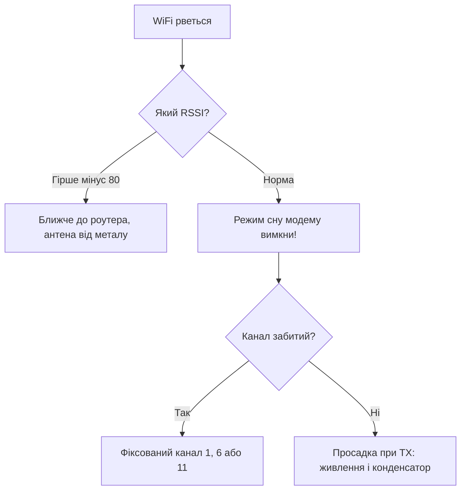

# Troubleshooting FAQ - 69 проблем таблицею

![[assets/img/placeholder.png]]

Як користуватись: знайди симптом у таблиці, перевір причину, застосуй рішення. База: живлення [[02-Zhivlennya/01-Lancjugi-zhivlennya]], GPIO [[03-GPIO/01-GPIO-oglyad]], I2C [[04-Shini/03-I2C|I2C]], SPI [[04-Shini/02-SPI|SPI]], UART [[04-Shini/01-UART|UART]], WiFi [[05-Radio/01-WiFi-STA-AP]], MQTT [[15-Protokoli/01-MQTT|MQTT]], сон [[07-Timeri-Son/03-Sleep-ULP]], OTA [[08-Pamyat/03-OTA|OTA]], старт [[Home]].

## Живлення та brownout (1-8)

| № | Симптом | Причина | Рішення | Див. |
| --- | --- | --- | --- | --- |
| 1 | Brownout detector was triggered, reboot | просадка 3.3V при WiFi TX (500 мА пік), тонкі USB-дроти | короткий товстий USB, конд. 470-1000 мкФ на 5V+100 нФ на 3.3V, окремий блок 5V 2A | [[02-Zhivlennya/01-Lancjugi-zhivlennya]] [[02-Zhivlennya/02-LDO-DC-DC]] |
| 2 | Boot loop: rst:0x8 TG1WDT_SYS_RESET | strapping GPIO притягнутий / живлення / биті flash | прибрати навантаження зі strapping 0/2/5/12/15, стерти flash esptool erase_flash | [[01-Hardware/07-Boot-Strapping-Reset]] [[09-Proshivka/04-Esptool-Flash]] |
| 3 | Guru Meditation Error: LoadProhibited / IntegerDivideByZero | null-вказівник, ділення на 0, переповнення стеку 8 кБ | декодувати backtrace EspExceptionDecoder, збільшити стек задачі до 4-8к, перевірити malloc | [[09-Proshivka/05-JTAG-Debug]] [[09-Proshivka/01-ESP-IDF-setup]] |
| 4 | Task watchdog got triggered, abort | loop() блокується >5 с, delay без yield, довгий I2C | розбити на шматки, vTaskDelay(1), esp_task_wdt_reset(), винести в окрему задачу | [[07-Timeri-Son/02-WDT]] |
| 5 | Upload failed: no serial data received | не той COM, GPIO0 не в boot, CH340 драйвер | тримати BOOT + натиснути EN, перевірити драйвер CH340/CP2102, кабель DATA (не charge-only) | [[09-Proshivka/04-Esptool-Flash]] [[13-Moduli-zhivlennya-rivniv/05-USB-UART-AutoReset]] |
| 6 | Timed out waiting for packet header | слабке живлення при flash, швидкість 921600 | швидкість 115200, конд. на EN 10 мкФ, інший USB-порт без хаба | [[09-Proshivka/04-Esptool-Flash]] |
| 7 | Flash read err 1000 / invalid header | біта прошивка, не той flash mode (QIO vs DIO) | erase_flash + прошити з DIO 40М, перевірити partition scheme | [[01-Hardware/06-Flash-PSRAM]] [[08-Pamyat/01-Partitions-NVS]] |
| 8 | EN пін висить, плата не стартує без кнопки | немає RC на EN, просадка при старті | конденсатор 10 мкФ EN-GND + резистор 10к EN-3.3V | [[01-Hardware/07-Boot-Strapping-Reset]] [[00-Start/04-Devkit-plati]] |

## Boot та flash (9-12)

| № | Симптом | Причина | Рішення | Див. |
| --- | --- | --- | --- | --- |
| 9 | rst:0x10 RTCWDT_RTC_RESET після прошивки | strapping GPIO12 підтягнутий HIGH (VDD_SDIO 1.8V) | прибрати pull-up з GPIO12, перевірити [[03-GPIO/02-Strapping-pini]] | [[03-GPIO/02-Strapping-pini]] [[01-Hardware/07-Boot-Strapping-Reset]] |
| 10 | invalid magic byte / reboot без логу | прошивка залита не з адреси 0x10000 / не той chip-target | esptool write_flash 0x1000 bootloader + 0x8000 partitions + 0x10000 firmware, перевірити `--chip esp32-s3` | [[09-Proshivka/04-Esptool-Flash]] [[08-Pamyat/01-Partitions-NVS]] |
| 11 | Download-режим не входить, BOOT не допомагає | обірваний auto-reset (DTR/RTS), CH340 без DTR | перемкнути вручну: BOOT LOW + EN LOW-HIGH, перевірити схему [[13-Moduli-zhivlennya-rivniv/05-USB-UART-AutoReset]] | [[13-Moduli-zhivlennya-rivniv/05-USB-UART-AutoReset]] [[09-Proshivka/04-Esptool-Flash]] |
| 12 | Після erase_flash плата мовчить | стерто все включно з bootloader | прошити повний комплект: bootloader + partitions + app + `esptool --chip auto` | [[09-Proshivka/04-Esptool-Flash]] [[08-Pamyat/01-Partitions-NVS]] |

## WiFi та BLE-розриви (13-20)

| № | Симптом | Причина | Рішення | Див. |
| --- | --- | --- | --- | --- |
| 13 | WiFi disconnect reason 201 / 202 (NO_AP_FOUND) | слабкий сигнал, не той канал, роутер 5 ГГц only | піднести ближче, зафіксувати канал 1/6/11 2.4 ГГц, WiFi.setAutoReconnect(true) | [[05-Radio/01-WiFi-STA-AP]] |
| 14 | reason 15 (4WAY_HANDSHAKE_TIMEOUT) | неправильний пароль / WPA3 несумісний | перевірити пароль, роутер у WPA2, esp_wifi_set_ps(WIFI_PS_NONE) для тестів | [[05-Radio/01-WiFi-STA-AP]] |
| 15 | WiFi працює, але MQTT рветься | heap вичерпується, keepalive 60 с завеликий | keepalive 15-30 с, MQTT-буфер 1024+, перевірити freeHeap | [[15-Protokoli/01-MQTT | MQTT]] [[15-Protokoli/03-mDNS-NTP-TLS]] |
| 16 | BLE + WiFi одночасно - ребути | нестача RAM/струму, антена поруч з металом | WiFi modem-sleep, BLE MTU менше, окреме живлення, віднести антену | [[05-Radio/02-BLE-Bluetooth]] [[05-Radio/01-WiFi-STA-AP]] |
| 17 | WiFi reason 8 (ASSOC_LEAVE) кожні хвилини | роутер викидає через power-save / DHCP-оренда коротка | WIFI_PS_NONE, статичний IP або довга оренда DHCP, reconnect з backoff | [[05-Radio/01-WiFi-STA-AP]] [[00-Start/02-Glosariy | Глосарій]] |
| 18 | BLE GATT disconnect 0x08 / MTU exchange fail | телефон ріже MTU до 23, bonding без IO-capability | MTU 23 за замовчуванням, bonding тільки з passkey, NimBLE замість Bluedroid на малому heap | [[05-Radio/02-BLE-Bluetooth]] [[00-Start/02-Glosariy | Глосарій]] |
| 19 | ESP-NOW delivery fail / peer not found | різні канали / різні MAC / WiFi не стартовано | зафіксувати канал обом, додати peer через esp_now_add_peer(), антену від металу | [[05-Radio/03-ESP-NOW]] [[01-Hardware/08-Anteni-RF]] |
| 20 | WiFi працює тільки поруч з роутером | антена PCB закрита металом / IPEX без антени | винести антену, для WROOM з IPEX накрутити антену 2.4 ГГц, RSSI > -75 дБм | [[01-Hardware/08-Anteni-RF]] [[05-Radio/01-WiFi-STA-AP]] |

## MQTT та HTTP-обриви (21-28)

| № | Симптом | Причина | Рішення | Див. |
| --- | --- | --- | --- | --- |
| 21 | MQTT `rc=-2` conn lost одразу після WiFi | реконект MQTT раніше ніж WL_CONNECTED | реконект тільки після WiFi-статусу, backoff 1/2/4/8 с | [[15-Protokoli/01-MQTT | MQTT]] [[05-Radio/01-WiFi-STA-AP]] |
| 22 | MQTT `rc=5` not authorized / CONNACK 0x05 | невірний логін або ACL забороняє топік | mosquitto_passwd + `topic readwrite device/<id>/#`, allow_anonymous false з юзером | [[15-Protokoli/01-MQTT | MQTT]] [[15-Protokoli/05-Cloud-Pipeline]] |
| 23 | Retain-шторм: старі команди прилітають після реконекту | retain стоїть на потоці телеметрії | retain тільки на state/status/config, телеметрія QoS 0 без retain | [[15-Protokoli/01-MQTT | MQTT]] [[00-Start/02-Glosariy | Глосарій]] |
| 24 | JSON обрізається, брокер рве з'єднання | буфер PubSubClient 256 байт замалий | setBufferSize(1024) до connect(), перевірити довжину JSON | [[15-Protokoli/01-MQTT | MQTT]] [[15-Protokoli/05-Cloud-Pipeline]] |
| 25 | HTTPS `handshake failed` / mbedTLS -0x2700 | час 1970 (немає NTP) або не той CA-bundle | спочатку SNTP sync, потім TLS; CA в LittleFS, setInsecure тільки для стенду | [[15-Protokoli/03-mDNS-NTP-TLS]] [[15-Protokoli/02-HTTP-WebSocket]] |
| 26 | WebSocket рветься кожні ~60 с | ping/pong не налаштовано, проксі ріже idle | ping кожні 20-30 с, reconnect з backoff, окремий таск під WS | [[15-Protokoli/02-HTTP-WebSocket]] [[07-Timeri-Son/02-WDT]] |
| 27 | SSE `/events` не доходять у браузер | буферизація проксі / не той Content-Type | Content-Type text/event-stream, flush після кожного event, heartbeat-коментар `:ping` | [[15-Protokoli/02-HTTP-WebSocket]] |
| 28 | Node-RED не бачить топіки `device/#` | плутанина `+` vs `#`, кирилиця/пробіли в топіку | підписка `device/+/sensors` для одного рівня, `#` тільки в кінці; ID без пробілів | [[15-Protokoli/05-Cloud-Pipeline]] [[15-Protokoli/01-MQTT | MQTT]] |

## LoRa та 4G (29-33)

| № | Симптом | Причина | Рішення | Див. |
| --- | --- | --- | --- | --- |
| 29 | LoRa/NRF24 TX fail | живлення 3.3V просідає, антена не та | конд. 10-47 мкФ на модулі, PA_LOW спочатку, антена на свою частоту [[12-Moduli-zvyazku/02-NRF24-LoRa]] | [[12-Moduli-zvyazku/02-NRF24-LoRa]] |
| 30 | LoRa дальність метри замість кілометрів | антена 433 на модулі 868 (або навпаки), SF7 + BW500 | антена строго на частоту, SF10-12 + BW125 для дальності, антена вертикально вгору | [[12-Moduli-zvyazku/02-NRF24-LoRa]] [[01-Hardware/08-Anteni-RF]] |
| 31 | E32/E22 LoRa-UART мовчить | M0/M1 обидва HIGH (режим сну/конфіга) замість 00 | M0=LOW M1=LOW для роботи, AT/конфіг тільки в режимі 11, AUX дочекатись HIGH | [[12-Moduli-zvyazku/09-Cellular-NBIoT-UARTLoRa]] [[04-Shini/01-UART | UART]] |
| 32 | SIM800L/A7670 `+CREG: 0,0` не реєструється | немає 4V/2A, SIM без PIN-розблокування, антена GSM не та | LM2596 4.0V + 1000 мкФ, AT+CPIN?, AT+CBAND, винести антену до вікна | [[12-Moduli-zvyazku/03-SIM800L-GPS]] [[12-Moduli-zvyazku/07-SIM7600-W5500-MCP2515]] |
| 33 | GPS NEO-M8N холодний старт 15 хв / немає фікса | антена в приміщенні, немає backup-живлення RTC | вид неба 180°, active-антена 3.3V, батарейка на V_BCKP, NMEA GGA перевірити | [[12-Moduli-zvyazku/03-SIM800L-GPS]] [[14-Devboards/03-LILYGO-TDisplay-TBeam]] |

## I2C, SPI та сенсори (34-40)

| № | Симптом | Причина | Рішення | Див. |
| --- | --- | --- | --- | --- |
| 34 | ADC шум +-100 одиниць, плаває | WiFi-шум + відсутність усереднення + довгі дроти | усереднення 32-64 семпли, конд. 100 нФ на вхід, ADC1 тільки, atten 11dB [[06-Analog/01-ADC | ADC]] | [[06-Analog/01-ADC | ADC]] |
| 35 | ADC2 показує нулі при WiFi | апаратний конфлікт ADC2/WiFi | перенести на ADC1 (GPIO32-39) | [[06-Analog/01-ADC | ADC]] |
| 36 | DS18B20 -127 / 85 градусів | немає pull-up 4.7к, паразитне живлення без сили | pull-up 4.7к до 3.3V, окреме живлення, резол 12 біт із затримкою 750 мс | [[10-Sensori/02-DS18B20 | DS18B20]] |
| 37 | BME280 не знаходиться 0x76/0x77 | переплутана адреса SDO, довгі дроти | сканер I2C, SDO до GND=0x76 до VCC=0x77, дроти <30 см | [[10-Sensori/03-BME280-BMP280-SHT31]] [[04-Shini/03-I2C | I2C]] |
| 38 | MPU6050 дрейф / шум | вібрація + немає калібрування + 5V замість 3.3V | калібрування offset, DLPF 42 Гц, живлення 3.3V стабільне | [[10-Sensori/04-MPU6050 | MPU6050]] [[10-Sensori/19-IMU-6-9DOF]] |
| 39 | SHT40/BME680 читає 0xFF або -45°C | heater увімкнено постійно / конденсат / 5V pull-up | heater імпульсно 1 с, сушити плату, pull-up тільки до 3.3V | [[10-Sensori/07-AHT10-AHT20-SHT40]] [[10-Sensori/17-Gas-CO2-Precision]] |
| 40 | HX711 дрейф нуля / ADS1115 насичення (32767) | немає екрану тензодатчика / PGA зависокий | кручена пара + екран на GND, PGA x1, усереднення 10, калібрування відомою вагою | [[10-Sensori/06-INA219-HX711-BH1750]] [[10-Sensori/09-ADS1115-MCP3008-PCF8574-MCP23017]] |

## Шина та периферія (41-46)

| № | Симптом | Причина | Рішення | Див. |
| --- | --- | --- | --- | --- |
| 41 | I2C NACK / bus busy / timeout | підтяжки відсутні/слабкі, 5V без shift, ємність шини | pull-up 4.7к до 3.3V, TXS0108E для 5V, частота 50-100 кГц [[04-Shini/03-I2C | I2C]] [[13-Moduli-zhivlennya-rivniv/02-Level-Shifters]] | [[04-Shini/03-I2C | I2C]] [[13-Moduli-zhivlennya-rivniv/02-Level-Shifters]] |
| 42 | SPI читає 0x00/0xFF | переплутані MOSI/MISO, CS не перемикається, швидкість зависока | перевірити VSPI 18/19/23/5, почати з 1 МГц, CS pull-up 10к | [[04-Shini/02-SPI | SPI]] |
| 43 | RC522 Version 0x00 | живлення 5V або довгі макетні дроти | тільки 3.3V + 10 мкФ, дроти <20 см [[12-Moduli-zvyazku/01-RC522-RFID]] | [[12-Moduli-zvyazku/01-RC522-RFID]] |
| 44 | SIM800L ребутиться при дзвінку | пік 2A, немає 1000 мкФ | LM2596 4.0V + 1000 мкФ low-ESR [[12-Moduli-zvyazku/03-SIM800L-GPS]] | [[12-Moduli-zvyazku/03-SIM800L-GPS]] |
| 45 | RS485 тиша / сміття | DE/RE не керується, немає термінатора, переплутані A/B | один GPIO на DE+RE, 120 Ом на кінцях, поміняти A/B [[12-Moduli-zvyazku/04-RS485-CAN-Ethernet-Kamera]] | [[12-Moduli-zvyazku/04-RS485-CAN-Ethernet-Kamera]] [[04-Shini/05-CAN-TWAI-RS485]] |
| 46 | UART сміття на 115200 | землі не спільні, довгі дроти, різні baud | спільна земля, <1 м на 115200, перевірити 8N1 | [[04-Shini/01-UART | UART]] |

## Дисплеї та LVGL (47-51)

| № | Симптом | Причина | Рішення | Див. |
| --- | --- | --- | --- | --- |
| 47 | OLED SSD1306 чорний екран, сканер мовчить | адреса 0x3D замість 0x3C (SA0), живлення 5V на VCC | SA0→GND = 0x3C, живлення 3.3V, контраст + `display()` після буфера | [[11-Vivid/01-OLED-SSD1306]] [[04-Shini/03-I2C | I2C]] |
| 48 | TFT ST7789 білий екран / інверсія кольорів | не той init (135x240 vs 240x240), BLK висить | правильний User_Setup у TFT_eSPI, BLK→3.3V або PWM, invertDisplay(true/false) | [[11-Vivid/02-TFT-LCD-Epaper]] [[11-Vivid/10-Displays-2]] |
| 49 | LVGL рве WDT / tearing при скролі | буфер у внутрішній RAM + flush в loop() | 2×1/10 кадру в PSRAM, flush в окремому таску, PSRAM octa 120 МГц | [[11-Vivid/02-TFT-LCD-Epaper]] [[01-Hardware/06-Flash-PSRAM]] |
| 50 | NeoPixel мерехтить / перший LED зелений | просадка 5V, DATA 3.3V на межі, немає 330 Ом | БЖ 5V з запасом 60 мА×N, 1000 мкФ + 330 Ом на DATA, 74AHCT125 для довгих ліній | [[11-Vivid/03-NeoPixel-Servo-Rele-MOSFET]] [[11-Vivid/09-LED-Strip-Power-SK6812-APA102]] |
| 51 | 7-seg TM1637/MAX7219 тьмяно або мерехтить | спільний струм перевищує USB, довгі CLK/DIO | окремий БЖ 5V, конд. 10 мкФ біля MAX7219, яскравість 2-4 з 7 | [[11-Vivid/05-MAX7219-TM1637-74HC595]] |

## Мотори та серво (52-55)

| № | Симптом | Причина | Рішення | Див. |
| --- | --- | --- | --- | --- |
| 52 | Серво SG90 тремтить / ESP32 ребутиться | живлення серво з 3.3V піна плати | окремий БЖ 5V 2A + спільний GND, сигнал через 1к, 50 Гц LEDC | [[11-Vivid/03-NeoPixel-Servo-Rele-MOSFET]] [[11-Vivid/06-PCA9685-MG996R-28BYJ48-TMC2209]] |
| 53 | L298N гріється, мотор повільний | біполярні втрати 2V + немає радіатора | перейти на TB6612/MOSFET-міст, VM 12V окремо, ШІМ 20 кГц поза слухом | [[11-Vivid/04-L298N-TB6612-A4988-Buzzer]] [[11-Vivid/11-PowerMotion-2]] |
| 54 | TMC2209 хибний StallGuard / пропуск кроків | Vref зависокий/занизький, швидкість зависока | Vref = I×1.41×Rs, stealthChop для тиші + spreadCycle для моменту, DIAG pullup | [[11-Vivid/06-PCA9685-MG996R-28BYJ48-TMC2209]] [[11-Vivid/11-PowerMotion-2]] |
| 55 | BLDC FOC вібрує / не стартує | не той порядок фаз, deadtime замалий, енкодер шумить | калібрування pole-pairs + zero-offset, deadtime 0.5-1 мкс, AS5600 зазор 0.5-3 мм | [[11-Vivid/11-PowerMotion-2]] [[10-Sensori/15-ACS712-ZMPT101B-PZEM-AS5600-FSR]] |

## Сон та батарея (56-59)

| № | Симптом | Причина | Рішення | Див. |
| --- | --- | --- | --- | --- |
| 56 | Deep-sleep їсть 5-15 мА замість 10 мкА | USB-UART + LED + LDO гріють, GPIO течуть | вимірювати після AMS1117 (або плата з низьким Iq), GPIO hold, відпаяти LED [[07-Timeri-Son/03-Sleep-ULP]] | [[07-Timeri-Son/03-Sleep-ULP]] [[02-Zhivlennya/03-Spozhivannya | Споживання]] |
| 57 | Після wakeup не працює I2C/SPI | периферія не реініціалізована | Wire.begin/SPI.begin заново після wakeup | [[07-Timeri-Son/03-Sleep-ULP]] |
| 58 | Light-sleep + WiFi: не прокидається по пакету | modem-sleep вимкнено / DTIM великий | DTIM 3, listen_interval 3, прокидання по таймеру + GPIO, ULP для датчиків | [[07-Timeri-Son/03-Sleep-ULP]] [[05-Radio/01-WiFi-STA-AP]] |
| 59 | TP4056 не заряджає / DW01 відсікає при TX | PROG-резистор на 100 мА + пік WiFi 500 мА | заряд 500 мА-1A (Rprog 2.4к-1.2к), батарея безпосередньо через BMS, сон між TX | [[02-Zhivlennya/04-Akumulyatori-TP4056]] [[13-Moduli-zhivlennya-rivniv/03-TP4056-IP5306-BMS-UPS]] |

## OTA, розділи, NVS (60-62)

| № | Симптом | Причина | Рішення | Див. |
| --- | --- | --- | --- | --- |
| 60 | OTA abort / not enough space | partition без OTA (default без OTA), маленький flash | partition Minimal SPIFFS + OTA, або two-OTA слоти на 8+ МБ | [[08-Pamyat/03-OTA | OTA]] [[08-Pamyat/01-Partitions-NVS]] |
| 61 | Heap вичерпується, reboot за години | витік String/JSON, фрагментація | уникати String у циклі, StaticJsonDocument, heap_caps_check, регулярний ESP.restart за таймером як костиль | [[09-Proshivka/01-ESP-IDF-setup]] [[08-Pamyat/02-Filesystem | Файлові системи]] |
| 62 | OTA rollback loop: нова прошивка стартує і відкочується | немає esp_ota_mark_app_valid_after_boot, self-test падає | викликати mark_valid після WiFi+MQTT OK, watchdog self-test 60 с | [[08-Pamyat/03-OTA | OTA]] [[07-Timeri-Son/02-WDT]] |
| 63 | NVS `NOT_FOUND` / `NO_FREE_PAGES` після років роботи | знос сторінок / переповнення namespace | nvs_flash_erase при NO_FREE_PAGES, wear-leveling: писати раз на хвилини, не в циклі | [[08-Pamyat/01-Partitions-NVS]] [[08-Pamyat/02-Filesystem | Файлові системи]] |
| 64 | LittleFS mount failed / `no space` | не той partition-label, SPIFFS замість LittleFS | label збігається з partitions.csv, формат при першому старті, wear-leveling LittleFS | [[08-Pamyat/02-Filesystem | Файлові системи]] [[08-Pamyat/01-Partitions-NVS]] |

## Час, TLS, mDNS, provisioning (65-69)

| № | Симптом | Причина | Рішення | Див. |
| --- | --- | --- | --- | --- |
| 65 | Час 1970 після reboot, TLS падає | немає SNTP-синхронізації перед TLS | SNTP UDP 123 → UTC + TZ Europe/Kyiv, чекати time>1700000000 перед mqtts/https | [[15-Protokoli/03-mDNS-NTP-TLS]] [[15-Protokoli/01-MQTT | MQTT]] |
| 66 | esp32.local не резолвиться з телефона | mDNS тільки в одній підмережі / AP-ізоляція | одна WiFi-мережа, без гість-AP, сервіси _http._tcp:80 + _mqtt._tcp | [[15-Protokoli/03-mDNS-NTP-TLS]] [[15-Protokoli/04-Provisioning | Provisioning]] |
| 67 | Captive-портал не відкривається / boot loop в AP | портал блокує loop, WDT 5 с | портал в окремому таску, таймаут 180 с → reboot у STA, кнопка 10 с erase NVS | [[15-Protokoli/04-Provisioning | Provisioning]] [[07-Timeri-Son/02-WDT]] |
| 68 | BluFi/RainMaker pairing timeout | security1 PoP не той / телефон на 5 ГГц | PoP з наліпки, телефон у 2.4 ГГц, protocomm BLE поруч (<2 м) | [[15-Protokoli/04-Provisioning | Provisioning]] [[05-Radio/02-BLE-Bluetooth]] |
| 69 | Secure Boot brick: плата не приймає прошивку | спалено efuse SECURE_BOOT_EN без підписаного ключа | тестувати на dev-платі без efuse, ключі в HSM, для прод - підпис + flash-encrypt разом | [[08-Pamyat/04-Secure-Boot-Encrypt]] [[09-Proshivka/04-Esptool-Flash]] |

## Рівні діагностики: L1, L2, L3

| Рівень | Що робимо | Інструмент | Час |
| --- | --- | --- | --- |
| L1 Швидкий фікс | Живлення, USB-кабель, кнопки BOOT/EN, порт | Очі і мультиметр | 5 хвилин |
| L2 Софт і конфіг | Логи монітора, partition, NVS, WiFi-конфіг | Serial monitor, esptool | Година |
| L3 Глибина | Завади, брак, ревізія кристала, аналізатор | Осцилограф, аналізатор | День |

```text
Правило ескалації:
  L1 двічі не допоміг — іди на L2, не міняй кабелі годину;
  L2 не допоміг — мінімальний скетч і міряй залізо (L3).
```

## Дерево рішень: не завантажується



## Дерево рішень: рветься WiFi



## Panic-декодер: Guru Meditation

| Поле логу | Значення |
| --- | --- |
| Core panic | Ядро, що впало (0 або 1) |
| EXCVADDR | Адреса-винуватець (LoadProhibited!) |
| Backtrace | Стек викликів у hex |
| ELF файл | Твоя прошивка для розшифровки |

```text
Розшифровка backtrace:
  1. Зберегти лог цілком у файл;
  2. Espressif addr2line: xtensa-esp32-elf-addr2line -e firmware.elf <адреси>;
  3. Отримати файли і рядки винуватців.
Типові винуватці: NULL-вказівник, стек задачі замалий, доступ з ISR без IRAM.
```

## Плати: DevKit, CAM, S3, C3 (70-77)

| № | Симптом | Причина | Рішення | Див. |
| --- | --- | --- | --- | --- |
| 70 | DevKitV1 не заливається, немає порту | кабель тільки зарядка / драйвер CP210x відсутній | кабель з даними, драйвер Silicon Labs, інший порт | [[14-Devboards/01-DOIT-DevKitV1-NodeMCU32S]] |
| 71 | Потрібно тримати BOOT при заливці | немає auto-reset на клоні | BOOT при EN-імпульсі, або допаяти транзистори | [[14-Devboards/01-DOIT-DevKitV1-NodeMCU32S]] |
| 72 | ESP32-CAM: коричневий екран / reboot | живлення просідає при PSRAM + камера | БЖ 5В 2А, bulk біля плати, нижча роздільність спочатку | [[14-Devboards/05-ESP32-CAM]] |
| 73 | S3 native USB не бачиться | ROM CDC вимкнено / не той порт | правильний USB-розєм, BOOT+EN для download, TinyUF2 за потреби | [[14-Devboards/08-S3-DevKitC-C3-SuperMini-XIAO]] |
| 74 | C3/S2: аналог шумить сильніше за класику | інший ADC-тракт, WiFi вбиває виміри | вимір між пакетами, усереднення, окремий LDO | [[06-Analog/01-ADC]] |
| 75 | M5Stack/LilyGo: дисплей білий | не той драйвер ініціалізації | точна модель з наліпки, приклад виробника плати | [[14-Devboards/06-M5Stack-Core-Stick]] |
| 76 | WROVER: panic при WiFi+BT разом | PSRAM вимкнено / купа замала | увімкнути SPIRAM, більше стеку BT-таску | [[01-Hardware/06-Flash-PSRAM | Flash-PSRAM]] |
| 77 | SuperMini/XIAO: мало пінів, strapping конфлікт | strapping-піни зайняті периферією | таблиця strapping перед розводкою! | [[03-GPIO/02-Strapping-pini]] |

## Війністорії: як це було в полі (В1-В5)

### В1. Кабель тільки зарядка

| Поле | Запис |
| --- | --- |
| Симптом | Порту немає взагалі |
| Вимір | Той же порт з іншим кабелем - є |
| Причина | Дешевий кабель без D+/D- |
| Фікс | Маркувати кабелі з даними ізолентою |

### В2. Клон без auto-reset

| Поле | Запис |
| --- | --- |
| Симптом | Заливка тільки з кнопкою BOOT |
| Вимір | Транзисторів скидання немає на платі |
| Причина | Зекономлено на схемі |
| Фікс | Ритуал BOOT+EN або інша плата |

### В3. CAM вмирає на фото

| Поле | Запис |
| --- | --- |
| Симптом | Reboot при знімку |
| Вимір | Просадка 5В до 4.2 при спалаху PSRAM |
| Причина | Слабкий БЖ і тонкі дроти |
| Фікс | БЖ 2А, короткі товсті дроти, bulk |

### В4. Час 1970 ламає MQTTS

| Поле | Запис |
| --- | --- |
| Симптом | TLS handshake падає після reboot |
| Вимір | time() повертає 1970 |
| Причина | Немає SNTP перед першим з'єднанням |
| Фікс | Чекати синхронізацію перед mqtts |

### В5. NVS забита - налаштування не пишуться

| Поле | Запис |
| --- | --- |
| Симптом | Зберігання мовчки не працює |
| Вимір | nvs_get повертає NOT_FOUND, erase допомагає |
| Причина | Знос сторінки NVS частими записами |
| Фікс | Рідше писати, wear-leveling namespace, erase при вводі |

## Див. також

- [[Home]]
- [[02-Zhivlennya/01-Lancjugi-zhivlennya]]
- [[99-Dodatki/01-Pinout-tablici]]
- [[99-Dodatki/03-Cheklisti-montazhu]]
- [[99-Dodatki/04-Datasheet-Links]]
- [[04-Shini/03-I2C|I2C]]
- [[05-Radio/01-WiFi-STA-AP]]
- [[15-Protokoli/01-MQTT|MQTT]]
- [[08-Pamyat/03-OTA|OTA]]
- [[15-Protokoli/03-mDNS-NTP-TLS]]

![[assets/img/placeholder.png]]

> English twin: [[99-Dodatki/02-Troubleshooting-FAQ.en.md | EN]]
