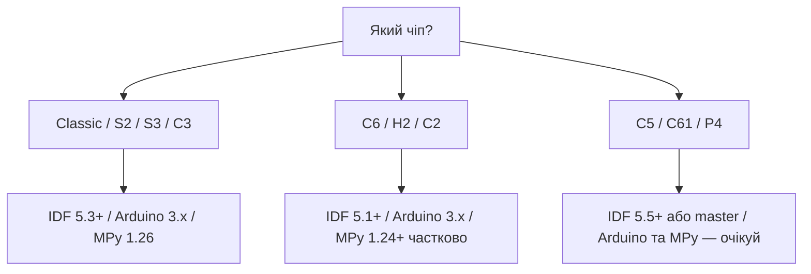

# Матриця версій - IDF / Arduino-core / MicroPython

![[assets/img/versions-matrix-scheme.png|600]]

База звіряється з актуальними гілками трьох екосистем. Кожна стаття має штамп свіжості формату **«Перевірено: 2026-09»** - шукай його внизу сторінки або в HAT-платі розділу.

> [!info] Навіщо ця сторінка
> Новий чіп (C5/C61/P4) без потрібної версії фреймворку - це «компілюється, але не працює». Спочатку дивись сюди, потім став тулчейн.

## ESP-IDF - актуальні гілки

| Гілка | Статус (2026-09) | Що нового для бази |
| --- | --- | --- |
| v5.5 | стабільна LTS-кандидат | LP-core C6 зрілий, ULP-RISC-V API стабільний, ESP32-C5 preview-підтримка |
| v5.4 | стабільна | Matter 1.4, покращений WiFi 6 (C6), новий `esp_timer` профіль |
| v5.3 | maintenance | остання з підтримкою Classic без warnings, базова C6 |
| v5.1-v5.2 | EOL-наближені | тільки для старих проєктів, не для нових статей |
| v6.0 (master) | розробка | P4 повна підтримка, C61, новий USB-стек |

Мінімальна рекомендована для нових проєктів: **v5.4+**. Всі приклади коду бази орієнтовані на v5.3+ API (напр. `esp_task_wdt_config_t` замість старого `esp_task_wdt_init(timeout, panic)`).

## Arduino-core - актуальні гілки

| Гілка | Статус (2026-09) | Що нового для бази |
| --- | --- | --- |
| 3.2.x | стабільна | S3/C3/C6 з коробки, базований на IDF 5.4, новий `USBCDC` |
| 3.1.x | maintenance | S2/S3 стабільні, C6 частково |
| 2.0.x | legacy | тільки Classic/S2/S3-ранні; C3 - сирий, C6 - немає |

Пастки Arduino-core:

| Проблема | Деталь |
| --- | --- |
| `analogRead` різна розрядність | 2.0.x - 12 біт default; 3.x - калібрована крива, див. [[06-Analog/01-ADC | ADC]] |
| `Serial` на C3/S3 через USB-CDC | потрібен `USB_CDC_ON_BOOT=1` в Tools-меню, інакше тиша в моніторі |
| Task-WDT default | 5 с в обох гілках, але 3.x слідкує і за IDLE обох ядер |

## MicroPython - актуальні гілки

| Гілка | Статус (2026-09) | Що нового для бази |
| --- | --- | --- |
| v1.26+ | стабільна | C3/S3 підтримка, `esp32.ULP()` для S2/S3, покращений `machine.SDCard` |
| v1.22-v1.24 | maintenance | Classic/S2 робочі, S3 частково |
| v1.20 і старше | legacy | не для нових статей |

Обмеження MicroPython (нагадування для авторів статей):

- SDMMC 4-bit - немає, тільки SPI-режим SD.
- ULP-RISC-V з Python - тільки запуск готового бінарника, розробка ULP - через IDF/C.
- LP-core C6 з Python не програмується.

## Матриця «чип → мінімальна версія»

| Чіп | Min ESP-IDF | Min Arduino-core | Min MicroPython | Примітка |
| --- | --- | --- | --- | --- |
| ESP32 Classic | v4.4 | 2.0.0 | v1.19 | еталон, усе працює всюди |
| ESP32-S2 | v4.2 | 2.0.0 | v1.19 | USB-OTG з IDF 4.3+ |
| ESP32-S3 | v4.4 | 2.0.5 | v1.22 | ULP-RISC-V з IDF 5.0+ |
| ESP32-C3 | v4.3 | 2.0.5 | v1.22 | BLE 5 з IDF 4.4+ |
| ESP32-C6 | v5.1 | 3.0.0 | v1.24 (частково) | WiFi 6 + 802.15.4, LP-core з v5.2+ |
| ESP32-H2 | v5.1 | 3.0.0 (частково) | - (немає) | тільки 802.15.4/BLE, без WiFi |
| ESP32-C2 | v5.0 | 3.0.0 (частково) | - (немає) | бюджетний WiFi 4/BLE 5 |
| ESP32-C5 | v5.5+ | - (очікується) | - (немає) | WiFi 6 + 5 ГГц! Preview в v5.5 |
| ESP32-C61 | v5.5+ | - (очікується) | - (немає) | здешевлений C5-варіант |
| ESP32-P4 | v5.3+ | - (очікується) | - (немає) | без радіо, HP-CPU + H264/CAM |

Деталі нових чіпів: [[01-Hardware/10-ESP32-C5-C61|C5 C61]], [[01-Hardware/09-ESP32-C2-P4|C2 P4]], [[01-Hardware/04-ESP32-C3-C6-H2|C3 C6 H2]].

Схема вибору тулчейну (ASCII):

```text
            ┌─────────────┐
            │  Який чіп?  │
            └──────┬──────┘
        ┌──────────┼──────────────┐
   Classic/S2/S3/C3  C6/H2/C2   C5/C61/P4
        │              │              │
   IDF будь-який   IDF ≥ v5.1    IDF ≥ v5.3/5.5
   Ard ≥ 2.0       Ard ≥ 3.0     Ard — чекай
   MPy ≥ v1.22     MPy ≥ v1.24   MPy — немає
```

Та сама логіка Mermaid (для рендеру в Obsidian):



## Політика оновлень бази

1. **Щоквартальний рев'ю-прохід** (01, 04, 07, 10): звірити таблиці вище з релізами Espressif/Arduino/MicroPython, оновити штампи.
2. **Штамп свіжості** - єдиний формат: `Перевірено: 2026-09` (рік-місяць, нулі обов'язкові: `2026-04`, не `2026-4`). Ставиться внизу статті перед `## Див. також` або в frontmatter-поле `verified:`.
3. **Новий стабільний реліз** (напр. IDF v5.6): оновити цю сторінку першою, потім - статті, що залежать від зміненого API.
4. **Breaking change**: стаття отримує callout `> [!warning] Змінилось в IDF 5.x` + старий код лишається під спойлером, не видаляється.
5. **EOL-гілки**: статті не переписуються під EOL, додається помітка «legacy, див. матрицю версій».
6. **Новий чіп**: мінімум - рядок у матриці вище + згадка в [[00-Start/03-Porivnyannya-chipiv|порівнянні чіпів]]; повна стаття - за шаблоном [[Home|Home]].

## Міграція ESP-IDF 4.4 → 5.x: breaking-зміни периферії

IDF 5.0 - мажорний реліз: «переважно сумісний з 4.x», але драйвери периферії переписані в об'єктно-орієнтованому стилі (opaque handles + factory-функції). Правило: спочатку читати офіційний [Migration from 4.4 to 5.0](https://docs.espressif.com/projects/esp-idf/en/v5.0/esp32/migration-guides/release-5.x/index.html), потім правити код. Нижче - те, що б'є по ESP32-проєктах найчастіше (джерело: [Peripherals migration](https://docs.espressif.com/projects/esp-idf/en/v5.0/esp32/migration-guides/release-5.x/peripherals.html)).

### ADC (зламано найбільше)

| Було (4.4) | Стало (5.x) |
| --- | --- |
| `driver/adc.h`: `adc1_get_raw()`, `adc1_config_width/atten`, `adc2_get_raw` | `esp_adc/adc_oneshot.h`: `adc_oneshot_new_unit()` + `adc_oneshot_read()`; continuous - `esp_adc/adc_continuous.h` |
| `esp_adc_cal.h`: `esp_adc_cal_characterize()`, `esp_adc_cal_raw_to_voltage()` | `esp_adc/adc_cali.h`: `adc_cali_create_scheme_line_fitting()` + `adc_cali_raw_to_voltage()` |
| `hall_sensor_read()` | **Видалено** (датчика Холла немає в залозі нових чіпів) |
| `adc_set_i2s_data_source()` / `adc_i2s_mode_init()` | Deprecated → `adc_continuous` |
| `ADC_UNIT_BOTH/ALTER/MAX`, `ADC_CHANNEL_MAX`, `ADC_ATTEN_MAX` | Видалено - драйвер повертає динамічну помилку на непідтримуваному |

```c
// IDF 4.4:
adc1_config_width(ADC_WIDTH_BIT_12);
adc1_config_channel_atten(ADC1_CHANNEL_6, ADC_ATTEN_DB_11);
int raw = adc1_get_raw(ADC1_CHANNEL_6);
// IDF 5.x:
adc_oneshot_unit_handle_t h;
adc_oneshot_unit_init_cfg_t u = { .unit_id = ADC_UNIT_1 };
adc_oneshot_new_unit(&u, &h);
adc_oneshot_chan_cfg_t c = { .atten = ADC_ATTEN_DB_12, .bitwidth = ADC_BITWIDTH_DEFAULT };
adc_oneshot_config_channel(h, ADC_CHANNEL_6, &c);
int raw = 0; adc_oneshot_read(h, ADC_CHANNEL_6, &raw);
```

Деталі калібрування АЦП - у [[06-Analog/01-ADC|ADC]].

### RMT / LEDC / Timers / MCPWM / PCNT

| Драйвер | Було | Стало |
| --- | --- | --- |
| RMT | `driver/rmt.h`, канали фіксовані, `rmt_item32_t`, `rmt_driver_install` | `driver/rmt_tx.h` + `rmt_rx.h`: `rmt_new_tx_channel()` / `rmt_new_rx_channel()`, `rmt_symbol_word_t`, енкодери; legacy - з warning (глушиться `CONFIG_RMT_SUPPRESS_DEPRECATE_WARN`) |
| LEDC | `bit_num` у `ledc_timer_config_t` | `duty_resolution` (механічна заміна) |
| Timer Group | `driver/timer.h`: групи/індекси, `timer_init`, ISR вручну | `driver/gptimer.h`: `gptimer_new_timer()`, колбеки `on_alarm`, auto-reload прапором |
| MCPWM | `driver/mcpwm.h`: `mcpwm_init`, `mcpwm_set_duty`, пресети deadtime | `driver/mcpwm_prelude.h`: таймер + оператор + компаратор + генератор окремими об'єктами, `mcpwm_operator_connect_timer()` |
| PCNT | `driver/pcnt.h`: unit/channel-індекси | `driver/pulse_cnt.h`: `pcnt_new_unit()` + `pcnt_new_channel()`, watch-points замість подій |

Таймери/MCPWM/PCNT/RMT детально - у [[07-Timeri-Son/01-Timeri-MCPWM-PCNT-RMT|Таймери/MCPWM/PCNT/RMT]].

### Інше (часто ламає збірку мовчки)

| Що | Зміна |
| --- | --- |
| CAN → TWAI | Драйвер `driver/can.h` **видалено** → `driver/twai.h` (див. [[04-Shini/05-CAN-TWAI-RS485 | CAN/TWAI]]) |
| Temp sensor | `driver/temp_sensor.h` deprecated → `driver/temperature_sensor.h` |
| SPI flash | Префікс `spi_flash_*` видалено → `esp_flash_*`; `spi_cal_clock()` → `spi_get_actual_clock()` (див. [[04-Shini/02-SPI | SPI]]) |
| GPIO ISR | Статус переривань тепер чиститься **до** колбеків - читати регістр статусу всередині колбека заборонено, пін брати з аргументу |
| UART | `uart_isr_register/free` видалено (перериваннями керує драйвер); `use_ref_tick` → `source_clk` (див. [[04-Shini/01-UART | UART]]) |
| I2C | У 5.0 прибрано `i2c_isr_register`; у 5.2+ з'явився новий master-драйвер `driver/i2c_master.h` (`i2c_new_master_bus`) - legacy помічений EOL до 6.0 (див. [[04-Shini/03-I2C | I2C]]) |
| LCD | `esp_lcd_panel_init()` більше **не вмикає** дисплей - потрібен явний `esp_lcd_panel_disp_on_off()` |
| I2S | Legacy `driver/i2s.h` deprecated у 5.0 (видалений у 6.0) → `i2s_std/i2s_pdm/i2s_tdm` |

## IDF 5.1 → 5.5: стислі віхи (деталі - у реліз-нотах Espressif)

| Перехід | Що важливо для бази |
| --- | --- |
| 5.0 → 5.1 | Підтримка C6/H2; база Arduino-core 3.0; новий I2C-драйвер дозріває |
| 5.1 → 5.2 | C6 стабільніша; LP-core API; MicroPython 1.24 взяв 5.2.2 як базу |
| 5.2 → 5.3 | Гілка maintenance; перша підтримка P4; остання «тиха» для Classic без warnings |
| 5.3 → 5.4 | Matter 1.4, WiFi 6 (C6) стабільний, новий профіль `esp_timer`; база Arduino 3.2 |
| 5.4 → 5.5 | Preview C5 (WiFi 6 + 5ГГц), зрілий LP-core C6, кандидат у LTS |

## Міграція Arduino-core 2.x → 3.x: breaking-зміни

Arduino 3.0 = перехід з IDF 4.4 на IDF 5.1 + нові SoC (C6/H2). Старі скетчі 2.x збираються з помилками - це нормально, правиться механічно за офіційним [Migration from 2.x to 3.0](https://docs.espressif.com/projects/arduino-esp32/en/latest/migration_guides/2.x_to_3.0.html). Повний розбір середовища - у [[09-Proshivka/02-Arduino-PlatformIO|Arduino/PlatformIO]].

### LEDC (б'є першим - кожен другий скетч)

```cpp
// Arduino 2.x:
ledcSetup(0, 5000, 8);      // канал 0, 5кГц, 8 біт
ledcAttachPin(25, 0);       // пін 25 -> канал 0
ledcWrite(0, 128);          // писати в КАНАЛ
// Arduino 3.x: каналів більше немає, все по ПІНАХ:
ledcAttach(25, 5000, 8);    // пін 25, 5кГц, 8 біт (канал призначається сам)
ledcWrite(25, 128);         // писати в ПІН!
ledcDetach(25);             // було ledcDetachPin()
```

Канали призначає Peripheral Manager автоматично; `ledcOutputInvert`, `ledcFade` - нові API для інверсії/затухання.

### RMT + NeoPixel (б'є другим)

RMT переведено на піни: `rmtInit` повертає bool і приймає частоту (`rmtSetTick` видалено), `rmtWrite` - блокуючий з таймаутом (для асинхрона - `rmtWriteAsync`), `rmtLoop` → `rmtWriteLooping`, прийом - нові сигнатури `rmtRead/rmtReadAsync`.

Практика NeoPixel на 3.x (підтверджено скаргами спільноти: краш на `strip.show()` після переїзду з 2.0.x):

1. Оновити Adafruit NeoPixel до найсвіжішого релізу (старі версії ламаються об новий RMT).
2. Не допомогло → перейти на NeoPixelBus (активно підтримує 3.x) або IDF-драйвер `esp32_rmt_led_strip`.
3. На Arduino Nano ESP32 перевірити Tools → Pin Numbering: **By GPIO number (legacy)**, інакше стрічка мовчить.

### Timer / SigmaDelta

```cpp
// 2.x: timerBegin(0, 80, true); timerAlarmWrite(t, 1000000, true); timerAlarmEnable(t);
// 3.x: один параметр частоти + злитий alarm:
hw_timer_t *t = timerBegin(1000000);          // частота 1МГц, дільник рахується сам
timerAttachInterrupt(t, &onTimer);
timerAlarm(t, 1000000, true, 0);              // write+enable одним викликом
```

Видалено: `timerGetConfig/SetConfig/SetDivider/SetCountUp/SetAutoReload…`, `timerAlarmEnable/Disable/Write/Read…`. SigmaDelta: `sigmaDeltaSetup/Read` видалено → `sigmaDeltaAttach(pin, …)`, канал - автоматом; `sigmaDeltaDetachPin` → `sigmaDeltaDetach`.

### UART / ADC / BLE / WiFi / інше

| Що | 2.x → 3.x |
| --- | --- |
| UART-дефолти | ESP32: UART1 RX/TX тепер GPIO26/27, UART2 - GPIO4/25; S2: UART1 - GPIO4/5. `setPins()` можна до `begin()` і в будь-якому порядку |
| ADC | `analogSetClockDiv`, `adcAttachPin`, `analogSetVRefPin` - видалено (АЦП тепер каліброване, див. [[06-Analog/01-ADC | ADC]]) |
| Hall | `hallRead()` - видалено (див. IDF-таблицю вище) |
| BLE | `std::string` → Arduino `String`; UUID `uint16_t` → клас `BLEUUID`; `BLEScan::start/getResults` повертають вказівник |
| WiFi | `WiFiClient/WiFiUDP::flush()` більше не чистить RX-буфер (нічого не робить) → для очистки `clear()`; `WiFiServer::available()` deprecated → `accept()` |
| I2S | Драйвер повністю переписаний під новий IDF - приклади 2.x не заведуться |

### SPI-практика на 3.x

1. Завжди явні піни: `SPI.begin(SCK, MISO, MOSI, SS)` - дефолти плати/ядра можуть не збігтися з розводкою (особливо кастомні плати і C6/H2).
2. Макроси HSPI/VSPI - deprecated в IDF 5 (у 6.0 видалені): використовувати FSPI / явні `SPIClass(HSPI)` лише там, де ще живі.
3. TFT_eSPI / SD / сенсори по SPI: оновити бібліотеку до версії з підтримкою 3.x + перевірити `User_Setup` (піни, частота, `USE_HSPI_PORT`).
4. Бонус 3.x: SPI-Ethernet (W5500, DM9051, KSZ8851) тепер з коробки через Arduino SPI.
5. PlatformIO: підтримка Arduino 3.x залежить від версії `platform-espressif32` - перевіряти перед міграцією; частину бойових проєктів свідомо лишають на 2.0.x до готовності всіх бібліотек (позначка legacy у політиці вище).

## MicroPython 1.19 → 1.24: віхи для ESP32

Повний розбір середовища - у [[09-Proshivka/03-MicroPython|MicroPython]]. Джерело фактів нижче - офіційні [реліз-ноти MicroPython](https://github.com/micropython/micropython/releases) (детально розібрано v1.24.0).

| Перехід | Що важливо для ESP32 |
| --- | --- |
| 1.19 → 1.22 | Дозрівання S3/C3: борд-дефініції, USB-CDC (S2/S3), мінімуми за матрицею вище (S3 - від 1.22, C3 - від 1.22) |
| 1.22 → 1.23 | База порту - IDF 5.0.x; стабілізація після стрибка з 4.4 |
| 1.23 → 1.24 | База порту - **IDF 5.2.2**; **підтримка ESP32-C6** (GENERIC_C6 + борди M5Stack/UM); RISC-V native emitter на C3/C6 |

Ключові API-зміни 1.24 (ESP32-порт):

- `network.ipconfig()` (глобальна + `nic.ipconfig()`): новий API адрес IPv4/IPv6 - рекомендований; старий `nic.ifconfig()` лишається для сумісності.
- `machine.UART.irq()`: Python-колбеки IRQ_RX / IRQ_RXIDLE / IRQ_TXIDLE / IRQ_BREAK на esp32-порту.
- `machine.SoftSPI(firstbit=...)`: додано LSB-режим.
- ⚠️ Breaking: `sys.exit()` / `raise SystemExit` тепер робить **soft reset** пристрою (раніше - повернення в REPL). Скрипти з `sys.exit()` у логіці «вийти в REPL» переписувати!
- `micropython.RingIO`: потоковий кільцевий буфер.
- TinyUSB-уніфікація (S2/S3): стартовий CDC-трафік буферизується - банер REPL тепер видно при першому підключенні.
- Жорсткий ліміт активних TCP-сокетів - стабільність при частих перепідключеннях.
- `mpremote`: `sha256sum` + рекурсивне копіювання з хешами (синк великих застосунків за секунди).

## Таблиця deprecated API: старе → нове + код

| # | Старе | Нове | Мінімальний патч |
| --- | --- | --- | --- |
| 1 | `adc1_get_raw()` + `adc1_config_*` (IDF 4.4) | `adc_oneshot_read()` (IDF 5) | Див. приклад у міграції IDF вище |
| 2 | `esp_adc_cal_raw_to_voltage()` | `adc_cali_raw_to_voltage()` | `adc_cali_create_scheme_line_fitting(&cfg, &h); adc_cali_raw_to_voltage(h, raw, &mv);` |
| 3 | `driver/timer.h` (`timer_init`, `timer_set_alarm_value`…) | `driver/gptimer.h` (`gptimer_new_timer`, `on_alarm`) | Хендл + колбек замість ISR вручну |
| 4 | `ledcSetup(ch, f, res)` + `ledcAttachPin(pin, ch)` (Arduino 2.x) | `ledcAttach(pin, f, res)` (Arduino 3.x) | Писати `ledcWrite(pin, …)`, не канал |
| 5 | `timerAlarmWrite(t, us, reload)` + `timerAlarmEnable(t)` | `timerAlarm(t, us, reload, 0)` | Один виклик; `timerBegin(freq)` - один параметр |
| 6 | `sigmaDeltaSetup(ch, freq)` / `sigmaDeltaRead` | `sigmaDeltaAttach(pin, freq)` | Канал призначається сам |
| 7 | `adcAttachPin()`, `analogSetClockDiv()` | Видалити | АЦП каліброване з коробки |
| 8 | `hallRead()` | Видалити | Холла немає в залозі |
| 9 | `driver/can.h` (`can_driver_install`…) | `driver/twai.h` (`twai_driver_install`…) | Перейменування 1:1 + `twai_general_config_t` |
| 10 | `driver/temp_sensor.h` | `driver/temperature_sensor.h` | `temperature_sensor_install()` |
| 11 | `spi_flash_read/write/erase()` | `esp_flash_read/write/erase()` | Механічна заміна префікса |
| 12 | RMT legacy (`rmt_driver_install`, `rmt_item32_t`) | `rmt_new_tx/rx_channel` + `rmt_symbol_word_t` (IDF) / pin-API (Arduino) | Енкодер замість ручних items |
| 13 | MCPWM legacy (`mcpwm_init`, `mcpwm_set_duty`) | `mcpwm_prelude.h` (timer+operator+comparator+generator) | `mcpwm_operator_connect_timer()` + `mcpwm_comparator_set_compare_value()` |
| 14 | `bit_num` у `ledc_timer_config_t` | `duty_resolution` | Одне поле |
| 15 | `WiFiClient::flush()` для чистки RX (Arduino) | `clear()` | `flush()` тепер нічого не робить |
| 16 | `driver/i2s.h` legacy | `i2s_std/pdm/tdm` (IDF) / новий I2S (Arduino 3.x) | Приклади 2.x не заведуться - брати нові |
| 17 | `nic.ifconfig(...)` (MicroPython) | `nic.ipconfig(...)` / `network.ipconfig()` | Новий API з IPv6; старий поки живий |

## Матриця сумісності бібліотек (станом на 2026-09, перевіряти релізи!)

| Бібліотека | Arduino 2.x | Arduino 3.x | ESP-IDF 5.x | MicroPython | Коментар |
| --- | --- | --- | --- | --- | --- |
| Adafruit NeoPixel | ✅ | ⚠️ Оновити до свіжої (краші `show()` на ранніх 3.0.x) | - (див. `esp32_rmt_led_strip`) | ✅ `neopixel`-модуль | На 3.x за потреби → NeoPixelBus |
| NeoPixelBus | ✅ | ✅ (рекомендований шлях) | - | - | Активно тримає 3.x |
| FastLED | ✅ | ⚠️ Свіжий реліз під 3.x/RMT | - | - | Перевіряти конкретну версію |
| TFT_eSPI | ✅ | ⚠️ Версія з IDF5-підтримкою + `User_Setup` | esp_lcd + LVGL | Драйвери `st7789_mpy` | Піни/порт - вручну |
| IRremote (Arduino) | ✅ | ⚠️ Свіжі версії (RMT-перепис) | Приклад RMT-RX | Сирий RMT-захват (розд. TSOP у [[10-Sensori/35-Tails | Хвости]]) | Несуча приймача = несучій пульта |
| OneWire / DS18B20 | ✅ | ⚠️ Перевіряти | - | ✅ `onewire` + `ds18x20` | Див. [[10-Sensori/02-DS18B20 | DS18B20]] |
| PubSubClient | ✅ | ✅ | - (esp-mqtt) | `umqtt.simple/robust` | API стабільний |
| ArduinoJson | ✅ | ✅ | - (`cJSON` в IDF) | Вбудовано `ujson` | Мажорних зламів у v7-гілці уникати |
| Blynk | ✅ (2.x) | ⚠️ Оновити lib, перевірити LEDC-залежності | - | - | Спочатку зразок на столі |
| ESPAsyncWebServer | ✅ (2.x) | ⚠️ Потрібен сумісний форк/версія під 3.x | `esp_http_server` | `microdot`/`mip`-пакети | Найболючіша міграція - закладати час |
| ESPHome | - | - | ✅ (IDF-база) | - | T6615/SGP41 з коробки |
| Вбудовані Wire/SPI/SD | ✅ | ✅ (явні піни в `begin`!) | IDF-драйвери | `machine.*` | Дефолтні піни звіряти з платою |

> Як читати матрицю: ✅ - працює; ⚠️ - працює після оновлення/з застереженнями (деталь у коментарі); - - не застосовується. Перед міграцією бойового проєкту: підняти копію на столі, прогнати всі периферійні шляхи (WiFi-периферія × датчики × дисплей × LED), і лише потім чіпати бойовий стенд.

Офіційні джерела міграцій:

- [Migration from 2.x to 3.0 - Arduino ESP32](https://docs.espressif.com/projects/arduino-esp32/en/latest/migration_guides/2.x_to_3.0.html) - LEDC/RMT/Timer/UART/ADC/BLE/WiFi (розібрано вище).
- [Peripherals - Migration from 4.4 to 5.0 - ESP-IDF](https://docs.espressif.com/projects/esp-idf/en/v5.0/esp32/migration-guides/release-5.x/peripherals.html) - ADC/RMT/MCPWM/Timer/GPIO/UART/SPI-flash (розібрано вище).
- [MicroPython v1.24.0 release notes](https://github.com/micropython/micropython/releases/tag/v1.24.0) - C6, IDF 5.2.2, `ipconfig`, UART.irq, `sys.exit`-breaking.

Журнал змін бази: [[CHANGELOG]].

## Див. також

- [[Home]]
- [[00-Start/03-Porivnyannya-chipiv|Порівняння чіпів]]
- [[09-Proshivka/01-ESP-IDF-setup|ESP-IDF setup]]
- [[09-Proshivka/02-Arduino-PlatformIO]]
- [[09-Proshivka/03-MicroPython|MicroPython]]
- [[09-Proshivka/04-Esptool-Flash]]
- [[09-Proshivka/05-JTAG-Debug]]
- [[CHANGELOG]]

```text

Перевірено: 2026-09

> English twin: [[99-Dodatki/07-Versions.en.md | EN]]
