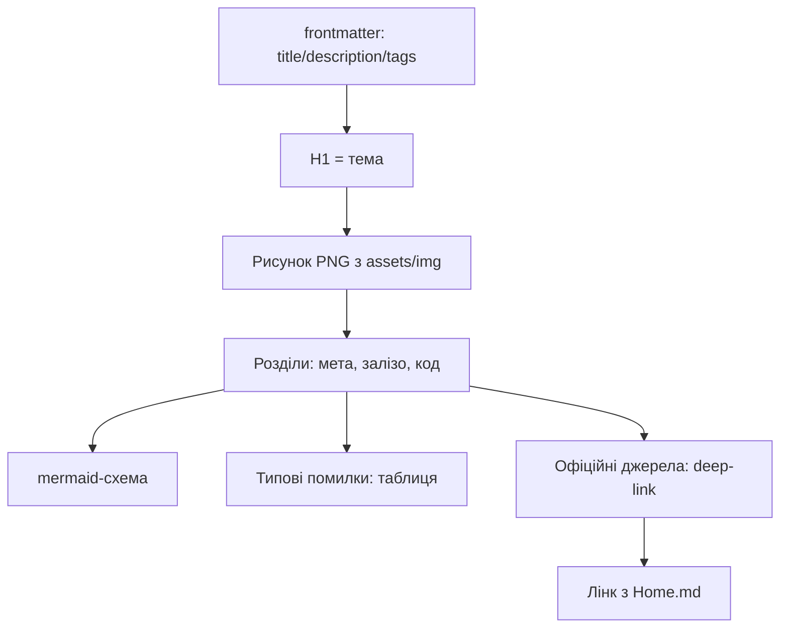

# Як користуватись довідником RaspberryPi-Reference - маршрути і стандарт

EN version: `00-Start/01-Yak-koristuvatis-dovidnikom.en.md`

![[assets/img/rpi-start-map-scheme.png|600]]
*Рис. Три маршрути: новачок (плата → ОС → перший LED), мейкер (GPIO → шини → HAT), IoT (мережа → хмара).*

> [!tip] Що це за нота
> Вхідна точка бази: як читати ноти, куди йти за метою, що означають валідатори. Стандарт ноти єдиний для всіх розділів. Карта: [[Home|головна карта]], порівняння плат: [[00-Start/03-Porivnyannya-plate|порівняння моделей]].

## 1. Мета

За 15 хвилин зорієнтувати читача:

- яка плата потрібна під задачу - див. порівняння моделей;
- яким маршрутом йти: новачок, мейкер, IoT-розробник;
- як влаштована кожна нота (стандарт розділів);
- як перевірити, що база ціла (три валідатори).

| Хто ви | Маршрут | Перша дія |
| --- | --- | --- |
| Новачок, плати ще немає | Порівняння → покупка → Imager | [[00-Start/03-Porivnyannya-plate | порівняння моделей]] |
| Є Pi, немає ОС | Imager → headless → SSH | [[09-Proshivka/01-Imager-Headless | прошивка Imager]] |
| Мейкер, треба GPIO | Header → gpiozero → датчик | [[03-GPIO/01-Header-Gpiozero | гребінка і gpiozero]] |
| IoT, треба хмара | WiFi → MQTT → дашборд | [[15-Protokoli/01-MQTT | протокол MQTT]] |

## 2. Стандарт ноти

Кожна контентна нота містить:

- frontmatter: title, description (8+ слів), tags, category, date;
- рисунок `![[assets/img/*.png|600]]` з підписом - схеми генеруємо локально;
- mermaid-схему архітектури або потоку;
- таблицю «Типові помилки»: симптом, причина, лікування;
- «Офіційні джерела» - лінки на конкретну модель/документацію, не на головну сайту;
- робочий код (Python/C), перевірений логікою розділу;
- мінімум 150 рядків - інакше нота вважається заготівлею.

## 3. Маршрут новачка детально

- Крок 1: обрати плату за таблицею порівняння (для старту - Pi 4/5 або Zero 2 W);
- Крок 2: купити комплект - плата + офіційний БЖ + SD-карта + корпус;
- Крок 3: прошити Raspberry Pi OS через Imager, увімкнути SSH;
- Крок 4: запалити LED через gpiozero - перший успіх за вечір;
- Крок 5: підключити датчик BME280 по I2C - перший вимір.

## 4. Маршрут мейкера детально

- Крок 1: вивчити гребінку 40 пінів (3.3V логіка - це святе!);
- Крок 2: gpiozero для швидкості, lgpio для точності;
- Крок 3: шини I2C/SPI/UART - сканери і логічний аналізатор;
- Крок 4: HAT-плати або свої датчики на макетці;
- Крок 5: живлення і корпусування під 24/7.

## 5. Маршрут IoT-розробника детально

- Крок 1: мережа - WiFi на борту або Ethernet;
- Крок 2: MQTT-клієнт на Python, топіки і QoS;
- Крок 3: брокер локально або в хмарі;
- Крок 4: сторожові таймери і автоперезапуск сервісів;
- Крок 5: резервне живлення (UPS HAT) для поля.

## 5.1 Чекліст першого вечора

| Крок | Дія | Галочка |
| --- | --- | --- |
| 1 | Плата на столі, БЖ і SD поруч | [ ] |
| 2 | Imager: ОС + SSH + WiFi + користувач | [ ] |
| 3 | Перший boot, `ping raspberrypi.local` | [ ] |
| 4 | `sudo apt update && sudo apt upgrade` | [ ] |
| 5 | LED на GPIO17 через gpiozero | [ ] |
| 6 | Кнопка на GPIO27 з pull-up | [ ] |
| 7 | Бекап SD через Imager | [ ] |

Якщо застрягли на кроці - відповідний розділ маршруту вище. Не перестрибувати: кожен крок спирається на попередній. Виконали всі сім - сміливо йдіть у свій маршрут: залізо чекає коду.
Символ виконаного вечора - миготливий LED і розуміння, куди йти далі.

## 6. Валідатори бази

| Скрипт | Що перевіряє | Норма |
| --- | --- | --- |
| `check_style.py` | формат нот (9 правил) | 0 порушень |
| `check_links.py` | вікілінки і PNG | broken 0, missing NONE |
| `check_home.py` | навігація і лічильники | 0 помилок |
| `comp_inventory.py` | реєстр компонентів | усі з даташитом |

Запуск з кореня бази: `python3 scripts/check_style.py` і так далі. Реєстр `COMPONENTS.md` генерується ключем `--registry` - руками не правити.

## 7. Умовні позначки

- `3.3V!` - логіка GPIO, 5V на пін = смерть плати;
- `5V 3A+` - вимога живлення Pi 4/5, слабкий БЖ = блискавка на екрані;
- `HAT` - плата розширення на 40-пінову гребінку зі схемою EEPROM;
- `CSI/DSI` - шлейфи камери і дисплея (не GPIO!);
- `headless` - робота без монітора, через SSH.

## 7.1 Словник статусів плати

| Сигнал | Значення | Дія |
| --- | --- | --- |
| PWR червоний стабільно | живлення ок | нічого |
| PWR моргає/гасне | просадка нижче 4.65V | міняти БЖ і кабель |
| ACT зелений моргає | читає SD, все добре | нічого |
| ACT 4 спалахи | немає start.elf | перепрошити SD |
| ACT 7 спалахів | немає kernel.img | перепрошити SD |
| ACT 8 спалахів | пошкоджена SDRAM-настройка | інша SD, інший образ |
| Екран-веселка + блискавка | слабке живлення | офіційний БЖ |

## 8. Типові помилки

| Симптом | Причина | Лікування |
| --- | --- | --- |
| Не знаю, з чого почати | немає плати і задачі | порівняння моделей → купити комплект → Imager |
| Плутаюсь у нотах | читання не за маршрутом | обрати свій маршрут з розділу 1 і йти ним |
| Код з ноти не працює | інша модель плати або ОС | звірити HAT-плату ноти (модель, ОС, ядро) |
| Немає потрібної теми | база росте чергами | дивитись TODO.md - черга теми вказана |
| Битий лінк у ноті | застарілий URL | прогнати `check_links.py`, полагодити deep-link |
| Нота коротша за стандарт | заготівля, не нота | дописати до 150+ рядків за шаблоном |

## 9. Суміжні ноти

- [[00-Start/02-Glosariy|глосарій термінів]] - усі терміни бази.
- [[00-Start/03-Porivnyannya-plate|порівняння моделей]] - вибір плати.
- [[00-Start/04-Devkit-plati|плати і аксесуари]] - що купити.
- [[00-Start/05-Vibir-seredovischa|вибір середовища]] - ОС і мови.
- [[Home|головна карта]] - повна навігація.

## Офіційні джерела

- [Getting Started (Raspberry Pi docs)](https://www.raspberrypi.com/documentation/computers/getting-started.html) - перший запуск, Imager.
- [Raspberry Pi OS (Raspberry Pi)](https://www.raspberrypi.com/software/) - образи і Imager.
- [rpi-imager (Raspberry Pi, GitHub)](https://github.com/raspberrypi/rpi-imager) - вихідники прошивальника.
- [gpiozero docs (Read the Docs)](https://gpiozero.readthedocs.io/en/stable/) - бібліотека GPIO для старту.
