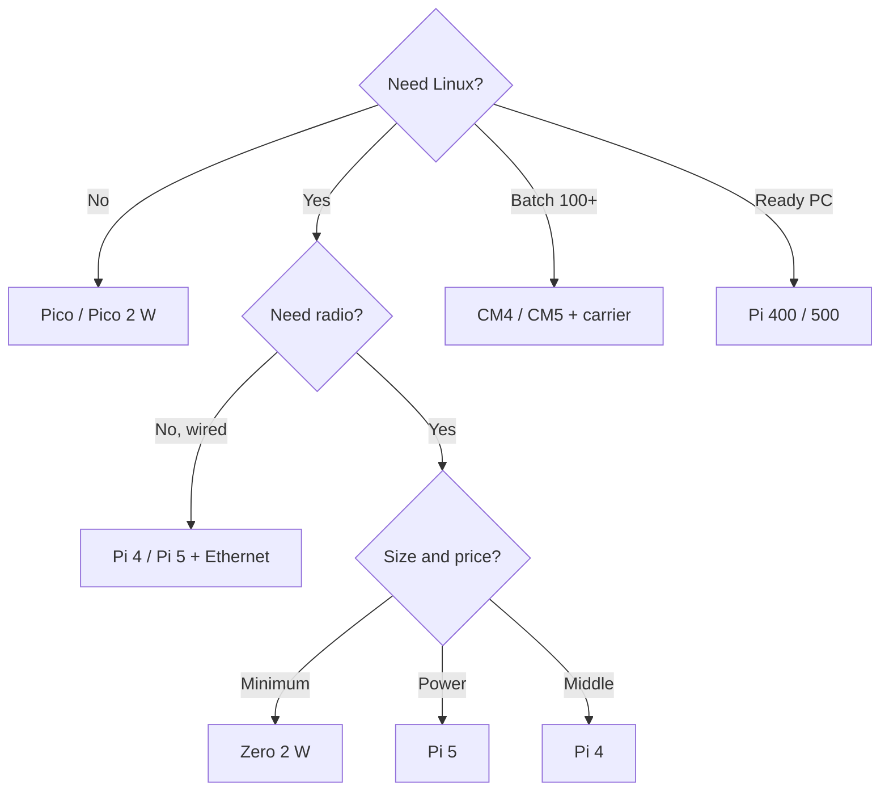

# Raspberry Pi board comparison - Pi 5, Pi 4, Zero, Pico, CM and 400/500

![[assets/img/rpi-models-compare-scheme.png|600]]
*Fig. Lineup: Pi 5 - flagship, Pi 4 - workhorse, Zero 2 W - tiny one, Pico - microcontroller, CM - embedding.*

> [!tip] What this note is
> Main choice table: all current models side by side - CPU, RAM, radio, USB, power, price, purpose. After choice - [[00-Start/04-Devkit-plati.en|what to buy]] and [[00-Start/05-Vibir-seredovischa.en|environment]]. Board details - board section.

## 1. Goal

Answer "which one to take" in 5 minutes:

- full table of the current lineup with no retired models;
- honest limits: what each board cannot do;
- choice by three questions: Linux or not, radio or not, budget;
- where to go next with each model.

## 2. Big model table

| Model | SoC / CPU | RAM | Radio | USB | Power |
| --- | --- | --- | --- | --- | --- |
| Pi 5 4/8/16 GB | BCM2712 4xA76 2.4 GHz | 4-16 GB | WiFi ac + BT 5 | 2xUSB3 + 2xUSB2 | USB-C PD 5V 5A |
| Pi 4 2/4/8 GB | BCM2711 4xA72 1.5 GHz | 2-8 GB | WiFi ac + BT 5 | 2xUSB3 + 2xUSB2 | USB-C 5V 3A |
| Zero 2 W | RP3A0 4xA53 1 GHz | 512 MB | WiFi + BT 4.2 | 1xmicro-OTG | micro-USB 5V 2.5A |
| Pico / Pico W | RP2040 2xM0+ 133 MHz | 264 KB | W: WiFi (+BT only C SDK/BTstack) | micro-USB device | 5V/3.3V |
| Pico 2 / 2 W | RP2350 2xM33 150 MHz | 520 KB | W: WiFi (+BT only C SDK/BTstack) | micro-USB device | 5V/3.3V |
| CM4 / CM5 | as Pi 4 / Pi 5 | to 8/16 GB | optional | via carrier board | from carrier |
| Pi 400 / 500 | as Pi 4 / Pi 5 | 4/8 GB | WiFi + BT | 2xUSB3 + USB2 | USB-C, in keyboard |

Retired/rare ones (1/2/3, Zero W v1) are not in the table - buying them in 2026 makes no sense, except for repair.

## 3. Choice architecture

Three questions close 95 % of choices. The rest - nuances below.

## 4. What each one cannot do

- Pi 5: no analog audio jack (only HDMI/USB/I2S), runs hot - needs a fan/heatsink;
- Pi 4: USB-C with no PD (plain 5V 3A), WiFi weaker than Pi 5;
- Zero 2 W: single USB-OTG (hub for keyboard+mouse), 512 MB - heavy desktop will not run;
- Pico: no Linux at all (C SDK or MicroPython), WiFi only in W versions;
- CM4/CM5: no connectors - a carrier board (IO Board) is needed;
- 400/500: GPIO under the keyboard, awkward for a breadboard.

## 5. Choice by task

| Task | Model | Why |
| --- | --- | --- |
| Home server, NAS, Pi-hole | Pi 5 8 GB | CPU/RAM reserve, USB3, NVMe HAT boards |
| Kodi media center | Pi 4 2 GB / Pi 5 4 GB | 4K HDMI, hardware codecs |
| WiFi IoT sensor | Zero 2 W | small, cheap, Linux with WiFi |
| Real-time microcontroller | Pico 2 W | PIO, ADC, microamp sleep |
| Robot/car | Pi 4/5 + Pico as slave | Linux brain + real-time hardware |
| Industrial batch | CM4/CM5 + own carrier | eMMC, long life cycle |
| School PC | Pi 400/500 | all in keyboard, monitor + mouse |
| Camera with analytics | Pi 5 + AI Camera | Hailo accelerator on camera |

## 5.1 Power draw and noise

| Model | Idle | Peak | Fan |
| --- | --- | --- | --- |
| Pi 5 | ~3W | ~12W | yes, active |
| Pi 4 | ~2.5W | ~7W | advised |
| Zero 2 W | ~0.5W | ~2W | no |
| Pico W | ~0.1W | ~0.5W | no |
| CM4/CM5 | as Pi 4/5 | by carrier | by case |

Silence rule: server in a bedroom - Pi 4 with passive Flirc or Zero 2 W. Pi 5 with no fan in a closed case throttles and hisses with coil whine.

## 6. Prices and kits (landmarks)

- board alone - from a Pico price to a Pi 5 16 GB price (about x20 range);
- must buy extra: official PSU, A2 SD card, case with cooling;
- starter kit (board+PSU+SD+case+cables) - plus about 50 % over the board price;
- market "5V 3A" PSU clones - first cause of undervoltage lightning.

## 7. Compatibility and migration

- 40-pin header same since B+ - HATs fit all models;
- Pi 5: new PCIe/FPC connector, JST fan connector - old cases do not fit;
- Zero: mini-HDMI and micro-USB - adapters needed;
- Pico: castellated pins - soldering or a carrier board;
- software: Raspberry Pi OS Bookworm - on Pi 4/5/Zero 2 W/400/500, on Pico - MicroPython/C SDK.

## 7.1 Revisions and what to ask the seller

- board revision (printed near the header): newer - fewer errata;
- RAM size on the sticker: Pi 4/5 share cases across RAM sizes;
- kit scope: whether PSU and SD are in the price, or bare board;
- origin: official reseller gives 12 months of warranty;
- returns: check boot before the return window ends;
- for batches: CM modules with fixed revision under contract.

Seller questions: revision, RAM, whether the PSU is official, whether the SD is A2, warranty. "Do not know" answers - a reason to go elsewhere.

Extra for batches:

- same revisions in a batch (images interchangeable);
- 10 % board spare for defects and repairs;
- separate test bench - do not run firmware on live nodes;
- logged MAC/serial of each board in a table;
- one "golden" image for the whole batch, clone from it;
- sticker with install date on each node;
- replacement log: what, when and why died.

## Common issues

| Symptom | Cause | Fix |
| --- | --- | --- |
| Bought a Zero for desktop | too little RAM/USB | Zero - IoT, desktop - Pi 4/5 |
| Waited for WiFi on Pico | non-W version | take Pico W / Pico 2 W |
| CM4 does not start | no carrier board | CM - only with IO Board or own one |
| Pi 5 heats to throttle | no cooling | active fan or big heatsink |
| HAT did not fit old Pi | 26-pin header | HAT needs B+ and newer (40 pins) |
| Too expensive | kit + delivery + adapters | count the kit, not the board |

## 9. Related notes

- [[00-Start/04-Devkit-plati.en|boards and accessories]] - what to buy extra.
- [[14-Devboards/01-Pi5-Flagman.en|Pi 5 flagship]] - board in detail.
- [[14-Devboards/03-Pico-W-Family.en|Pico family]] - microcontrollers.
- [[14-Devboards/05-CM4-CM5.en|CM modules]] - embedding.
- [[00-Start/05-Vibir-seredovischa.en|environment choice]] - OS for the board.

## Official sources

- [Raspberry Pi 5 (Raspberry Pi)](https://www.raspberrypi.com/products/raspberry-pi-5/) - flagship specs.
- [Raspberry Pi 4 Model B (Raspberry Pi)](https://www.raspberrypi.com/products/raspberry-pi-4-model-b/) - workhorse.
- [Raspberry Pi Zero 2 W (Raspberry Pi)](https://www.raspberrypi.com/products/raspberry-pi-zero-2-w/) - tiny one with Linux.
- [RP2040 Datasheet (Raspberry Pi)](https://datasheets.raspberrypi.com/rp2040/rp2040-datasheet.pdf) - Pico crystal.
