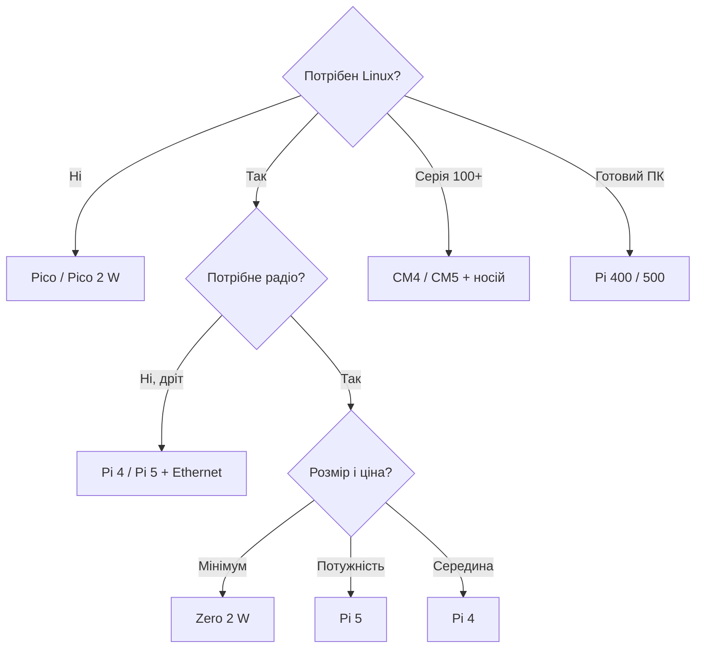

# Порівняння плат Raspberry Pi - Pi 5, Pi 4, Zero, Pico, CM і 400/500

EN version: `00-Start/03-Board-Comparison.en.md`

![[assets/img/rpi-models-compare-scheme.png|600]]
*Рис. Лінійка: Pi 5 - флагман, Pi 4 - робоча конячка, Zero 2 W - малюк, Pico - мікроконтролер, CM - вбудовування.*

> [!tip] Що це за нота
> Головна таблиця вибору: усі актуальні моделі поруч - CPU, RAM, радіо, USB, живлення, ціна, призначення. Після вибору - [[00-Start/04-Devkit-plati|що купити]] і [[00-Start/05-Vibir-seredovischa|середовище]]. Деталі по платах - розділ плати.

## 1. Мета

Відповісти на «яку взяти» за 5 хвилин:

- повна таблиця актуального ряду без знятих з виробництва;
- чесні межі: що кожна плата не вміє;
- вибір за трьома питаннями: Linux чи ні, радіо чи ні, бюджет;
- куди йти далі з кожною моделлю.

## 2. Велика таблиця моделей

| Модель | SoC / CPU | RAM | Радіо | USB | Живлення |
| --- | --- | --- | --- | --- | --- |
| Pi 5 4/8/16 ГБ | BCM2712 4×A76 2.4 ГГц | 4-16 ГБ | WiFi ac + BT 5 | 2×USB3 + 2×USB2 | USB-C PD 5V 5A |
| Pi 4 2/4/8 ГБ | BCM2711 4×A72 1.5 ГГц | 2-8 ГБ | WiFi ac + BT 5 | 2×USB3 + 2×USB2 | USB-C 5V 3A |
| Zero 2 W | RP3A0 4×A53 1 ГГц | 512 МБ | WiFi + BT 4.2 | 1×micro-OTG | micro-USB 5V 2.5A |
| Pico / Pico W | RP2040 2×M0+ 133 МГц | 264 КБ | W: WiFi (+BT лише C SDK/BTstack) | micro-USB пристрій | 5V/3.3V |
| Pico 2 / 2 W | RP2350 2×M33 150 МГц | 520 КБ | W: WiFi (+BT лише C SDK/BTstack) | micro-USB пристрій | 5V/3.3V |
| CM4 / CM5 | як Pi 4 / Pi 5 | до 8/16 ГБ | опційно | через плату-носій | від носія |
| Pi 400 / 500 | як Pi 4 / Pi 5 | 4/8 ГБ | WiFi + BT | 2×USB3 + USB2 | USB-C, у клавіатурі |

Зняті/рідкісні (1/2/3, Zero W v1) у таблиці немає - купувати їх у 2026 році немає сенсу, крім ремонту.

## 3. Архітектура вибору

Три питання закривають 95 % виборів. Решта - нюанси нижче.

## 4. Що кожна НЕ вміє

- Pi 5: немає аналогового аудіо-джека (тільки HDMI/USB/I2S), гріється - потрібен кулер/радіатор;
- Pi 4: USB-C без PD (просто 5V 3A), WiFi слабший за Pi 5;
- Zero 2 W: один USB-OTG (хаб для клавіатури+миші), 512 МБ - важкий десктоп не тягне;
- Pico: немає Linux взагалі (C SDK або MicroPython), WiFi лише у W-версіях;
- CM4/CM5: немає роз'ємів - потрібна плата-носій (IO Board);
- 400/500: GPIO під клавіатурою, незручно для макетки.

## 5. Вибір під задачі

| Задача | Модель | Чому |
| --- | --- | --- |
| Домашній сервер, NAS, Pi-hole | Pi 5 8 ГБ | запас CPU/RAM, USB3, NVMe-HAT-плати |
| Медіацентр Kodi | Pi 4 2 ГБ / Pi 5 4 ГБ | 4K HDMI, апаратні кодеки |
| IoT-датчик на WiFi | Zero 2 W | малий, дешевий, Linux з WiFi |
| Мікроконтролер реального часу | Pico 2 W | PIO, АЦП, сон у мікроамперах |
| Робот/машинка | Pi 4/5 + Pico як підлегла | Linux-мозок + залізо реального часу |
| Промислова серія | CM4/CM5 + свій носій | eMMC, довгий життєвий цикл |
| ПК для школи | Pi 400/500 | усе в клавіатурі, монитор + миша |
| Камера з аналітикою | Pi 5 + AI Camera | Hailo-прискорювач на камері |

## 5.1 Споживання і шум

| Модель | Простій | Пік | Кулер |
| --- | --- | --- | --- |
| Pi 5 | ~3W | ~12W | так, активний |
| Pi 4 | ~2.5W | ~7W | бажано |
| Zero 2 W | ~0.5W | ~2W | ні |
| Pico W | ~0.1W | ~0.5W | ні |
| CM4/CM5 | як Pi 4/5 | за носієм | за корпусом |

Правило тиші: сервер у спальні - Pi 4 з пасивним Flirc або Zero 2 W. Pi 5 без кулера в закритому корпусі тротлить і шумить дроселем.

## 6. Ціни і комплекти (орієнтири)

- плата окремо - від ціни Pico до ціни Pi 5 16 ГБ (порядок ×20);
- обов'язково докупити: офіційний БЖ, SD-карту A2, корпус з охолодженням;
- стартовий кіт (плата+БЖ+SD+корпус+кабелі) - плюс ~50 % до ціни плати;
- клони БЖ «5V 3A» з ринку - перша причина блискавки undervoltage.

## 7. Сумісність і перехід

- гребінка 40 пінів однакова з B+ - HATи сідають на всі моделі;
- Pi 5: новий роз'єм PCIe/FPC, вентиляторний конектор JST - старі корпуси не підходять;
- Zero: mini-HDMI і micro-USB - потрібні перехідники;
- Pico: castellated-піни - паяння або плата-носій;
- софт: Raspberry Pi OS Bookworm - на Pi 4/5/Zero 2 W/400/500, на Pico - MicroPython/C SDK.

## 7.1 Ревізії і що питати у продавця

- ревізія плати (надрукована біля гребінки): свіжіша - менше еррат;
- об'єм RAM на стікері: у Pi 4/5 однакові корпуси під різні RAM;
- комплектність: чи є БЖ і SD в ціні, чи гола плата;
- походження: офіційний реселер дає гарантію 12 місяців;
- повернення: перевірити boot до закінчення терміну повернення;
- для серії: CM-модулі з фіксованою ревізією під контракт.

Питання продавцю: ревізія, RAM, чи офіційний БЖ, чи SD A2, гарантія. Відповіді «не знаю» - привід піти до іншого.

Додатково для серії:

- однакові ревізії в партії (образи взаємозамінні);
- запас 10 % плат на брак і ремонти;
- окремий тестовий стенд - не ганяти прошивку на бойових вузлах;
- задокументовані MAC/серійники кожної плати в таблиці;
- один «золотий» образ на всю партію, клонуємо з нього;
- стікер з датою введення на кожному вузлі;
- журнал замін: що, коли і чому здохло.

## 8. Типові помилки

| Симптом | Причина | Лікування |
| --- | --- | --- |
| Купив Zero для десктопа | замало RAM/USB | Zero - IoT, десктоп - Pi 4/5 |
| Чекав WiFi на Pico | версія без W | брати Pico W / Pico 2 W |
| CM4 не стартує | немає плати-носія | CM - тільки з IO Board або своєю |
| Pi 5 гріється до тротлінгу | немає охолодження | активний кулер або великий радіатор |
| HAT не сів на старий Pi | гребінка 26 пінів | HAT треба B+ і новіші (40 пінів) |
| Дорого вийшло | кіт + доставка + перехідники | рахувати комплект, не плату |

## 9. Суміжні ноти

- [[00-Start/04-Devkit-plati|плати і аксесуари]] - що докупити.
- [[14-Devboards/01-Pi5-Flagman|флагман Pi 5]] - плата детально.
- [[14-Devboards/03-Pico-W-Family|родина Pico]] - мікроконтролери.
- [[14-Devboards/05-CM4-CM5|модулі CM]] - вбудовування.
- [[00-Start/05-Vibir-seredovischa|вибір середовища]] - ОС під плату.

## Офіційні джерела

- [Raspberry Pi 5 (Raspberry Pi)](https://www.raspberrypi.com/products/raspberry-pi-5/) - характеристики флагмана.
- [Raspberry Pi 4 Model B (Raspberry Pi)](https://www.raspberrypi.com/products/raspberry-pi-4-model-b/) - робоча конячка.
- [Raspberry Pi Zero 2 W (Raspberry Pi)](https://www.raspberrypi.com/products/raspberry-pi-zero-2-w/) - малюк з Linux.
- [RP2040 Datasheet (Raspberry Pi)](https://datasheets.raspberrypi.com/rp2040/rp2040-datasheet.pdf) - кристал Pico.
