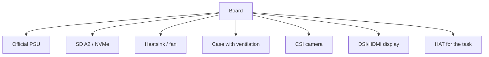

# Raspberry Pi boards and accessories - official PSU, SD, cases, cameras

![[assets/img/rpi-boards-choice-scheme.png|600]]
*Fig. Mandatory minimum: board + official PSU + A2 SD + cooling; then - camera, display, HAT.*

> [!tip] What this note is
> Purchase checklist: what is mandatory, what is advised, what to skip. Half of "dead" Pi boards - savings on PSU and SD card. After purchase - [[00-Start/05-Vibir-seredovischa|environment]] and flashing. Boards in detail: Pi 5 flagship.

## 1. Goal

Assemble the kit on the first try:

- mandatory minimum for each model;
- how to tell a good PSU and SD card from trash;
- cooling: when a heatsink is enough, when a fan is needed;
- cameras and displays: genuine versus compatible.

## 2. Mandatory minimum

| Model | PSU | Media | Cooling |
| --- | --- | --- | --- |
| Pi 5 | USB-C PD 27W (5V 5A) | SD A2 / NVMe-HAT | active fan |
| Pi 4 | USB-C 15W (5V 3A) | SD A2 | heatsink minimum |
| Zero 2 W | micro-USB 12.5W | SD A2 | usually not needed |
| Pico (W) | micro-USB from PC/PSU | onboard flash (2 MB) | not needed |
| CM4/CM5 | from carrier board | eMMC / NVMe / SD | by load |

Official PSU - not marketing: holds 5.1V at peak, cheap ones sag to 4.6V and raise lightning.

## 3. SD cards: how to choose

- A2 class (Application Performance) - random OS operations, not only stream;
- 32-64 GB size for the system, more - for media/logs;
- brands with a controller for Linux load (Samsung EVO, SanDisk Extreme);
- fake check: `f3` or H2testw full size before flashing;
- spare: back up the SD image with `dd` monthly (see memory media).

## 4. Cases and cooling

- Pi 5 with no fan throttles in minutes under load - active cooling is mandatory;
- official case with fan - quiet and enough for a server;
- metal heatsink cases (Flirc) - silent alternative;
- Zero - bare or mini case, no overheating;
- thermal pad instead of paste on SoC - simpler and enough.

## 5. Cameras and displays

| Accessory | Genuine | Compatible | Note |
| --- | --- | --- | --- |
| Camera Module 3 | 12 MP, autofocus | ArduCam analogues | CSI camera |
| AI Camera | Sony IMX500 + Hailo | - | CSI camera |
| Display 7" DSI | 800x480, touch | Waveshare analogues | [[11-Vivid/01-DSI-HDMI-Displeyi.en | displays]] |
| Display 5" DSI | compact | - | displays |

CSI/DSI flexes are fragile: 90-degree bend near the connector - a break. A spare flex in the bag saves a week.

## 5.1 Cables and adapters

| Adapter | Why | Note |
| --- | --- | --- |
| micro-HDMI to HDMI | Pi 4/Zero to monitor | two ports on Pi 4, one on Zero |
| USB-OTG micro | keyboard/mouse on Zero | powered hub for two devices |
| Quality USB-C | power with no sags | thick wires, length to 1.5 m |
| CSI/DSI flexes | camera/display | various lengths, spare in bag |
| GPIO extender | HAT over case | stacking header 2x20 |

Cheap unshielded micro-HDMI cables sparkle on a 4K picture. For Zero take a proven cable at once.

## 6. Where to buy and what to skip

- official resellers (list on raspberrypi.com) - warranty and fresh revisions;
- marketplaces - only with seller check, many PSU clones;
- Do NOT take: no-brand "5V 3A" PSU, SD with no A2 class, deaf cases with no ventilation;
- HATs - for the task after the first start, not "in reserve".

## 7. Kit budgets (order)

| Kit | Scope | Landmark |
| --- | --- | --- |
| Zero 2 W minimum | board + PSU + 32 GB SD | cheapest Linux entry |
| Pi 4 standard | 4 GB board + PSU + 64 GB SD + case | workhorse |
| Pi 5 maximum | 8 GB board + PD 27W + NVMe + fan + case | server/desktop |
| Pico start | Pico W + breadboard + wires + sensor | microcontroller entry |

## 7.1 Maker desk tools

| Tool | Why | Minimum |
| --- | --- | --- |
| Multimeter | 5V/3V3, beeping, USB current | any digital one |
| USB tester | power volts/amps/watt-hours | with screen, to 3A+ |
| Screwdrivers/tweezers | case screws, jumpers | PH0/PH1, sharp tweezers |
| Soldering iron + flux | Pico headers, wires | 60W adjustable, cone tip |
| Logic analyzer | live I2C/SPI/UART | 8 channels, 24 MHz (Saleae clone) |
| Lab PSU | sag imitation, currents | 0-15V, 0-3A with limit |
| Thermometer/pyrometer | SoC and regulator heat | IR gun is enough |

With no multimeter and USB tester, power diagnosis - fortune telling. The analyzer pays off on the first silent bus.

Next level after the analyzer:

- oscilloscope sees sags and ringing hidden from digital capture;
- current clamps - current with no circuit break;
- phone thermal camera - hot regulators and shorts;
- lab PSU with limit - safe first power-on;
- smoke stopper (lamp in series) - saves from fireworks;
- loupe/microscope - solder microcracks and bridges.

## Common issues

| Symptom | Cause | Fix |
| --- | --- | --- |
| Lightning on screen | weak PSU | official PSU for the model |
| Random hangs | fake SD | f3 check, swap to A2 |
| Pi 5 drops frequency | no cooling | fan + thermal pad |
| Black camera | flex wrong side | blue stripe to connector, latch it |
| HAT did not fit | case blocks header | header extender (stacking header) |
| Overpaid twice | "all inclusive" kit with trash | buy from the section 2 checklist |

## 9. Related notes

- [[00-Start/03-Porivnyannya-plate|board comparison]] - board choice.
- [[14-Devboards/01-Pi5-Flagman.en|Pi 5 flagship]] - board in detail.
- [[02-Zhivlennya/01-USB-C-PD.en|USB-C power]] - power demands.
- [[08-Pamyat/01-SD-eMMC-NVMe.en|memory media]] - SD and NVMe.
- [[10-Sensori/06-Kamera-CSI.en|CSI camera]] - cameras in detail.

## Official sources

- [Raspberry Pi 4 Model B (Raspberry Pi)](https://www.raspberrypi.com/products/raspberry-pi-4-model-b/) - kit and power.
- [Raspberry Pi Zero 2 W (Raspberry Pi)](https://www.raspberrypi.com/products/raspberry-pi-zero-2-w/) - tiny one and accessories.
- [Compute Module 4 (Raspberry Pi)](https://www.raspberrypi.com/products/compute-module-4/) - embedding and media.
- [RP2350 Datasheet (Raspberry Pi)](https://datasheets.raspberrypi.com/rp2350/rp2350-datasheet.pdf) - Pico 2 crystal.
