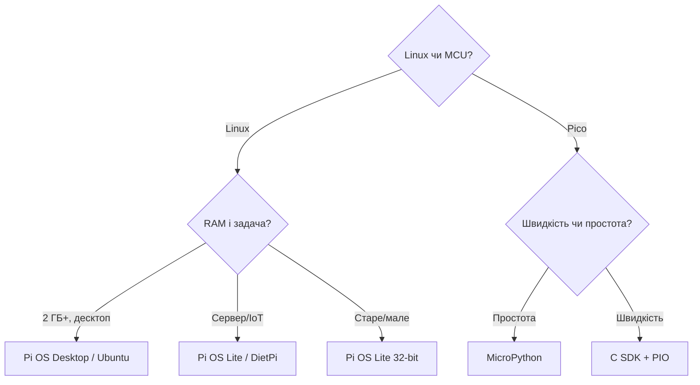

# Вибір середовища Raspberry Pi - Pi OS, Ubuntu, DietPi і Pico SDK

EN version: `00-Start/05-Environment-Choice.en.md`

![[assets/img/rpi-os-choice-scheme.png|600]]
*Рис. Вибір за гілками: Linux-моделі - Pi OS/Ubuntu/DietPi, Pico - C SDK або MicroPython.*

> [!tip] Що це за нота
> Софт під залізо: яка ОС на яку плату, коли вистачить Lite без десктопа, чим шити Pico. Після вибору - прошивка: прошивка Imager. Плати: [[00-Start/03-Porivnyannya-plate|порівняння моделей]].

## 1. Мета

Поставити правильний софт з першого разу:

- ОС під Linux-моделі за ресурсами і задачею;
- Lite проти Desktop: коли графіка не потрібна;
- Pico: C SDK проти MicroPython - швидкість проти простоти;
- інструменти прошивки і віддаленої роботи.

## 2. ОС для Linux-моделей

| ОС | Коли брати | Обмеження |
| --- | --- | --- |
| Raspberry Pi OS Desktop | десктоп, навчання, медіа | треба 2+ ГБ RAM |
| Raspberry Pi OS Lite | сервери, IoT, Zero | немає графіки (це плюс) |
| Ubuntu Server/Desktop | знайомий apt-стек, ROS | важча за Pi OS |
| DietPi | мінімум ресурсів, Zero/1 | менше «з коробки» |
| RetroPie/Recalbox | ретро-ігри | окремі образи |

Bookworm (Debian 12) - актуальна база Pi OS: Wayland за замовчуванням, NetworkManager, новий стек камер libcamera.

## 3. Pico: C SDK проти MicroPython

| Критерій | MicroPython | C SDK |
| --- | --- | --- |
| Старт | UF2 перетягнув - працює | тулчейн, CMake, компіляція |
| Швидкість | вистачає датчикам | максимум, PIO, DMA |
| Бібліотеки | модулі з коробки | драйвери руками |
| Налагодження | REPL по USB | SWD + gdb |
| Вибір | навчання, прототипи | продакшн, таймінги |

Thonny IDE - стандарт для MicroPython: REPL, плоттер, прошивка UF2 в один клік.

## 4. Прошивка і доступ

- Imager: ОС на SD + SSH + WiFi + користувач - все в одному вікні;
- headless: файл `ssh` і `wpa_supplicant` більше не потрібні - все робить Imager;
- SSH: ключі замість паролів, порт за замовчуванням міняємо;
- VNC/wayvnc - графічний доступ, RDP - альтернатива;
- Pico: BOOTSEL + перетягнути UF2, або `picotool` з консолі.

## 4.1 Віддалений доступ детально

| Спосіб | Коли | Команда |
| --- | --- | --- |
| SSH ключі | завжди, база | `ssh-copy-id user@host` |
| SSH тунель | веб-морда ззовні | `ssh -L 8080:localhost:80 user@host` |
| VNC/wayvnc | потрібен стіл | увімкнути в `raspi-config` |
| VS Code Remote | розробка на платі | розширення Remote-SSH |
| Tailscale | доступ без білого IP | один демон, вся мережа |

Парольну автентифікацію SSH вимикаємо після налаштування ключів. Порт 22 закриваємо від світу або ховаємо за VPN.

## 5. Python-стек мейкера

- gpiozero - GPIO/ШІМ/датчики трьома рядками;
- lgpio/gpiod - коли треба швидкість і переривання;
- smbus2/spidev/pyserial - шини безпосередньо;
- paho-mqtt/requests - хмара;
- venv на кожен проєкт - системний Python не засмічуємо.

## 6. C-стек просунутого

- ядро і Device Tree overlays (`config.txt`, `/boot/firmware/overlays/README`);
- `raspi-config` - перший інструмент, далі руками;
- компіляція на платі - для малого, крос-компіляція - для ядра;
- EEPROM-конфіг Pi 4/5 - порядок завантаження (див. [[09-Proshivka/02-EEPROM-Boot|завантаження EEPROM]]).

## 7. Версії і сумісність

| Плата | ОС | Pico-середовище |
| --- | --- | --- |
| Pi 5 / 400 / 500 | Pi OS Bookworm 64-bit | - |
| Pi 4 / Zero 2 W | Pi OS Bookworm 32/64-bit | - |
| Pico / Pico W | - | MicroPython / C SDK |
| Pico 2 / 2 W | - | MicroPython / C SDK (M33) |
| CM4 / CM5 | Pi OS Lite / Ubuntu Server | - |

## 7.1 Бекапи і відкат системи

| Задача | Інструмент | Період |
| --- | --- | --- |
| Повний образ SD | Imager / `dd` / PiShrink | раз на місяць |
| Конфіги `/etc` | git-репозиторій | при кожній зміні |
| Дані проєкту | rsync на NAS | щодня cron |
| Список пакетів | `dpkg --get-selections` | перед апгрейдом |
| Відкат ядра | попереднє ядро в boot | тримати 2 версії |

Золоте правило: SD-карта вмре - питання коли, а не чи. Бекап образу 32 ГБ стискається PiShrink до 3-5 ГБ і лежить на полиці.

Перевірка бекапу:

- розгорнути на запасну карту раз на квартал;
- завантажитись і залогінитись - бекап живий;
- неробочий бекап гірший за його відсутність;
- дві копії в різних місцях (дім + хмара);
- дата на імені файлу образу, без пробілів.

## 8. Типові помилки

| Симптом | Причина | Лікування |
| --- | --- | --- |
| Стара ОС не бачить Pi 5 | образ старший за Bookworm | свіжий Imager + останній образ |
| Немає SSH після прошивки | не увімкнули в Imager | вкладка сервісів Imager: SSH + користувач |
| MicroPython не імпортує модуль | прошивка без модуля | повна UF2 з модулями або `mip` |
| C SDK не збирається | немає ARM-тулчейну | `arm-none-eabi-gcc` + pico-sdk за гайдом |
| Wayland ламає старий код | дисплейний сервер змінився | X11-сесія або оновлення бібліотек |
| Python плутає пакети | все в системний інтерпретатор | venv на проєкт, `pip` тільки туди |

## 9. Суміжні ноти

- [[09-Proshivka/01-Imager-Headless|прошивка Imager]] - перша прошивка покроково.
- [[09-Proshivka/03-OS-Nalashtuvannya|налаштування ОС]] - система після старту.
- [[14-Devboards/03-Pico-W-Family|родина Pico]] - плати мікроконтролерів.
- [[03-GPIO/01-Header-Gpiozero|гребінка і gpiozero]] - перший код.
- [[00-Start/03-Porivnyannya-plate|порівняння моделей]] - залізо під софт.

## Офіційні джерела

- [Raspberry Pi OS (Raspberry Pi)](https://www.raspberrypi.com/software/) - редакції і Imager.
- [rpi-imager (Raspberry Pi, GitHub)](https://github.com/raspberrypi/rpi-imager) - опції headless-прошивки.
- [RP2040 Datasheet (Raspberry Pi)](https://datasheets.raspberrypi.com/rp2040/rp2040-datasheet.pdf) - PIO і периферія Pico.
- [gpiozero docs (Read the Docs)](https://gpiozero.readthedocs.io/en/stable/) - перший Python-код.
