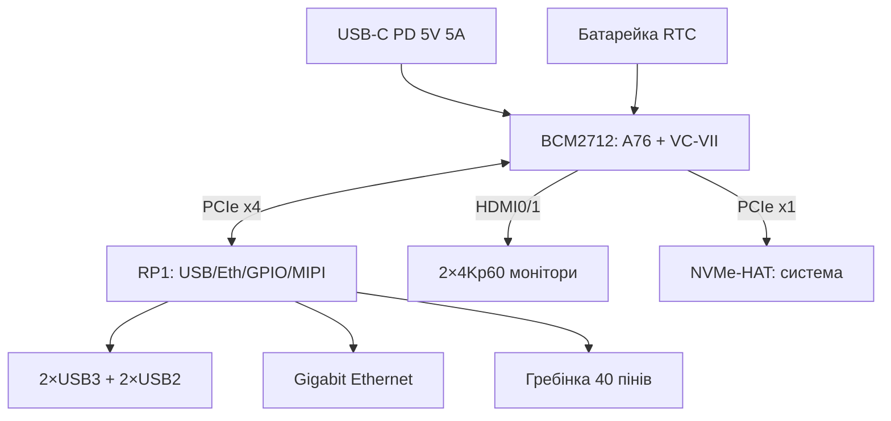

# BCM2712 і Raspberry Pi 5 - A76, PCIe, RP1 і живлення PD

![[assets/img/rpi-bcm2712-pi5-scheme.png|600]]
*Рис. BCM2712 (CPU+GPU) + RP1 (вся периферія) + PCIe (NVMe) + RTC: анатомія флагмана.*

> [!tip] Що це за нота
> Глибокий розбір флагмана: що дає швидкість, куди поділась периферія, як живити і охолоджувати. Огляд лінійки: [[01-Hardware/01-SoC-Oglyad|огляд SoC]], плата як виріб: [[14-Devboards/01-Pi5-Flagman|флагман Pi 5]].

## 1. Мета

Вичавити з Pi 5 усе без сюрпризів:

- де ховається приріст 2-3× проти Pi 4;
- як увімкнути PCIe/NVMe і RTC;
- живлення 5V 5A: коли вистачить 3A, а коли ні;
- охолодження під тривалим навантаженням.

| Блок | BCM2712 | Приріст проти Pi 4 |
| --- | --- | --- |
| CPU | 4×A76 2.4 ГГц, 512 КБ L2 + 2 МБ L3 | ~2.5× |
| GPU | VideoCore VII 800 МГц, Vulkan 1.3 | ~2× |
| RAM | LPDDR4X-4267 до 16 ГБ | швидша шина |
| I/O | RP1 по PCIe x4 | без заторів VLI |
| Диски | PCIe 2.0 x1 для NVMe | було лише USB3 |

## 2. Архітектура плати



Кнопка живлення на платі - вперше: коротке натискання (меню), довге (вимкнення). UART-консоль виведена окремим 3-піновим роз'ємом.

## 3. PCIe і NVMe

- роз'єм FPC PCIe 2.0 x1 - офіційні HAT NVMe (M.2 2230/2242);
- увімкнення: `dtparam=pciex1` у config.txt + свіжий EEPROM;
- система з NVMe: прошивка Imager прямо на диск, SD не потрібна;
- швидкість ~500 МБ/с - межа x1 лінії, для сервера вистачає;
- SSD без DRAM-буфера гріється менше - брати такі.

## 4. RTC з батарейкою

- роз'єм JST-SH 2-піновий під акумулятор (офіційний);
- час живе без мережі - логер у полі без NTP;
- будильник пробудження: `echo +60 > /sys/class/rtc/rtc0/wakealarm`;
- fake-hwclock більше не потрібен, видаляємо пакет.

## 5. Живлення 5V 5A

- офіційний БЖ 27W (PD): 5V 5A для плати + USB-периферії;
- старий БЖ 3A - працює, але USB обмежаться 600 мА сумарно;
- попередження ядра про слабке живлення - дивитись `dmesg`;
- PoE+ HAT - альтернатива для стелі/шафи (див. живлення).

## 6. Охолодження

| Навантаження | Пасив | Активний кулер | Корпус з кулером |
| --- | --- | --- | --- |
| Простій | 45 °C | 35 °C | 38 °C |
| Сервер | 70 °C | 55 °C | 58 °C |
| Повний стрес | тротлінг 80 °C+ | 65 °C | 68 °C |

Тротлінг починається з 80 °C: частота падає, сервер гальмує. Для 24/7 - активний кулер обов'язково.

## 7. Робочий код: монітор плати

```python
from gpiozero import CPUTemperature
import time
import os

cpu = CPUTemperature()
ALARM = '/sys/class/hwmon/hwmon0/in0_lcrit_alarm'

while True:
    t = cpu.temperature
    with open('/sys/devices/system/cpu/cpufreq/policy0/scaling_cur_freq') as f:
        freq = int(f.read()) // 1000
    volt = 'n/a'
    if os.path.exists(ALARM):
        volt = open(ALARM).read().strip()
    print(f"CPU {t:.1f}C {freq}MHz undervolt:{volt}")
    time.sleep(5)
```

Прапорець undervoltage - перша ознака слабкого БЖ. При спрацюванні міняємо живлення, не ігноруємо.

## 7.1 PCIe-пристрої крім NVMe

Лінія x1 - не лише диски:

- Coral TPU (PCIe-версія) - ML-інференс без USB;
- Ethernet 2.5G-карти - маршрутизатор на стероїдах;
- SATA-контролери - масив HDD для NAS;
- CAN-FD і RS485 промислові карти;
- обмеження: одна лінія, живлення HAT до 5W без зовнішнього.

Перед покупкою карти - перевірити драйвер під ядро Bookworm: `lspci -k` покаже, хто підхопив пристрій.

Сумісність живлення:

- слот дає 3.3V, 5V беремо з гребінки або окремо;
- карти з власним живленням (SATA) - стабільніші;
- сумарний бюджет плати не гумовий - рахуємо вати.

## 8. Типові помилки

| Симптом | Причина | Лікування |
| --- | --- | --- |
| NVMe не видно | немає `dtparam=pciex1` | config.txt + перезавантаження |
| Блискавка з БЖ 3A | USB-периферія їсть струм | офіційний PD 27W або менше USB |
| Тротлінг під навантаженням | немає кулера | активне охолодження |
| Час скидається | немає батарейки RTC | JST-акумулятор, `hwclock -w` |
| Не стартує зі старою SD | образ старіший за Bookworm | свіжий образ під Pi 5 |
| Вентилятор реве | крива за замовчуванням | `pwm-fan` оверлей з гістерезисом |

## 9. Суміжні ноти

- [[01-Hardware/01-SoC-Oglyad|огляд SoC]] - місце BCM2712 в лінійці.
- [[14-Devboards/01-Pi5-Flagman|флагман Pi 5]] - плата як виріб.
- [[02-Zhivlennya/01-USB-C-PD|живлення USB-C]] - БЖ детально.
- [[09-Proshivka/02-EEPROM-Boot|завантаження EEPROM]] - прошивка завантажувача.
- [[08-Pamyat/01-SD-eMMC-NVMe|носії пам'яті]] - NVMe детально.

## 9.1 Швидка шпаргалка Pi 5

- живлення: PD 27W, інакше USB-обмеження;
- диск: `dtparam=pciex1` + свіжий EEPROM;
- тепло: кулер для 24/7, тротлінг з 80 °C;
- час: JST-батарейка + `hwclock -w`;
- монітор: `vcgencmd` температура і тротлінг.

## Офіційні джерела

- [Raspberry Pi 5 (Raspberry Pi)](https://www.raspberrypi.com/products/raspberry-pi-5/) - характеристики, живлення, PCIe.
- [Getting Started (Raspberry Pi docs)](https://www.raspberrypi.com/documentation/computers/getting-started.html) - перший запуск Pi 5.
- [gpiozero docs (Read the Docs)](https://gpiozero.readthedocs.io/en/stable/) - моніторинг CPU і пінів.
