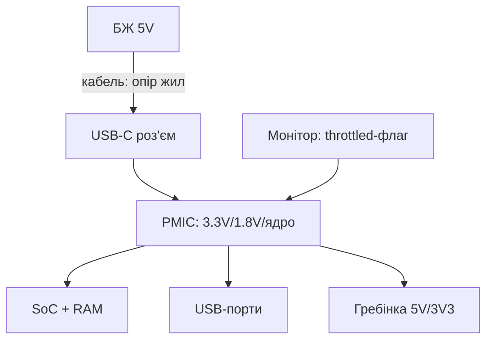

# Живлення Raspberry Pi - USB-C PD, просадки і блискавка undervoltage

![[assets/img/rpi-usb-c-pd-scheme.png|600]]
*Рис. Ланцюг живлення: БЖ 5V → якісний кабель → USB-C → PMIC → 3.3V/1.8V; слабка ланка дає блискавку.*

> [!tip] Що це за нота
> Причина №1 всіх «дивних» глюків: слабке живлення. Блискавка на екрані, випадкові ребути, відвали USB - усе звідси. Вибір комплекту: [[00-Start/04-Devkit-plati|плати і аксесуари]], моніторинг: [[01-Hardware/02-BCM2712-Pi5|BCM2712 і Pi 5]].

## 1. Мета

Закрити живлення раз і назавжди:

- скільки ампер треба кожній моделі насправді;
- офіційний БЖ проти «5V 3A з ринку»;
- кабель як джерело просадок (опір жил!);
- діагностика: прапорець, USB-тестер, логи.

| Модель | Штатний БЖ | Реальний пік | USB-ліміт |
| --- | --- | --- | --- |
| Pi 5 | PD 27W (5V 5A) | ~12W | 1.6A сумарно |
| Pi 5 з БЖ 3A | працює, USB різано | ~8W | 600 мА |
| Pi 4 | 15W (5V 3A) | ~7W | 1.2A сумарно |
| Zero 2 W | 12.5W (5V 2.5A) | ~2W | OTG-хаб окремо |
| Pico | USB 5V / VSYS | ~0.5W | - |

## 2. Архітектура живлення



Просадка в будь-якій ланці - undervoltage: ядро скидає частоту, USB відвалюються, SD б'ється. Прапорець лишається до ребута.

## 3. Офіційні БЖ детально

- 27W PD (Pi 5): 5V 5A по PD-протоколу, кабель в комплекті;
- 15W (Pi 4): 5V 3A, USB-C без PD;
- 12.5W micro-USB: Zero/старі;
- 5.1V замість 5.0V - запас на падіння в кабелі (фішка офіційних);
- клони «5V 3A»: брешуть про струм, просідають до 4.5V.

## 4. Кабель вирішує

- опір жил: тонкий 28AWG на 1.5 м = −0.5V при 3A;
- якісний короткий кабель 20AWG - must-have;
- USB-тестер у розриві показує правду: вольти під навантаженням;
- тест: `stress-ng` + дивитись напругу і прапорець;
- хаби без живлення + диски = гарантовані відвали.

## 5. Робочий код: вартовий живлення

```python
import subprocess
import time

def get_throttled():
    out = subprocess.check_output(['vcgencmd', 'get_throttled']).decode()
    return int(out.strip().split('=')[1], 16)

FLAGS = {
    0x1: 'undervoltage зараз',
    0x2: 'тротлінг ARM зараз',
    0x4: 'тротлінг температури зараз',
    0x10000: 'undervoltage був',
    0x20000: 'тротлінг був',
    0x40000: 'перегрів був',
}

while True:
    v = get_throttled()
    if v == 0:
        print('power OK')
    else:
        for bit, msg in FLAGS.items():
            if v & bit:
                print('ALARM:', msg)
    time.sleep(60)
```

Ненульовий прапорець після доби - привід міняти БЖ/кабель, навіть якщо « наче працює». Історія не бреше.

## 6. USB-ліміти і периферія

- Pi 5 + PD: 1.6A на всі USB разом (1.2A - ліміт Pi 4, не плутати);
- Pi 5 + БЖ 3A: ядро ріже до 600 мА (попередження в логах);
- SSD 2.5" + ще щось - через хаб з живленням;
- вимірюємо USB-тестером, не гадаємо;
- PoE-варіант - окрема нота живлення по витій парі.

## 7. Поле і батареї

- павербанк з PD-тригером: просити 5V профіль явно;
- 12V→5V buck в авто: піки стартера не мають доходити;
- суперконденсатор на вхід - пережити короткі провали;
- сонячна панель + MPPT + акумулятор - повна автономія;
- детальніше - ноти PoE і UPS розділу живлення.

## 8. Типові помилки

| Симптом | Причина | Лікування |
| --- | --- | --- |
| Блискавка на екрані | слабкий БЖ/кабель | офіційний БЖ + короткий кабель |
| Випадкові ребути під навантаженням | просадка в піку | USB-тестер, заміна ланки |
| USB-диск зникає | ліміт струму порту | хаб з живленням |
| Прапорець після ночі | нічний пік/нагрів | лог throttled, кулер |
| Не стартує взагалі | 4.0V на вході | міряти на TP1/гребінці, міняти БЖ |
| Гріється сам БЖ | перевантаження/підробка | запас 30 % по струму, оригінал |

## 9. Швидка шпаргалка живлення

- Pi 5 - тільки PD 27W для повного USB;
- кабель короткий і товстий, не з ящика;
- `vcgencmd get_throttled` - перша команда при глюках;
- USB-диски - через хаб з живленням;
- PoE/UPS - для 24/7 і поля.

## 10. Суміжні ноти

- [[00-Start/04-Devkit-plati|плати і аксесуари]] - вибір БЖ.
- [[01-Hardware/02-BCM2712-Pi5|BCM2712 і Pi 5]] - апетити флагмана.
- [[14-Devboards/01-Pi5-Flagman|флагман Pi 5]] - USB-ліміти плати.
- [[09-Proshivka/03-OS-Nalashtuvannya|налаштування ОС]] - моніторинг здоров'я.
- [[Home|головна карта]] - повна навігація.

## 9.1 Діагностика за 5 хвилин

- блискавка/ребути → USB-тестер у розрив, дивитись вольти;
- `vcgencmd get_throttled` → розшифрувати біти прапорця;
- підмінити БЖ і кабель по черзі - знайти винну ланку;
- USB-диски вимкити на час тесту;
- записати значення до/після - для історії вузла.

## Офіційні джерела

- [27W Power Supply (Raspberry Pi)](https://www.raspberrypi.com/products/27w-power-supply/) - PD-профіль, сумісність.
- [Raspberry Pi 5 (Raspberry Pi)](https://www.raspberrypi.com/products/raspberry-pi-5/) - вимоги живлення.
- [Getting Started (Raspberry Pi docs)](https://www.raspberrypi.com/documentation/computers/getting-started.html) - перший запуск і живлення.
