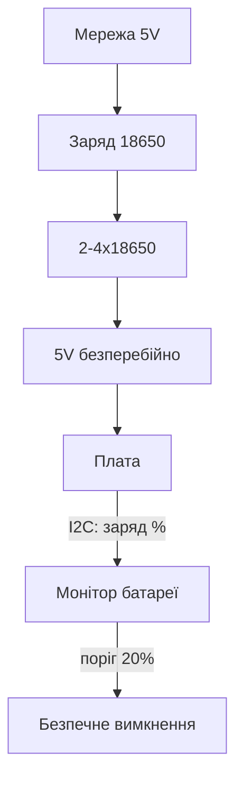

# Безперебійне живлення Raspberry Pi - UPS HAT, 18650 і суперконденсатори

![[assets/img/rpi-ups-18650-scheme.png|600]]
*Рис. UPS-тракт: мережа → заряд → 18650 → безперебійні 5V; скрипт гасить систему до розряду.*

> [!tip] Що це за нота
> Поле і нестабільна мережа: вузол переживає вимкення і коректно гасне, а не б'є SD-карту. 18650-HAT-плати, скрипт shutdown, суперконденсатори для коротких провалів. База: [[02-Zhivlennya/01-USB-C-PD|живлення USB-C]], [[02-Zhivlennya/02-PoE-HAT|живлення PoE]].

## 1. Мета

Пережити блекаут без втрат:

- UPS-HAT-плата: вибір під модель плати;
- 18650: скільки тримає і як заряджати;
- скрипт безпечного вимкнення за порогом батареї;
- суперконденсатори для провалів до хвилини.

| Варіант | Час резерву | Для чого |
| --- | --- | --- |
| UPS HAT + 2×18650 | 2-6 годин (залежно від плати) | поле, дача |
| UPS HAT + 4×18650 | 6-12 годин | доба без світла |
| Суперконденсатор 100F | 1-3 хвилини | коректне вимкнення |
| Павербанк з UPS-режимом | години | швидко і грубо |

## 2. Архітектура резерву



Ключове: плата не має знати про вимкення, поки є заряд. Дізнається - лише для коректного shutdown.

## 3. UPS-HAT-плати: що брати

- Waveshare UPS HAT (C): I2C-монітор, кнопки, підтримка Pi 4/5;
- DFRobot Solar Power Manager: сонце + батарея + USB-вихід;
- дивитись: струм віддачі (3A мінімум для Pi 4/5), прохідне заряджання;
- 18650 тільки з захистом (protected) або плата BMS на HAT-платі;
- ємність чесна: 3000 мАг банка = ~10 Вт-год корисних.

## 4. Скрипт безпечного вимкнення

```python
import time
import os
import smbus

bus = smbus.SMBus(1)
LOW_BAT = 20
SHUTDOWN_FILE = '/tmp/lowbat.flag'

def battery_pct():
    raw = bus.read_word_data(0x36, 0x04)
    return ((raw & 0xFF) << 8 | (raw >> 8)) / 256.0

low_since = None
while True:
    pct = battery_pct()
    print(f"battery {pct:.0f}%")
    if pct < LOW_BAT:
        if low_since is None:
            low_since = time.time()
        if time.time() - low_since > 300:
            os.system('sudo shutdown -h now')
    else:
        low_since = None
    time.sleep(60)
```

Гістерезис 5 хвилин нижче порогу - захист від хибних спрацювань на піках. Адресу I2C-монітора дивитись в мануалі конкретної HAT-плати.

## 5. Суперконденсатори

- 2×100F послідовно (5.4V) через балансувальні резистори;
- вистачає на 1-3 хвилини - встигнути записати кеш і згаснути;
- заряд через обмежувальний резистор (інакше іскра);
- не плутати з батареями: саморазряд за добу;
- ідеальні для «моргнуло світло», не для ночі.

## 6. Розрахунок автономності

| Споживання | 2×18650 (20 Вт-год) | 4×18650 (40 Вт-год) |
| --- | --- | --- |
| Zero 2 W, 1W | ~18 годин | ~36 годин |
| Pi 4 простій, 3W | ~6 годин | ~12 годин |
| Pi 5 сервер, 7W | ~2.5 години | ~5 годин |
| Pi 5 стрес, 12W | ~1.5 години | ~3 години |

ККД перетворювача ~85 % уже враховано. Холод з'їдає 20-30 % ємності - взимку запас подвійний.

## 7. 18650: правила безпеки

- тільки захищені банки або BMS на HAT-платі;
- не паяти безпосередньо до банок - точкове зварювання або тримачі;
- зберігання - заряд 40-60 %, прохолода;
- здулась/гріється - в утилізацію, не в шухляду;
- зарядний струм 0.5C максимум для довголіття.

## 8. Типові помилки

| Симптом | Причина | Лікування |
| --- | --- | --- |
| Вимикається одразу при вимкенні | HAT-плата не тримає струм піка | HAT-плата на 3A+, батареї свіжі |
| Бита SD після блекауту | не було shutdown-скрипта | скрипт + поріг 20 % |
| Павербанк перемикається з паузою | немає UPS-режиму (pass-through) | тільки pass-through моделі |
| Заряд стоїть на 80 % | перегрів при заряді | вентиляція, менший струм |
| Швидко сідає вночі | WiFi не спить | modem-sleep, рідші опитування |
| Суперконденсатор не тримає | саморазряд + витік | тільки для хвилинних провалів |

## 9. Швидка шпаргалка резерву

- HAT-плата на 3A + захищені 18650;
- shutdown-скрипт з гістерезисом 5 хв;
- бекап SD до сезону блекаутів;
- суперконденсатор - на моргання, не на ніч;
- тест: висмикнути живлення і засікти час.

## 10. Суміжні ноти

- [[02-Zhivlennya/01-USB-C-PD|живлення USB-C]] - штатне живлення.
- [[02-Zhivlennya/02-PoE-HAT|живлення PoE]] - альтернатива з мережі.
- [[09-Proshivka/03-OS-Nalashtuvannya|налаштування ОС]] - systemd-сервіс скрипта.
- [[14-Devboards/04-Zero-2W|малюк Zero 2 W]] - найживучіший вузол.
- [[Home|головна карта]] - повна навігація.

## 9.1 Тест резерву щокварталу

- висмикнути мережу, засікти час до shutdown;
- перевірити лог: поріг, гістерезис, коректне гасіння;
- виміряти ємність банок розрядом (старіють!);
- почистити контакти тримачів від окислів;
- оновити дату наступного тесту на стікері.

## Офіційні джерела

- [UPS HAT C (Waveshare Wiki)](https://www.waveshare.com/wiki/UPS_HAT_(C)) - I2C-монітор, кнопки, схеми.
- [Raspberry Pi OS (Raspberry Pi)](https://www.raspberrypi.com/software/) - система для вузла.
- [gpiozero docs (Read the Docs)](https://gpiozero.readthedocs.io/en/stable/) - кнопки і LED HAT-плати.
