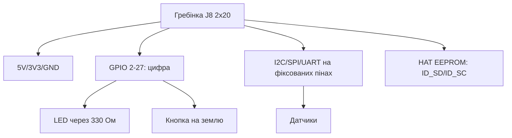

# Гребінка 40 пінів і gpiozero - перший LED, кнопка і датчик

EN version: `03-GPIO/01-Header-Gpiozero.en.md`

![[assets/img/rpi-header-gpiozero-scheme.png|600]]
*Рис. Гребінка J8: 5V/3V3/GND - живлення, зелені - GPIO, сині - шини; нумерація BCM, не за порядком!*

> [!tip] Що це за нота
> Перша залізна нота: де який пін, чому нумерація дивна, як не спалити плату. gpiozero - три рядки на LED. Глосарій: [[00-Start/02-Glosariy|глосарій термінів]], перший код: [[00-Start/01-Yak-koristuvatis-dovidnikom|як користуватись]].

## 1. Мета

За вечір дійти до робочої схеми:

- карта гребінки: живлення, земля, GPIO, шини;
- BCM-нумерація проти фізичних номерів - раз і назавжди;
- 3.3V правила: що можна, що вбиває;
- gpiozero: LED, кнопка, датчик руху.

| Група пінів | Кількість | Призначення |
| --- | --- | --- |
| 5V | 2 піни (2, 4) | живлення HAT/модулів |
| 3V3 | 2 піни (1, 17) | логіка, до 500 мА сумарно |
| GND | 8 пінів | земля поруч із сигналом! |
| GPIO | 26 пінів | цифра, ШІМ, шини |
| ID_SD/ID_SC | 2 піни | EEPROM HAT (не чіпати!) |

## 2. Архітектура гребінки



Нумерація BCM = номер GPIO-контролера, не місце на гребінці. GPIO17 - це пін 11 фізично. Плутанина BOARD vs BCM - класика першого дня.

## 3. Карта ключових пінів

| BCM | Фіз. пін | Функції |
| --- | --- | --- |
| 2, 3 | 3, 5 | I2C SDA/SCL (підтяжки на платі!) |
| 14, 15 | 8, 10 | UART TXD/RXD, консоль |
| 18 | 12 | ШІМ0 (звук, яскравість) |
| 23, 24, 25 | 16, 18, 22 | вільні GPIO |
| 7-11 | 26-23 | SPI0 (CE1/CE0/MISO/MOSI/SCLK) |
| 17, 27 | 11, 13 | перші для LED/кнопок |
| 5, 6, 13, 19, 26 | 29-37 | SPI1/додаткові |

I2C-підтяжки вже на платі - свої не ставимо. UART-консоль вимикаємо, якщо порт потрібен модему.

## 4. Правила 3.3V

- HIGH = 3.3V, LOW = 0V, поріг ~1.8V;
- 5V на GPIO - смерть піна (іноді всієї плати);
- 5V датчики - через перетворювач рівнів або подільник на вхід;
- струм піна: 16 мА максимум, сумарно ~50 мА;
- реле/мотори - тільки через транзистор/драйвер;
- довгі дроти - кручена пара сигнал+земля.

## 5. Робочий код: gpiozero

```python
from gpiozero import LED, Button, MotionSensor
from signal import pause

led = LED(17)
btn = Button(27, bounce_time=0.05)
pir = MotionSensor(23)

btn.when_pressed = led.on
btn.when_released = led.off
pir.when_motion = lambda: print("рух!")
pir.when_no_motion = lambda: print("тиша")

print("LED на GPIO17, кнопка на GPIO27, PIR на GPIO23")
pause()
```

`bounce_time` давить брязкіт кнопки. `pause()` тримає скрипт - колбеки працюють у фоні. LED через резистор 330 Ом (без нього - перевантаження піна!).

## 6. Кнопки, LED і датчики руху

- LED: анод через 330 Ом на GPIO, катод на землю;
- кнопка: між GPIO і землею, внутрішній pull-up gpiozero;
- PIR HC-SR501: вихід 3.3V - прямо на GPIO, живлення 5V;
- геркон/двері: як кнопка, тільки магнітом;
- кілька кнопок - окремі піни або матриця (див. переривання).

## 7. Права без sudo

- користувач у групах `gpio`, `i2c`, `spi`;
- udev-правила вже налаштовані в Pi OS;
- `sudo python` для GPIO - антипатерн (і дірка безпеки);
- перевірка: `groups` показує членство після перелогіну.

## 8. Типові помилки

| Симптом | Причина | Лікування |
| --- | --- | --- |
| LED не світиться | переплутані BOARD/BCM номери | рахувати BCM, перевірити пін 11 = GPIO17 |
| Пін «вмер» | було 5V на вході | перетворювач рівнів/подільник, пін уже не врятувати |
| Кнопка дає 5 спрацювань | брязкіт контактів | `bounce_time=0.05` |
| I2C не бачить датчик | SDA/SCL переплутані | SDA→SDA (пін 3), SCL→SCL (пін 5) |
| Працює від root, не від юзера | немає груп gpio/i2c | `usermod -aG`, перелогін |
| HAT не визначається | зайняті ID_SD/ID_SC | звільнити піни 27/28 |

## 9. Швидка шпаргалка гребінки

- живлення: 5V піни 2/4, 3V3 піни 1/17;
- I2C: піни 3/5, підтяжки вже є;
- UART: піни 8/10, консоль вимкнути для модема;
- перший LED: GPIO17 (пін 11) + 330 Ом;
- перша кнопка: GPIO27 на землю + pull-up.

## 10. Суміжні ноти

- [[00-Start/02-Glosariy|глосарій термінів]] - усі терміни.
- [[03-GPIO/02-PWM-Pererivannya|ШІМ і переривання]] - наступний рівень.
- [[04-Shini/01-I2C-SPI-UART|шини I2C/SPI/UART]] - датчики на шинах.
- [[09-Proshivka/03-OS-Nalashtuvannya|налаштування ОС]] - групи і права.
- [[Home|головна карта]] - повна навігація.

## 11. Картка пінів у кишеню

- роздрукувати карту гребінки і заламінувати;
- маркером позначити зайняті піни проєкту;
- BCM-номери великими, фізичні - дрібними;
- червоним - 5V, синім - земля, зеленим - GPIO;
- картка поруч з макеткою завжди, не в шухляді.
- друга картка - розпиновка конкретного проєкту.
- оновлювати при зміні зайнятих пінів.

## Офіційні джерела

- [gpiozero docs (Read the Docs)](https://gpiozero.readthedocs.io/en/stable/) - LED, кнопки, датчики.
- [Getting Started (Raspberry Pi docs)](https://www.raspberrypi.com/documentation/computers/getting-started.html) - карта гребінки.
- [Raspberry Pi OS (Raspberry Pi)](https://www.raspberrypi.com/software/) - система з gpiozero.
