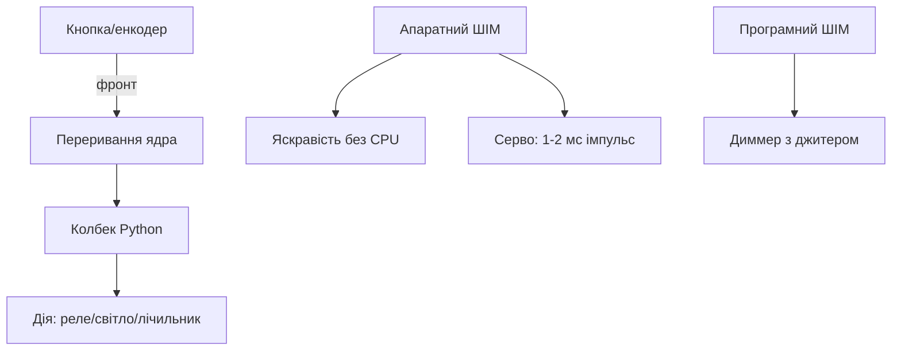

# ШІМ і переривання на Raspberry Pi - яскравість, серво і події

EN version: `03-GPIO/02-PWM-Interrupts.en.md`

![[assets/img/rpi-pwm-pererivannya-scheme.png|600]]
*Рис. Апаратний ШІМ - на фіксованих пінах, переривання - по фронтах; решта - програмна емуляція з джитером.*

> [!tip] Що це за нота
> Другий рівень GPIO: плавне керування і реакція на події без опитування в циклі. База: [[03-GPIO/01-Header-Gpiozero|гребінка і gpiozero]], далі - шини: [[04-Shini/01-I2C-SPI-UART|шини I2C/SPI/UART]] - нота черги 2.

## 1. Мета

Перейти від «увімкнути/вимкнути» до плавного керування:

- апаратний ШІМ: де є і чим відрізняється від програмного;
- серво: кути через ширину імпульсу;
- переривання: кнопки, енкодери, сигнали датчиків;
- lgpio: коли gpiozero повільний.

| Канал | Піни (BCM) | Апаратний? |
| --- | --- | --- |
| PWM0 | 12, 18 | так |
| PWM1 | 13, 19 | так |
| Решта GPIO | будь-які | програмний (джитер!) |
| Переривання | усі GPIO | по фронту/рівню |

## 2. Архітектура подій



Правило: в колбеку - швидко (прапорець/черга), важке - в основному потоці. Довгий колбек губить фронти.

## 3. Серво детально

- період 20 мс (50 Гц), імпульс 1-2 мс = 0-180°;
- живлення серво окремо (струм ривка до 1A!);
- земля спільна з платою обов'язково;
- калібрування min/max під конкретну модель;
- більше 2 серво - PCA9685 по I2C (16 каналів, 12 біт).

## 4. Кнопки і енкодери по перериваннях

- кнопка: фронт спаду + `bounce_time`;
- енкодер KY-040: два канали A/B, стан-автомат на 4 стани;
- швидкі імпульси (>1 кГц) - тільки C/lgpio, не Python;
- лічильник імпульсів - у колбеку лише `+= 1`.

## 5. Робочий код

```python
from gpiozero import PWMLED, Servo, Button
from gpiozero.pins.lgpio import LGPIOFactory
from signal import pause

factory = LGPIOFactory()
led = PWMLED(18, pin_factory=factory)
servo = Servo(12, pin_factory=factory,
              min_pulse_width=0.001, max_pulse_width=0.002)
btn = Button(27, bounce_time=0.05, pin_factory=factory)
counter = {'n': 0}

def brighter():
    led.value = min(1.0, led.value + 0.1)

def dimmer():
    led.value = max(0.0, led.value - 0.1)

btn.when_pressed = lambda: servo.mid()
servo.min()
led.pulse(fade_in_time=1, fade_out_time=1, n=None, background=True)

enc_btn = Button(22, bounce_time=0.02, pin_factory=factory)
enc_btn.when_pressed = lambda: counter.update(n=counter['n'] + 1)

print("серво, LED і лічильник активні")
pause()
```

`LGPIOFactory` - швидка фабрика пінів замість повільної за замовчуванням. `servo.mid/min/max` - готові позиції без математики.

## 6. lgpio: коли треба швидше

- gpiozero за замовчуванням - повільна фабрика (сумісність);
- lgpio - прямий доступ через kernel API;
- сповіщення (alerts) - мікросекундні мітки фронтів;
- ШІМ до МГц - програмно, але стабільно;
- установка: `pip install lgpio`, фабрика в кожен об'єкт.

## 7. Джитер і його межі

| Джерело | Джитер | Лікується |
| --- | --- | --- |
| Програмний ШІМ | ±100 мкс | апаратний канал |
| Python-колбек | ±1 мс | C/lgpio, короткі колбеки |
| WiFi-навантаження | сплески | ізольоване ядро (isolcpus) |
| SD-лаг | десятки мс | RAM-буфери, zram |

Для музики/серво без тремтіння - тільки апаратний ШІМ або PCA9685.

## 8. Типові помилки

| Симптом | Причина | Лікування |
| --- | --- | --- |
| Серво тремтить | програмний ШІМ | апаратні піни 12/13/18/19 |
| Пропуски натискань | довгий колбек | колбек - прапорець, робота - в потоці |
| Енкодер рахує назад | переплутані A/B | поміняти канали місцями |
| LED мерехтить | джитер програмного ШІМ | апаратний канал або PCA9685 |
| Серво не тримає | слабке живлення | окремий БЖ 5V 2A на серво |
| Кнопка «стріляє» | немає bounce_time | 20-50 мс за типом кнопки |

## 9. Швидка шпаргалка подій

- ШІМ без джитера: піни 12/13/18/19;
- серво: 50 Гц, 1-2 мс, живлення окремо;
- кнопки: фронт + bounce_time;
- швидке: lgpio-фабрика;
- колбек короткий, робота - в потоці.

## 10. Суміжні ноти

- [[03-GPIO/01-Header-Gpiozero|гребінка і gpiozero]] - перші піни.
- [[03-GPIO/03-HAT-EEPROM|HAT і EEPROM]] - плати розширення.
- Зовнішні АЦП для аналогових датчиків - нота черги 3.
- [[09-Proshivka/03-OS-Nalashtuvannya|налаштування ОС]] - групи і права.
- [[Home|головна карта]] - повна навігація.

## 9.1 Вибір: gpiozero чи lgpio

- gpiozero: навчання, повільні події, читабельність;
- lgpio: кілогерци, точні таймінги, довгі ШІМ;
- гібрид: логіка на gpiozero, критичне - на lgpio;
- перехід поступовий: спочатку фабрика, потім алерти;
- виміряти джитер до і після - цифрами, не відчуттями.

## Офіційні джерела

- [gpiozero docs (Read the Docs)](https://gpiozero.readthedocs.io/en/stable/) - PWMLED, Servo, події.
- [Getting Started (Raspberry Pi docs)](https://www.raspberrypi.com/documentation/computers/getting-started.html) - карта пінів і ШІМ.
- [Raspberry Pi OS (Raspberry Pi)](https://www.raspberrypi.com/software/) - система і бібліотеки.
