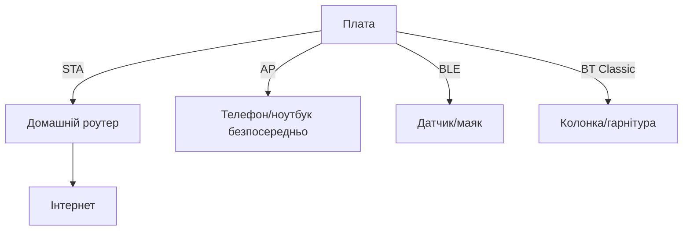

# Бортове радіо Raspberry Pi - WiFi, Bluetooth і антени

![[assets/img/rpi-wifi-bt-bort-scheme.png|600]]
*Рис. Одне радіо - три ролі: клієнт роутера, точка доступу, BLE-маяк; антена вирішує половину.*

> [!tip] Що це за нота
> WiFi і BT вже на платі: не треба донглів для 90 % задач. Режими, швидкості, співіснування і антени. Мережа вузла: [[09-Proshivka/03-OS-Nalashtuvannya|налаштування ОС]], хмара: протоколи черги 4.

## 1. Мета

Опанувати бортове радіо повністю:

- WiFi-клієнт, точка доступу, монітор-режим;
- Bluetooth Classic (аудіо, SPP) і BLE (маяки, GATT);
- антени: друкована, керамічна, зовнішня U.FL;
- стабільність: канали, живлення, відвали.

| Плата | WiFi | BT | Антена |
| --- | --- | --- | --- |
| Pi 5 / Pi 4 | ac dual-band | 5.0, BLE | друкована Proant |
| Zero 2 W | n 2.4 ГГц | 4.2, BLE | друкована/кераміка |
| Pico W / 2 W | 4, 2.4 ГГц | 5.2 | друкована на платі |
| CM4/CM5 | опційно | опційно | доріжка або U.FL |

## 2. Архітектура ролей



Одночасно: AP + клієнт (ретранслятор), BT-аудіо + WiFi-телеметрія. Монітор-режим - для аматорського радіо (законність - на совісті).

## 3. WiFi-режими детально

- клієнт: NetworkManager, пріоритети мереж, автоперепідключення;
- точка доступу: `nmcli` AP за 5 команд, DHCP вбудований;
- 5 ГГц: канали без DFS для стабільності;
- потужність TX за регіоном (країна в конфігу!);
- монітор: `airmon-ng` сумісність за чипсетом.

## 4. Bluetooth детально

- Classic: A2DP-приймач музики, SPP-термінал;
- BLE: маячки iBeacon/Eddystone, GATT-сервер датчиків;
- BlueZ стек: `bluetoothctl` для спарювання;
- співіснування з WiFi: рознести канали (WiFi 1/6/11, BT адаптивний);
- автопідключення колонки при boot - скрипт у systemd.

## 5. Робочий код: AP + монітор

```bash
#!/bin/bash
# ap-setup.sh — точка доступу за хвилину
SSID="PiField"
PASS="field12345"
nmcli device wifi hotspot ifname wlan0 ssid "$SSID" password "$PASS"
echo "AP $SSID up"
iw dev wlan0 info | grep -E "ssid|channel"
```

```python
import subprocess
import time

def wifi_rssi():
    out = subprocess.check_output(
        ['nmcli', '-t', '-f', 'SIGNAL', 'device', 'wifi', 'list', 'ifname', 'wlan0']
    ).decode().splitlines()
    vals = [int(x) for x in out if x.strip().isdigit()]
    return max(vals) if vals else 0

while True:
    s = wifi_rssi()
    print(f"best AP signal: {s}%")
    if s < 30:
        print("WARN: weak signal, move antenna")
    time.sleep(60)
```

Сигнал у відсотках nmcli - грубо, але для орієнтації вистачає. Точні дБм - `iw dev wlan0 link`.

## 6. Антени і дальність

- друкована Proant: всеспрямована, вистачає на квартиру;
- метал поруч вбиває діаграму - винести плату з корпусу-клітки;
- U.FL на CM: зовнішня антена з підсиленням для вулиці;
- орієнтація: ребром до кореспондента, не плазом;
- 2.4 ГГц далі, 5 ГГц швидше - вибір за відстанню.

## 7. Стабільність зв'язку

- живлення: просадки вбивають радіо першим;
- watchdog: ping шлюзу, при втраті - перезапуск інтерфейсу;
- канали 2.4: 1/6/11, ширина 20 МГц у забитому ефірі;
- вимкити power management WiFi для 24/7;
- логи `dmesg | grep brcmfmac` - діагностика драйвера.

## 8. Типові помилки

| Симптом | Причина | Лікування |
| --- | --- | --- |
| 5 ГГц не видно | немає країни в конфігу | виставити WiFi-country |
| Рветься щогодини | power management | вимкнути PM, watchdog |
| BT заїкається з WiFi | один радіотракт | рознести канали, пріоритет профілю |
| AP не піднімається | NetworkManager тримає інтерфейс | зупинити конкуруючі профілі |
| Повільно на Zero | антена в металі | винести, орієнтувати ребром |
| Не конектиться до WPA3 | старий драйвер | WPA2 для сумісності |

## 9. Швидка шпаргалка радіо

- країна WiFi - першим рядком;
- AP: `nmcli hotspot` за хвилину;
- PM вимкнути для 24/7;
- антена не в металі;
- логи brcmfmac - перше джерело.

## 10. Суміжні ноти

- [[09-Proshivka/03-OS-Nalashtuvannya|налаштування ОС]] - мережа системи.
- [[12-Moduli-zvyazku/02-GPS-LoRa-HAT|дальнє радіо LoRa]] - кілометри зв'язку.
- [[11-Vivid/03-Audio-HAT|аудіо і HAT]] - BT-аудіо.
- [[02-Zhivlennya/01-USB-C-PD|живлення USB-C]] - радіо їсть першим.
- [[Home|головна карта]] - повна навігація.

## 9.1 Радіопланування квартири

- точка по центру, вище меблів;
- 2.4 для далеких вузлів, 5 для швидких;
- канали сусідів дивитись сканером WiFi;
- репітер - крайній захід, краще провід;
- IoT-мережа окремим SSID з ізоляцією клієнтів.

## Офіційні джерела

- [Raspberry Pi Configuration (Raspberry Pi docs)](https://www.raspberrypi.com/documentation/computers/configuration.html) - WiFi, BT, країна.
- [Getting Started (Raspberry Pi docs)](https://www.raspberrypi.com/documentation/computers/getting-started.html) - мережа і антени.
- [Raspberry Pi OS (Raspberry Pi)](https://www.raspberrypi.com/software/) - NetworkManager і BlueZ.
