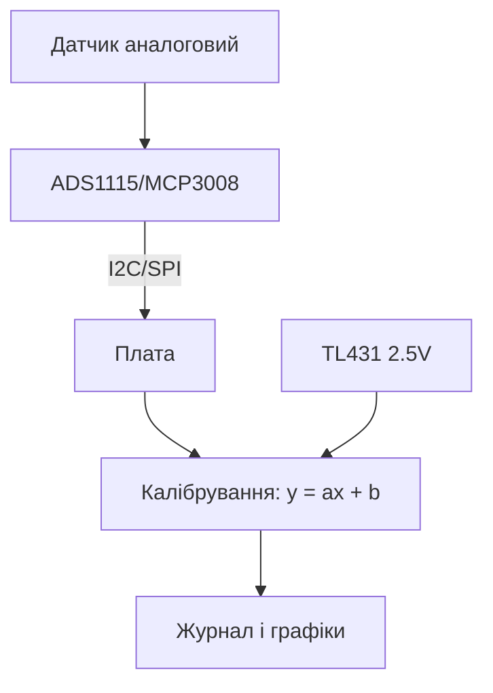

# Зовнішні АЦП для Raspberry Pi - ADS1115 і MCP3008

![[assets/img/rpi-adc-zovnishnye-scheme.png|600]]
*Рис. Аналог ззовні: ADS1115 - точність по I2C, MCP3008 - швидкість по SPI; Pico має свій вбудований.*

> [!tip] Що це за нота
> У Linux-плат Pi аналогових входів немає взагалі - додаємо чипами. Точні повільні виміри і швидкі сигнали - два різні чипи. Вбудований АЦП є лише у Pico: [[01-Hardware/03-RP2040-RP2350|RP2040 і RP2350]].

## 1. Мета

Міряти аналоговий світ:

- ADS1115: 16 біт, повільно, точно (ваги, pH, термопари через підсилювач);
- MCP3008: 10 біт, швидко (потенціометри, джойстики, аудіо-огинаюча);
- диференційні входи і програмований підсилювач;
- калібрування за опорним джерелом.

| Чип | Біт | Швидкість | Шина | Канали |
| --- | --- | --- | --- | --- |
| ADS1115 | 16 | до 860 вим/с | I2C, 4 адреси | 4 SE / 2 диф |
| MCP3008 | 10 | до 200 тис/с | SPI | 8 SE |
| Pico вбудований | 12 | швидко | - | 3 + батарея |

## 2. Архітектура вимірів



Опорне джерело TL431 - якір точності: міряємо його поруч із сигналом і компенсуємо дрейф живлення.

## 3. ADS1115 детально

- PGA: ±6.144V … ±0.256V - підсилення слабких сигналів;
- швидкості 8-860 вимірів/с: швидше - шумніше;
- компаратор з алертом на пін - без опитування;
- 4 адреси ADDR-піном - 4 чипи на шині;
- диференційний режим прибирає синфазну заваду.

## 4. MCP3008 детально

- SPI до 3.6 МГц на такті, 200 тис. вимірів/с;
- протокол: старт-біт + конфіг, відповідь 10 біт;
- опорна = живлення чипа (стабілізувати!);
- джойстики, потенціометри гучності, швидкі огинаючі;
- для точності - усереднення пачками по 16.

## 5. Робочий код

```python
import time
import board
import busio
import adafruit_ads1x15.ads1115 as ADS
from adafruit_ads1x15.analog_in import AnalogIn
import spidev

i2c = busio.I2C(board.SCL, board.SDA)
ads = ADS.ADS1115(i2c, address=0x48)
ads.gain = 1
ch0 = AnalogIn(ads, ADS.P0)

spi = spidev.SpiDev()
spi.open(0, 0)
spi.max_speed_hz = 1000000

def mcp_read(ch):
    r = spi.xfer2([1, (8 + ch) << 4, 0])
    return ((r[1] & 3) << 8) | r[2]

VREF = 3.3
while True:
    v_ads = ch0.voltage
    raw = mcp_read(0)
    v_mcp = raw * VREF / 1023.0
    print(f"ADS:{v_ads:.4f}V MCP:{v_mcp:.3f}V")
    time.sleep(0.5)
```

Gain ADS1115: 2/3 (±6.144V), 1 (±4.096V), 2 (±2.048V), 4/8/16 - під сигнал. MCP-формула - для опорної 3.3V.

## 6. Калібрування по двох точках

- точка 1: вхід на землю (0V), точка 2: TL431 (2.5V);
- лінійна поправка `y = ax + b` за двома вимірами;
- зберігаємо коефіцієнти у файл конфігу;
- перекалібрування при зміні живлення/температури;
- для pH/EC - буферні розчини замість TL431.

## 7. Шуми і точність на практиці

- кручена пара сигнал+земля, екран - на довгих лініях;
- RC-фільтр 1 кОм + 100 нФ біля входу АЦП;
- усереднення: медіана з 5 + середнє з 16;
- цифрова земля окремим провідником до плати;
- 50 Гц наводки - вимірювати кратно 20 мс.

## 8. Типові помилки

| Симптом | Причина | Лікування |
| --- | --- | --- |
| Значення плаває | немає опорної стабільності | TL431, калібрування |
| Насичення на максимумі | сигнал вище PGA-діапазону | зменшити gain / подільник |
| MCP дає нулі | не той канал у байті конфігу | формула `(8+ch)<<4` |
| I2C конфлікт адрес | два ADS1115 на 0x48 | ADDR-перемички 0x49-0x4B |
| Дрейф з температурою | саморозігрів + ТКО | калібрування при робочій температурі |
| Шум 50 Гц | мережева наводка | RC-фільтр, усереднення кратне 20 мс |

## 9. Швидка шпаргалка АЦП

- точність - ADS1115, швидкість - MCP3008;
- калібрування за TL431 двома точками;
- усереднення: медіана + середнє;
- RC-фільтр на вході завжди;
- земля зіркою, не ланцюжком.

## 10. Суміжні ноти

- [[01-Hardware/03-RP2040-RP2350|RP2040 і RP2350]] - вбудований АЦП Pico.
- [[04-Shini/01-I2C-SPI-UART|шини I2C/SPI/UART]] - шини детально.
- [[10-Sensori/04-INA219-Strum|струм INA219]] - готовий вимір на шині.
- [[02-Zhivlennya/01-USB-C-PD|живлення USB-C]] - стабільність опорної.
- [[Home|головна карта]] - повна навігація.

## 9.1 Вибір АЦП однією таблицею

- повільно і точно (ваги, pH) - ADS1115;
- швидко і грубо (ручки, звук) - MCP3008;
- батарея Pico - вбудований, без нічого;
- струм/потужність - готовий INA219;
- сумніваєшся - почни з ADS1115.

## Офіційні джерела

- [ADS1115 (Adafruit)](https://www.adafruit.com/product/1085) - модуль, PGA, адреси.
- [ADS1115 (Texas Instruments)](https://www.ti.com/product/ADS1115) - регістри, швидкості, компаратор.
- [Getting Started (Raspberry Pi docs)](https://www.raspberrypi.com/documentation/computers/getting-started.html) - шини і налаштування.
