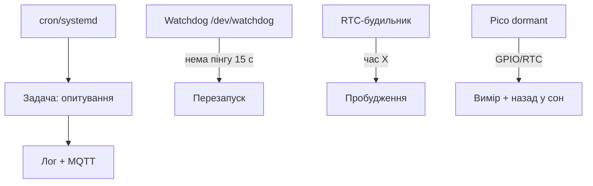

# Таймери і сон Raspberry Pi - watchdog, cron і батарейні режими

![[assets/img/rpi-taimeri-son-scheme.png|600]]
*Рис. Часова драбина: cron будить задачі, watchdog вартує зависання, RTC будить залізо, Pico спить у мікроамперах.*

> [!tip] Що це за нота
> Час як ресурс: періодичні задачі без циклів, перезапуск при зависанні, пробудження за розкладом, сон Pico для батареї. Система: [[09-Proshivka/03-OS-Nalashtuvannya|налаштування ОС]], живлення: [[02-Zhivlennya/03-UPS-18650|UPS-резерв]].

## 1. Мета

Налаштувати часову поведінку вузла:

- cron і systemd-таймери: що коли запускається;
- watchdog: апаратний перезапуск при зависанні;
- RTC-будильник: прокинутись і вимкнутись за розкладом;
- сон Pico: мікроампери між вимірами.

| Механізм | Точність | Для чого |
| --- | --- | --- |
| cron | хвилина | опитування датчиків |
| systemd-таймер | секунда + залежності | сервіси з умовами |
| watchdog | секунди | перезапуск завислого |
| RTC-будильник | хвилина | вмикання за розкладом |
| Pico dormant | мілісекунди | батарейні вузли |

## 2. Архітектура часу



Правило: кожен вузол 24/7 має watchdog. Без нього перше зависання - це поїздка на об'єкт.

## 3. Cron і systemd-таймери

- cron: `*/5 * * * * /home/pi/read.py` - кожні 5 хвилин;
- логи cron - у syslog, дивитись `grep CRON`;
- systemd-таймер: юніт `.timer` + `.service`, залежність від мережі;
- випадкова затримка `RandomizedDelaySec` - щоб 100 вузлів не били разом;
- flock-лок проти накладання запусків.

## 4. Watchdog детально

- апаратний bcm2835-wdt: `dtparam=watchdog=on`;
- демон `watchdog`: пінгує пристрій, стежить за load/network;
- конфіг: інтервал 10 с, поріг 15 с, тест ping шлюзу;
- софтверний рівень: systemd `WatchdogSec` у сервісі;
- перевірка спрацювання: `wdctl` і лічильник в логах.

## 5. Робочий код: вартовий вузла

```python
import os
import time
import subprocess

WD_DEV = '/dev/watchdog'

def wd_ping():
    with open(WD_DEV, 'w') as f:
        f.write('V')

def net_ok():
    try:
        subprocess.check_output(['ping', '-c1', '-W2', '192.168.1.1'])
        return True
    except subprocess.CalledProcessError:
        return False

fails = 0
wd = open(WD_DEV, 'w')
try:
    while True:
        wd.write('V')
        wd.flush()
        if net_ok():
            fails = 0
        else:
            fails += 1
            print(f"net fail {fails}")
            if fails >= 3:
                os.system('sudo systemctl restart NetworkManager')
                fails = 0
        time.sleep(10)
finally:
    wd.write('V')
    wd.close()
```

Увага: відкритий `/dev/watchdog` без пінгу = перезапуск через таймаут. Закриваємо коректно або пишемо магічне `V`.

## 6. RTC-будильник і розклад живлення

- Pi 5: вбудований RTC + батарейка, `wakealarm` з коробки;
- старі: HAT з DS3231 або PCF8523;
- сценарій: прокинувся, відправив, вимкнувся (реле/таймер живлення);
- `rtcwake -m off -s 3600` - заснути на годину (де підтримується);
- сонце + таймер: вузол живе лише вдень.

## 7. Сон Pico для батареї

- `machine.deepsleep(ms)` - мікроампери, прокидання по таймеру/GPIO;
- dormant-режим у C SDK - ще глибше;
- стан не зберігається - пишемо критичне у flash перед сном;
- цикл: прокинувся → виміряв → відправив → заснув;
- середній струм - мікроампери при періоді в хвилини.

## 8. Типові помилки

| Симптом | Причина | Лікування |
| --- | --- | --- |
| Cron не запускає | немає PATH/прав у cron | абсолютні шляхи, лог у файл |
| Watchdog ребутить здоровий | демон не пінгує | перевірити конфіг і інтервал |
| RTC-будильник не будить | немає батарейки/підтримки | HAT з DS3231 або Pi 5 RTC |
| Два запуски наклались | довга задача + частий cron | flock-лок у скрипті |
| Pico не прокидається | не той пін будильника | тільки дозволені GPIO сну |
| Час пливе без мережі | немає RTC | HAT-годинник або GPS-PPS |

## 9. Швидка шпаргалка часу

- cron - хвилини, systemd - секунди і залежності;
- watchdog увімкнений завжди на 24/7;
- RTC-будильник для розкладу живлення;
- Pico спить між вимірами;
- flock проти подвійних запусків.

## 10. Суміжні ноти

- [[09-Proshivka/03-OS-Nalashtuvannya|налаштування ОС]] - сервіси і cron.
- [[02-Zhivlennya/03-UPS-18650|UPS-резерв]] - живлення при сні.
- [[10-Sensori/05-GPS-NEO|GPS-модулі]] - точний час з PPS.
- [[14-Devboards/03-Pico-W-Family|родина Pico]] - сон мікроконтролера.
- [[Home|головна карта]] - повна навігація.

## Офіційні джерела

- [Raspberry Pi Configuration (Raspberry Pi docs)](https://www.raspberrypi.com/documentation/computers/configuration.html) - watchdog і RTC.
- [Getting Started (Raspberry Pi docs)](https://www.raspberrypi.com/documentation/computers/getting-started.html) - config.txt і сервіси.
- [gpiozero docs (Read the Docs)](https://gpiozero.readthedocs.io/en/stable/) - піни будильників.
