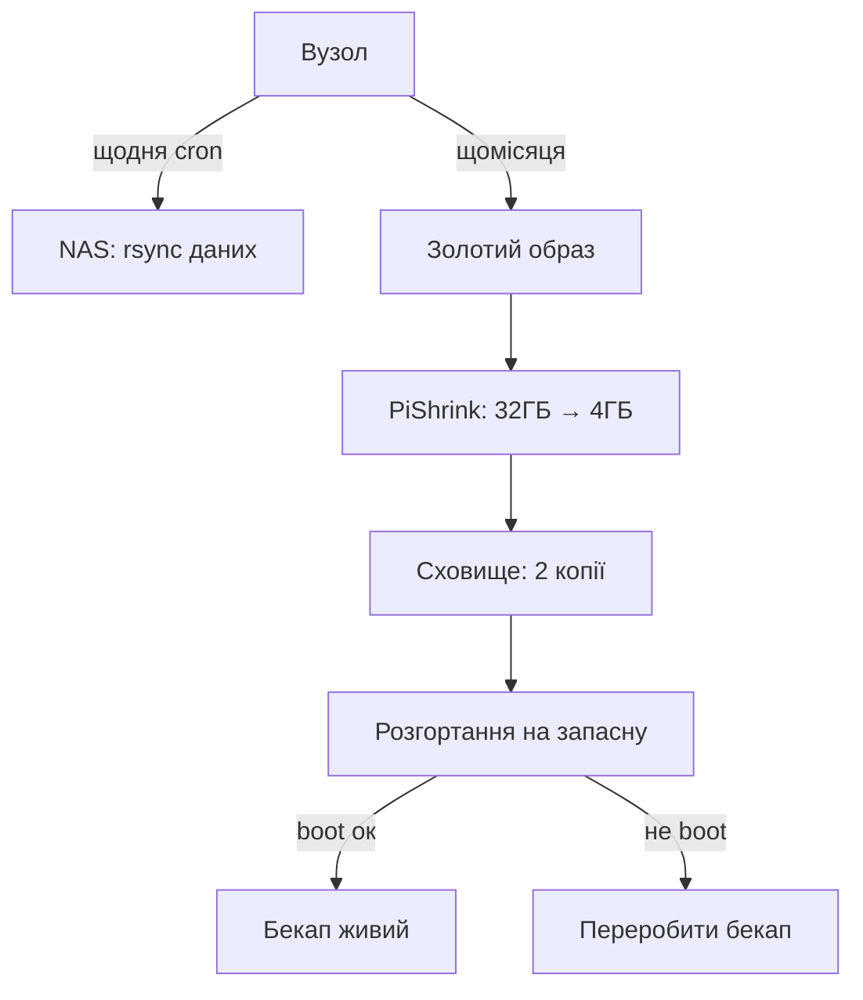

# Бекапи Raspberry Pi - образи, клони і відновлення за годину

![[assets/img/rpi-backup-clone-scheme.png|600]]
*Рис. Три рівні копій: золотий образ, щоденні дані, перевірка відновлення - бекап без перевірки не бекап.*

> [!tip] Що це за нота
> SD-карта вмре - питання часу. Стратегія трьох рівнів: образ системи, дані окремо, перевірене відновлення. Носії: [[08-Pamyat/01-SD-eMMC-NVMe|носії пам'яті]], система: [[09-Proshivka/03-OS-Nalashtuvannya|налаштування ОС]].

## 1. Мета

Спати спокійно з парком плат:

- рівні бекапів: що, куди і як часто;
- інструменти: dd, PiShrink, rsync, restic;
- золотий образ партії;
- перевірка відновлення - обов'язкова частина.

| Рівень | Що | Куди | Період |
| --- | --- | --- | --- |
| Золотий образ | чиста налаштована система | NAS + хмара | при зміні |
| Дані | /home, /etc, бази | NAS/rsync щодня | щодня |
| Швидкий клон | робоча карта 1:1 | запасна SD поруч | щотижня |

## 2. Архітектура стратегії



Неперевірений бекап - самообман. Тестове розгортання раз на квартал - частина регламенту.

## 3. Інструменти детально

- `dd if=/dev/sdX of=backup.img bs=4M status=progress` - повна копія;
- PiShrink: стискає вільне місце, образ меншає в рази;
- `rsync -a --delete` - інкремент даних без зайвого;
- restic/borg - версійні бекапи з шифруванням;
- SD Card Copier (графічний, з Pi OS) - клон у два кліки;
- `dpkg --get-selections` - список пакетів для відтворення.

## 4. Золотий образ партії

- чиста система + усі налаштування + потрібні пакети;
- hostname і ключі - шаблони, не захардкожені;
- версія в імені файлу: `gold-2026-10-06-v3.img`;
- контрольна сума sha256 поруч;
- розгортання на нову плату - 10 хвилин замість дня.

## 5. Робочий код: автобекап даних

```bash
#!/bin/bash
# backup-data.sh — щодня з cron
SRC="/home/pi/project/data /etc/nginx /etc/mosquitto"
DST="nas:/backups/node-01"
LOG="/var/log/backup.log"

rsync -a --delete $SRC $DST/current/ >> $LOG 2>&1
if [ $? -eq 0 ]; then
  rm -rf $DST/prev.7
  for i in 6 5 4 3 2 1; do
    [ -d $DST/prev.$i ] && mv $DST/prev.$i $DST/prev.$((i+1))
  done
  cp -al $DST/current $DST/prev.1
  echo "$(date): OK" >> $LOG
else
  echo "$(date): FAIL" >> $LOG
fi
```

Hardlink-копії (`cp -al`) - 7 денних зрізів за ціною одного плюс дельти. Відкат на будь-який день однією командою.

## 6. Відновлення покроково

- згоріла SD: беремо запасну з золотим образом;
- заливаємо Imager або `dd`, вставляємо, boot;
- накочуємо дані з останнього зрізу rsync;
- міняємо hostname/ключі під вузол;
- перевіряємо сервіси: `systemctl --failed` порожньо;
- норматив: година від діагнозу до роботи.

## 7. Типові граблі

| Помилка | Наслідок | Правило |
| --- | --- | --- |
| Бекап без перевірки | не розгортається в біду | тест щокварталу |
| Одна копія | згоріла разом з вузлом | мінімум дві, різні місця |
| Бекапять усе підряд | терабайти сміття | дані окремо, кеші - ні |
| Немає версій пакетів | «а воно само оновилось» | freeze списку пакетів |
| Паролі в бекапі відкрито | витік при крадіжці | шифрування restic/borg |

## 8. Типові помилки

| Симптом | Причина | Лікування |
| --- | --- | --- |
| Образ не влазить на карту | карта менша на сектор | цільова карта того ж або більшого обсягу |
| rsync повзе годинами | мільйон дрібних файлів | виключити кеші і логи |
| Відновлення не bootається | стара версія образу | золотий образ оновлювати разом із системою |
| Забився NAS | бекапи без ротації | ротація 7 денних + 4 тижневі |
| Cron мовчить | немає PATH/прав у cron | абсолютні шляхи, лог у файл |
| Забули пароль шифрування | ніде не записаний | менеджер паролів, паперова копія в сейфі |

## 9. Швидка шпаргалка бекапів

- 3 рівні: образ, дані, перевірка;
- 2 копії в різних місцях;
- тест відновлення щокварталу;
- ім'я образу з датою, без пробілів;
- автоматика в cron, не «коли згадаю».

## 10. Суміжні ноти

- [[08-Pamyat/01-SD-eMMC-NVMe|носії пам'яті]] - що бекапимо.
- [[09-Proshivka/01-Imager-Headless|прошивка Imager]] - запис образів назад.
- [[09-Proshivka/03-OS-Nalashtuvannya|налаштування ОС]] - що входить у золотий образ.
- [[15-Protokoli/01-MQTT|бекап конфігів брокера]] - що зберігати.
- [[Home|головна карта]] - повна навігація.

## 9.1 Календар бекапів

- щодня: дані rsync на NAS;
- щотижня: швидкий клон робочої карти;
- щомісяця: золотий образ + sha256;
- щокварталу: тестове відновлення;
- нагадування в календарі, не в голові.
- пароль шифрування - в менеджері паролів.
- журнал відновлень: дата, результат, зауваження.
- пароль шифрування зберігати окремо від бекапу.
- термін придатності носіїв: SD - 2 роки в 24/7.

## Офіційні джерела

- [Getting Started (Raspberry Pi docs)](https://www.raspberrypi.com/documentation/computers/getting-started.html) - образи і відновлення.
- [rpi-imager (Raspberry Pi, GitHub)](https://github.com/raspberrypi/rpi-imager) - запис і клонування.
- [Raspberry Pi OS (Raspberry Pi)](https://www.raspberrypi.com/software/) - SD Card Copier.
