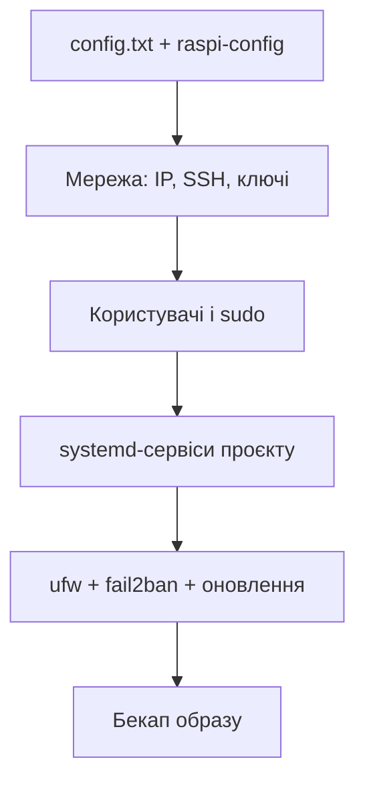

# Налаштування Raspberry Pi OS - config, сервіси, безпека і автозапуск

![[assets/img/rpi-os-nalashtuvannya-scheme.png|600]]
*Рис. Шлях системи: config.txt → мережа → користувачі → автозапуск → бекап - один прохід, далі лише підтримка.*

> [!tip] Що це за нота
> Чекліст «зробив раз - забув»: свіжа Pi OS перетворюється на стабільний вузол за 30 хвилин. Прошивка: [[09-Proshivka/01-Imager-Headless|прошивка Imager]], boot: [[09-Proshivka/02-EEPROM-Boot|завантаження EEPROM]].

## 1. Мета

Отримати відтворювану систему:

- config.txt без магії: що чіпати, чого не чіпати;
- мережа і доступ: SSH-ключі, статичний IP, VPN;
- автозапуск проєктів через systemd, не rc.local;
- безпека мінімуму: користувачі, фаєрвол, оновлення;
- бекап перед «а раптом».



## 2. config.txt: необхідний мінімум

| Параметр | Коли | Приклад |
| --- | --- | --- |
| `dtparam=i2c_arm=on` | датчики I2C | + `dtparam=spi=on`, `enable_uart=1` |
| `dtparam=pciex1` | NVMe на Pi 5 | тільки Pi 5 |
| `hdmi_force_hotplug=1` | безмоніторний VNC | віртуальний дисплей |
| `gpu_mem` | застарів, не чіпати | динамічний розподіл |
| `over_voltage/dfreq` | розгін (обережно!) | тільки з охолодженням |

Оверлеї апаратури - в `/boot/firmware/overlays/README`: читати перед вмиканням.

## 3. Мережа і доступ

- hostname унікальний: `raspi-config nonint do_hostname node-01`;
- WiFi-країна і пріоритети мереж через `nmcli`;
- SSH-ключі замість паролів, порт за замовчуванням - всередині LAN ок;
- Tailscale/WireGuard для доступу ззовні без білого IP;
- mDNS `.local` - для домашньої мережі достатньо.

## 4. Користувачі і безпека

- свій користувач в групі sudo, стандартного немає (і добре);
- пароль root заблокований - так і лишити;
- `ufw`: дозволити SSH/потрібне, решту закрити;
- `fail2ban` на SSH при доступі з інтернету;
- автоматичні оновлення безпеки - `unattended-upgrades`.

## 5. Робочий код: systemd-сервіс

```ini
[Unit]
Description=Climate publisher
After=network-online.target
Wants=network-online.target

[Service]
Type=simple
User=pi
WorkingDirectory=/home/pi/climate
ExecStart=/home/pi/climate/venv/bin/python main.py
Restart=always
RestartSec=10
StandardOutput=journal
StandardError=journal

[Install]
WantedBy=multi-user.target
```

```bash
sudo cp climate.service /etc/systemd/system/
sudo systemctl daemon-reload
sudo systemctl enable --now climate.service
journalctl -u climate.service -f
```

`Restart=always` переживає падіння скрипта і ребути. Логи - в journal, не в самописні файли.

## 6. Python-оточення вузла

- `python3-venv` на проєкт, системний Python не чіпати;
- `pip install` тільки у venv (Bookworm забороняє глобальний pip - і правильно);
- gpiozero/lgpio/smbus - системні пакети через apt;
- права на GPIO/I2C - група `gpio`/`i2c`, не root і не sudo;
- requirements.txt заморожуємо `pip freeze` після налаштування.

## 7. Моніторинг здоров'я

| Метрика | Джерело | Поріг |
| --- | --- | --- |
| Температура | `vcgencmd measure_temp` | > 75 °C - діяти |
| Троттлінг | `vcgencmd get_throttled` | ≠ 0x0 - живлення/тепло |
| Диск | `df -h` | > 85 % - чистити |
| Пам'ять | `free -h` | swap росте - додати RAM/zram |
| Сервіси | `systemctl --failed` | порожньо |

## 7.1 Ротація логів і tmpfs

- `/var/log` на SD: ліміт journald `SystemMaxUse=100M`;
- логи проєкту - в RAM (`/run`), на диск лише архів доби;
- tmpfs для кешів і піків: `/etc/fstab` з `size=100M`;
- `log2ram` пакет - готове рішення для малин;
- своп вимкнути або zram: класичний своп вбиває SD;
- перевірка зносу: `mmc extcsd read` показує стан eMMC/SD.

## 8. Типові помилки

| Симптом | Причина | Лікування |
| --- | --- | --- |
| Сервіс не стартує | шлях/venv не ті | абсолютні шляхи, `journalctl -u` |
| Немає доступу до GPIO | користувач не в групі | `usermod -aG gpio,i2c user` |
| pip відмовляє | PEP 668 захист системи | venv, ніяких `--break-system-packages` |
| WiFi відвалюється | power management | вимкнути PM, watchdog-скрипт |
| Після апгрейда не boot | ядро + оверлеї | тримати робоче ядро, відкат |
| Логи з'їли SD | журнал без ротації | `journald` ліміти, логи в RAM |

## 9. Суміжні ноти

- [[09-Proshivka/01-Imager-Headless|прошивка Imager]] - чиста установка.
- [[09-Proshivka/02-EEPROM-Boot|завантаження EEPROM]] - порядок boot.
- [[03-GPIO/01-Header-Gpiozero|гребінка і gpiozero]] - перший код на системі.
- [[15-Protokoli/01-MQTT|протокол MQTT]] - сервіс телеметрії.
- [[08-Pamyat/01-SD-eMMC-NVMe|носії пам'яті]] - бережемо SD.

## 10. Швидка шпаргалка ОС

- `raspi-config nonint` - все скриптами;
- systemd-сервіс + `Restart=always`;
- venv на проєкт, системний Python святий;
- ufw + ключі SSH назовні;
- бекап образу до, а не після біди.

## Офіційні джерела

- [Getting Started (Raspberry Pi docs)](https://www.raspberrypi.com/documentation/computers/getting-started.html) - config.txt і raspi-config.
- [Raspberry Pi OS (Raspberry Pi)](https://www.raspberrypi.com/software/) - редакції системи.
- [gpiozero docs (Read the Docs)](https://gpiozero.readthedocs.io/en/stable/) - права і групи GPIO.
