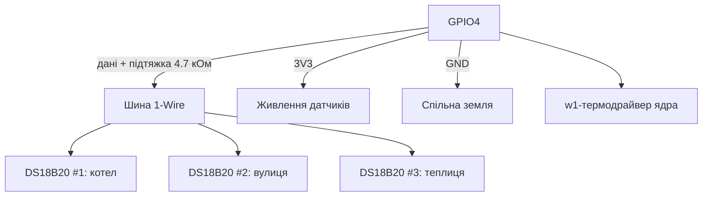

# Температура DS18B20 на Raspberry Pi - 1-Wire шина і точні виміри

![[assets/img/rpi-ds18b20-temp-scheme.png|600]]
*Рис. Шина 1-Wire: один GPIO + підтяжка 4.7 кОм - і десяток датчиків паралельно з адресами.*

> [!tip] Що це за нота
> Народний датчик температури: ±0.5 °C, гермований зонд, десятки штук на двох дротах. Ідеальний для вулиці, теплиці, котла. База: [[03-GPIO/01-Header-Gpiozero|гребінка і gpiozero]], [[10-Sensori/01-BME280-Klimat|клімат BME280]].

## 1. Мета

Повісити термометри де треба:

- один пін - багато датчиків, кожен зі своєю адресою;
- точність ±0.5 °C без калібрування;
- вуличний монтаж: гермозонди і довгі лінії;
- паразитне живлення: коли можна, а коли ні.

| Параметр | Значення |
| --- | --- |
| Діапазон | −55…+125 °C |
| Точність | ±0.5 °C (−10…+85 °C) |
| Роздільність | 9-12 біт (0.5-0.0625 °C) |
| Час конверсії | 94-750 мс за розрядністю |
| Шина | 1-Wire, до ~100 м (з нюансами) |

## 2. Архітектура шини



Кожен датчик має унікальний 64-бітний ROM-код: ядро створює каталог `/sys/bus/w1/devices/28-*/` на кожен. Читаємо як файли - ніяких бібліотек.

## 3. Увімкнення 1-Wire

- `dtoverlay=w1-gpio` у config.txt (пін GPIO4 за замовчуванням);
- свій пін: `dtoverlay=w1-gpio,gpiopin=17`;
- модулі ядра `w1-gpio` + `w1-therm` вантажаться самі;
- перевірка: `ls /sys/bus/w1/devices/` - каталоги `28-*`;
- читання: `cat /sys/bus/w1/devices/28-*/w1_slave`.

## 4. Формат відповіді і CRC

```text
a6 01 4b 46 7f ff 0c 10 5c : crc=5c YES
a6 01 4b 46 7f ff 0c 10 5c t=26875
```

- `YES` - контрольна сума зійшлась, даним віримо;
- `t=26875` - міліградуси, ділимо на 1000;
- `NO` - повторюємо читання, не пишемо сміття в лог;
- 12 біт за замовчуванням, 9 біт - швидше в 8 разів.

## 5. Робочий код

```python
import glob
import time

BASE = '/sys/bus/w1/devices/'
SENSORS = {}

def discover():
    global SENSORS
    SENSORS = {}
    for d in glob.glob(BASE + '28-*'):
        name = d.split('/')[-1]
        SENSORS[name] = {'path': d + '/w1_slave', 'alias': name[-6:]}
    return SENSORS

def read_temp(path):
    try:
        with open(path) as f:
            lines = f.readlines()
        if lines[0].strip().endswith('YES'):
            t = lines[1].split('t=')[1].strip()
            return int(t) / 1000.0
    except (IndexError, ValueError, OSError):
        pass
    return None

def scan_loop():
    discover()
    print(f"found: {list(SENSORS)}")
    while True:
        for sid, s in SENSORS.items():
            t = read_temp(s['path'])
            mark = f"{t:.2f}" if t is not None else "FAIL"
            print(f"{s['alias']}: {mark}")
        time.sleep(10)

if __name__ == '__main__':
    scan_loop()
```

Аліаси (`котел`, `вулиця`) - окремим словником `{'28-xxx': 'котел'}` у конфігу. Перепідключив датчик - правиш одне місце.

## 6. Паразитне живлення: так чи ні

- паразитний режим (2 дроти): працює, але гальмує і капризує на довгих лініях;
- нормальний (3 дроти: VCC+GND+дані) - завжди, коли можна;
- довжина: до 10 м звичайним дротом, далі - кручена пара і 3.3V стабільно;
- активна підтяжка (MOSFET) - для десятків датчиків;
- гроза і вулиця - розв'язка і грозозахист на вводі.

## 7. Вуличний монтаж

- гермозонд у гільзі з термопастою - тепловий контакт;
- гільза в тіні, з вентиляцією, не на сонці;
- кабель - гофра від УФ і гризунів;
- з'єднання - пайка + термоусадка з клеєм, не скрутки;
- силікагель у коробці комутації.

## 8. Типові помилки

| Симптом | Причина | Лікування |
| --- | --- | --- |
| Каталогів 28-* немає | оверлей не увімкнено | `dtoverlay=w1-gpio` + ребут |
| `NO` постійно | немає підтяжки 4.7 кОм | резистор між даними і 3V3 |
| 85 °C завжди | датчик не сконвертував | чекати 750 мс, читати повторно |
| Стрибки на довгій лінії | ємність кабелю | кручена пара, нижча швидкість |
| Один з десяти мовчить | бракований/переплутаний | перевірити окремо біля плати |
| Працювало, перестало взимку | волога в з'єднаннях | герметизувати, силікагель |

## 9. Швидка шпаргалка 1-Wire

- пін GPIO4 за замовчуванням, оверлей в config.txt;
- підтяжка 4.7 кОм обов'язкова;
- читати як файли, перевіряти YES;
- 3 дроти замість паразитних;
- аліаси - в конфігу, не в коді.

## 10. Суміжні ноти

- [[03-GPIO/01-Header-Gpiozero|гребінка і gpiozero]] - пін шини.
- [[10-Sensori/01-BME280-Klimat|клімат BME280]] - вологість у пару.
- [[09-Proshivka/03-OS-Nalashtuvannya|налаштування ОС]] - оверлеї в config.txt.
- Готова метеостанція як проєкт - нота черги 4.
- [[Home|головна карта]] - повна навігація.

## Офіційні джерела

- [DS18B20 (Adafruit)](https://www.adafruit.com/product/381) - зонд, 1-Wire, точність.
- [Getting Started (Raspberry Pi docs)](https://www.raspberrypi.com/documentation/computers/getting-started.html) - оверлеї 1-Wire.
- [gpiozero docs (Read the Docs)](https://gpiozero.readthedocs.io/en/stable/) - піни і скрипти.
