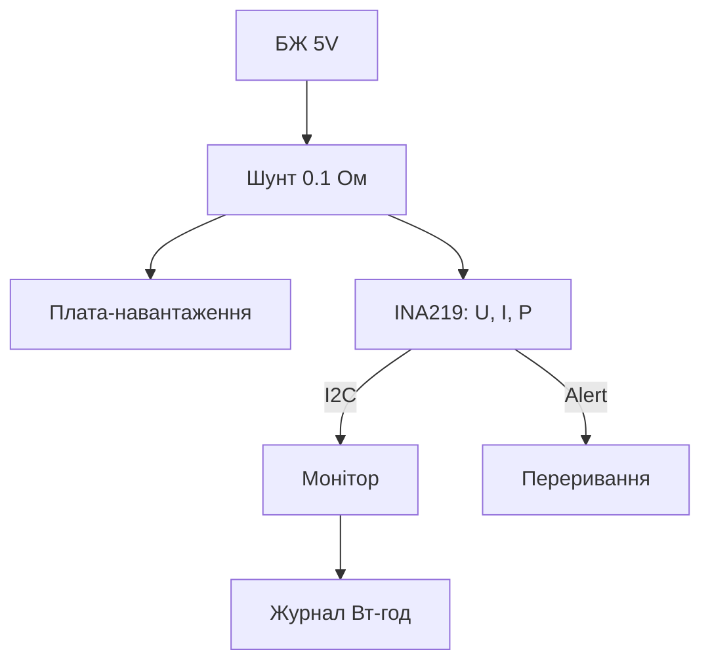

# Струм на Raspberry Pi - INA219 по I2C і облік енергії

![[assets/img/rpi-ina219-strum-scheme.png|600]]
*Рис. INA219 на шунті в плюсі живлення: напруга, струм і потужність - три регістри, одна шина.*

> [!tip] Що це за нота
> Контроль живлення своїх же вузлів: скільки їсть, коли пік, скільки ват-годин за добу. Шунт у плюс, I2C в плату, алерти на перевищення. Шина: [[04-Shini/01-I2C-SPI-UART|шини I2C/SPI/UART]], живлення: [[02-Zhivlennya/01-USB-C-PD|живлення USB-C]].

## 1. Мета

Побудувати облік енергії вузла:

- INA219 на шунті: напруга, струм, потужність;
- калібрування під свій шунт і діапазон;
- алерти про перевищення без опитування;
- журнал ват-годин за добу/місяць.

| Параметр | Значення |
| --- | --- |
| Шина | I2C, адреси 0x40-0x4F |
| Напруга шини | 0-26V |
| Шунт | 0.1 Ом за замовчуванням |
| Точність | ~1 % після калібрування |
| Алерт | пін на GPIO (переривання) |

## 2. Архітектура виміру



High-side: шунт у плюсі, земля спільна. Low-side (у мінусі) - тільки коли розумієш, навіщо: зсув землі ламає логіку.

## 3. Калібрування під задачу

- регістр Calibration = 0.04096 / (LSB × Rшунт);
- LSB струму обираємо під максимум: 1 мА для 3.2 А;
- PGA /8 - для падіння до 320 мВ на шунті;
- усереднення х128 - шум тоне без коду;
- перевірка: лабораторний БЖ + мультиметр у розриві.

## 4. Алерти без опитування

- регістр Mask/Enable: перевищення струму/потужності/напруги;
- вихід Alert - відкритий стік, підтяжка до 3.3V;
- ведемо на GPIO з перериванням по спаду;
- в обробнику - читаємо прапорець і скидаємо;
- сценарій: вимкити навантаження реле при перевантаженні.

## 5. Робочий код

```python
import time
import board
import busio
from adafruit_ina219 import Adafruit_INA219, BusVoltageRange, Gain

i2c = busio.I2C(board.SCL, board.SDA)
ina = Adafruit_INA219(i2c)
ina.bus_voltage_range = BusVoltageRange.RANGE_16V
ina.gain = Gain.DIV_8

wh_acc = 0.0
last = time.time()

with open('/home/pi/power.csv', 'a') as log:
    while True:
        v = ina.bus_voltage + ina.shunt_voltage
        i = ina.current / 1000.0
        p = ina.power
        now = time.time()
        wh_acc += p * (now - last) / 3600.0
        last = now
        log.write(f"{time.strftime('%F %T')},{v:.2f},{i:.3f},{p:.2f},{wh_acc:.2f}\n")
        log.flush()
        print(f"{v:.2f}V {i:.3f}A {p:.2f}W total {wh_acc:.2f}Wh")
        if i > 2.5:
            print("ALARM: overcurrent!")
        time.sleep(5)
```

Файл дописуємо з `flush()` - при блекауті втрачаємо секунди, не добу. Поріг алерту - під свій БЖ.

## 6. Куди ставити шунт

| Точка | Що бачимо | Нюанс |
| --- | --- | --- |
| Вхід вузла (після БЖ) | усе споживання | головний лічильник |
| USB-порт | периферія окремо | шунт у 5V лінії хаба |
| Сонячна панель | генерація | двонаправлений не треба |
| Батарея | заряд/розряд | знак струму показує напрям |

## 7. Похибки і як їх давити

- опір шунта пливе з температурою - брати 1 % з малим ТКО;
- саморозігрів шунта на великому струмі - запас по потужності ×2;
- падіння на шунті зменшує напругу навантаженню - рахувати;
- калібрування нуля при вимкненому навантаженні;
- звірка з мультиметром раз на пів року.

## 8. Типові помилки

| Симптом | Причина | Лікування |
| --- | --- | --- |
| Нулі скрізь | немає калібрувального регістра | бібліотека ставить сама, вручну - записати |
| Струм удвічі більший | не той шунт у формулі | звірити напис R100 = 0.1 Ом |
| Шум ±50 мА | немає усереднення | PGA + average х128 |
| Алерт не приходить | пін без підтяжки | 10 кОм до 3.3V |
| Гріється шунт | малий запас потужності | шунт ×2 по ватах |
| Знак струму не той | шунт навпаки | поміняти сторону або інвертувати в коді |

## 9. Швидка шпаргалка INA219

- адреса 0x40 за замовчуванням, A0/A1 - інші;
- калібрування - першим рядком після ініціалізації;
- алерт - на GPIO з перериванням;
- журнал з flush, поріг під БЖ;
- high-side, земля спільна.

## 10. Суміжні ноти

- [[04-Shini/01-I2C-SPI-UART|шини I2C/SPI/UART]] - шина детально.
- [[02-Zhivlennya/01-USB-C-PD|живлення USB-C]] - що міряємо.
- [[06-Analog/01-ADC-Zovnishnye|зовнішні АЦП]] - аналогова альтернатива.
- [[08-Pamyat/02-Backup-Clone|бекапи і клони]] - журнал переживає SD.
- [[Home|головна карта]] - повна навігація.

## 9.1 Куди росте облік

- другий канал - сонячна генерація окремо;
- добові зрізи в CSV для звітів;
- алерти в Telegram через вебхук;
- дашборд Grafana з історії;
- рік даних - відповіді на всі питання.

## Офіційні джерела

- [INA219 (Texas Instruments)](https://www.ti.com/product/INA219) - регістри, калібрування, алерти.
- [gpiozero docs (Read the Docs)](https://gpiozero.readthedocs.io/en/stable/) - піни і скрипти.
- [Getting Started (Raspberry Pi docs)](https://www.raspberrypi.com/documentation/computers/getting-started.html) - I2C і налаштування.
