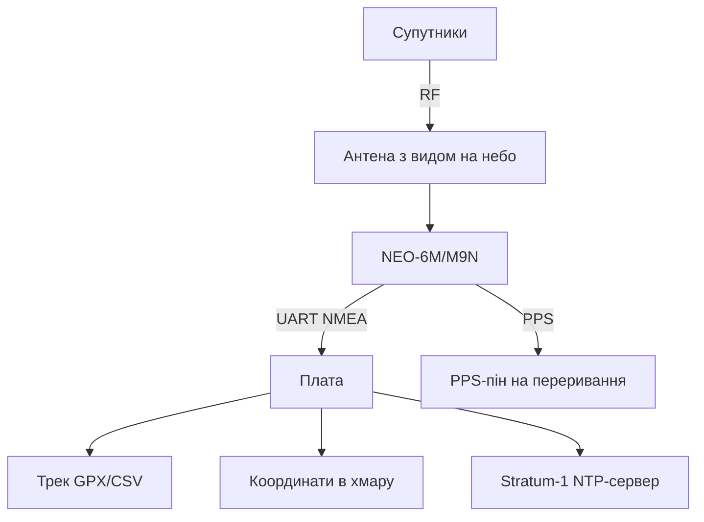

# GPS на Raspberry Pi - NEO-6M/NEO-M9N: координати, час і трекер

![[assets/img/rpi-gps-neo-scheme.png|600]]
*Рис. GPS-модуль на UART: NMEA-потік у плату, PPS - точна секунда, антена з видом на небо.*

> [!tip] Що це за нота
> Координати, швидкість і атомно-точний час з неба: трекер, годинник без NTP, геозони. NEO-6M - дешево і достатньо, NEO-M9N - швидкий фікс і більше сузір'їв. Шина: [[04-Shini/01-I2C-SPI-UART|шини I2C/SPI/UART]], час: [[07-Timeri-Son/01-Taimeri-Son|таймери і сон вузла]].

## 1. Мета

Отримати позицію і час з GPS:

- підключення NEO-модулів по UART (9600 за замовчуванням);
- парсинг NMEA: GGA (позиція), RMC (швидкість/дата), GSV (супутники);
- PPS - імпульс точної секунди для NTP-сервера (chrony, деталі - [[07-Timeri-Son/01-Taimeri-Son|нота таймерів]]);
- трекер з логуванням і геозонами.

| Модуль | Супутники | Час холодного старту | Антена |
| --- | --- | --- | --- |
| NEO-6M | GPS+SBAS | ~30 с | керамічна на платі |
| NEO-M9N | GPS+ГЛОНАСС+Galileo+BeiDou | ~20 с | активна рекомендована |
| NEO-M8N | як M9N, старіший | ~25 с | активна |

## 2. Архітектура вузла



Антена мусить бачити небо: підвіконня - мінімум, дах - ідеал. У приміщенні без вікна фікса не буде ніколи.

## 3. Підключення

| NEO-модуль | Плата | Примітка |
| --- | --- | --- |
| VCC | 5V (модулі GY) / 3V3 | за версією модуля |
| GND | земля | поруч |
| TX | RXD (пін 10) | перехресно! |
| RX | TXD (пін 8) | перехресно! |
| PPS | GPIO18 | переривання точної секунди |

Консоль з UART0 прибрати (`enable_uart=1`, без `console=serial0`), інакше ядро смітить у GPS-потік.

## 4. NMEA мінімум

- `$GPGGA` - час, широта, довгота, якість фікса, супутники;
- `$GPRMC` - дата, швидкість у вузлах, курс;
- `$GPGSV` - видимі супутники і SNR;
- якість фікса: 0 - немає, 1 - GPS, 2 - DGPS;
- парсимо тільки валідні (`A` в RMC), решту ігноруємо.

## 5. Робочий код: трекер

```python
import serial
import time
import math

gps = serial.Serial('/dev/serial0', 9600, timeout=1)

def nmea_to_deg(raw, hemi):
    d = int(float(raw) / 100)
    m = float(raw) - d * 100
    v = d + m / 60.0
    if hemi in 'SW':
        v = -v
    return v

def parse_gga(parts):
    if len(parts) < 10 or parts[6] == '0':
        return None
    lat = nmea_to_deg(parts[2], parts[3])
    lon = nmea_to_deg(parts[4], parts[5])
    return lat, lon, parts[7]

def parse_rmc(parts):
    if len(parts) < 10 or parts[2] != 'A':
        return None
    lat = nmea_to_deg(parts[3], parts[4])
    lon = nmea_to_deg(parts[5], parts[6])
    knots = float(parts[7] or 0)
    return lat, lon, knots * 1.852

last = None
dist = 0.0
with open('/home/pi/track.csv', 'a') as log:
    while True:
        line = gps.readline().decode('ascii', errors='ignore')
        if line.startswith('$GPGGA'):
            p = parse_gga(line.strip().split(','))
            if p:
                lat, lon, sats = p
                if last:
                    dlat = math.radians(lat - last[0])
                    dlon = math.radians(lon - last[1])
                    a = math.sin(dlat/2)**2 + math.cos(math.radians(last[0])) * math.cos(math.radians(lat)) * math.sin(dlon/2)**2
                    dist += 6371 * 2 * math.asin(math.sqrt(a))
                last = (lat, lon)
                log.write(f"{time.strftime('%F %T')},{lat:.6f},{lon:.6f},{dist:.2f}\n")
                log.flush()
                print(f"{lat:.6f},{lon:.6f} sats={sats} km={dist:.2f}")
```

Гаверсинус рахує дистанцію між точками. Фільтр: ігноруємо стрибки понад 200 км/год (міські каньйони брешуть).

## 6. PPS і точний час

- PPS-пін на GPIO з перериванням по фронту;
- `pps-gpio` оверлей + `chrony` з джерелом PPS;
- точність - мікросекунди, свій Stratum-1 сервер;
- перевірка: `chronyc sources` показує PPS зірочкою;
- NTP-клієнти дому - на наш сервер, не в інтернет.

## 7. Геозони і алерти

- коло: дистанція від бази менше радіуса - всередині;
- в'їзд/виїзд - подія в MQTT;
- швидкість понад поріг - алерт;
- стоянка понад N хвилин - окрема подія;
- трек пишемо завжди, алерти - за подіями.

## 8. Типові помилки

| Симптом | Причина | Лікування |
| --- | --- | --- |
| Немає фікса годинами | антена в приміщенні | вікно/дах, вид на небо |
| Сміття замість NMEA | швидкість не та | 9600 за замовчуванням, перевірити |
| Консольні рядки в потоці | getty на UART0 | вимкнути консоль, лишити UART |
| Стрибки координат | мало супутників | чекати 3D-фікс (4+ супутники) |
| PPS немає | пін не підключений | PPS на GPIO + оверлей pps-gpio |
| Час 1970-й | немає фікса + немає NTP | дочекатись фікса, chrony підхопить |

## 9. Швидка шпаргалка GPS

- антена бачить небо - інакше ніяк;
- TX→RX перехресно, консоль геть;
- парсимо тільки валідні кадри;
- PPS - для точного часу;
- фільтр стрибків швидкості обов'язковий.

## 10. Суміжні ноти

- [[04-Shini/01-I2C-SPI-UART|шини I2C/SPI/UART]] - UART детально.
- [[10-Sensori/02-MPU6050-Rukh|рух MPU6050]] - курс без супутників.
- [[16-Proekti/02-GPS-Treker|готовий GPS-трекер]] - повний проєкт.
- [[09-Proshivka/03-OS-Nalashtuvannya|налаштування ОС]] - chrony і час.
- [[Home|головна карта]] - повна навігація.

## Офіційні джерела

- [NEO-6 series (u-blox)](https://www.u-blox.com/en/product/neo-6-series) - NMEA, PPS, чутливість.
- [NEO-M9N module (u-blox)](https://www.u-blox.com/en/product/neo-m9n-module) - сузір'я, холодний старт.
- [Getting Started (Raspberry Pi docs)](https://www.raspberrypi.com/documentation/computers/getting-started.html) - UART і оверлеї.
