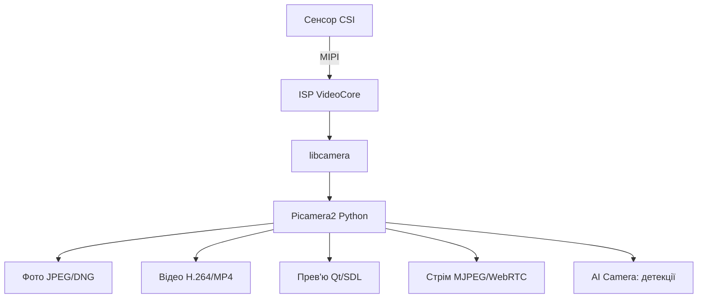

# Камера CSI на Raspberry Pi - Picamera2, автофокус і стрім

![[assets/img/rpi-kamera-csi-scheme.png|600]]
*Рис. Камера шлейфом CSI в роз'єм CAMERA: Picamera2 керує, файли на диск, стрім у мережу.*

> [!tip] Що це за нота
> Очі плати: фото, відео, стрім, таймлапс, розпізнавання. Стек libcamera + Picamera2 замінив старий raspistill - вчимо новий. Шлейфи: [[00-Start/04-Devkit-plati|плати і аксесуари]], носії: [[08-Pamyat/01-SD-eMMC-NVMe|носії пам'яті]].

## 1. Мета

Отримати картинку за 10 хвилин і вичавити максимум:

- модулі: Camera Module 3, AI Camera, HQ, сумісні;
- Picamera2: фото, відео, прев'ю, контроли;
- стрім у браузер і таймлапс на диск;
- детекція руху без нейромереж.

| Модуль | Сенсор | Фокус | Для чого |
| --- | --- | --- | --- |
| Camera Module 3 | IMX708 12 Мп | автофокус | універсальна |
| Camera Module 3 NoIR | IMX708 без ІЧ-фільтра | автофокус | ніч з підсвіткою |
| HQ Camera | IMX477 12 Мп | змінні об'єктиви | якість |
| AI Camera | IMX500 + Hailo | автофокус | аналітика на камері |
| Zero-камери | малі шлейфи | фікс | Zero-пастки |

## 2. Архітектура стека



Старий стек (raspistill/vcgencmd) мертвий на Bookworm - не шукати гайди 2020 року. Тільки libcamera + Picamera2.

## 3. Підключення

- шлейф синьою смугою до роз'єму, защіпнути до кінця;
- CAM0/CAM1 на Pi 5 - обидва 4-лінійні, камери будь-куди;
- на старих - один повний + один урізаний;
- довжина шлейфа до 2 м (екрановані подовжувачі);
- `libcamera-hello --list-cameras` - камера видно? працюємо.

## 4. Picamera2: режими і контроли

- `create_still_configuration` / `create_video_configuration` / `create_preview_configuration`;
- контроли: `AfMode`, `ExposureTime`, `AnalogueGain`, `AwbMode`, `Brightness`;
- автофокус: `AfMode.Continuous` для відео, `Auto` для фото;
- ROI автофокусу - прямокутником по об'єкту;
- DNG (raw) - для обробки, JPEG - для людей.

## 5. Робочий код

```python
from picamera2 import Picamera2
from picamera2.encoders import H264Encoder
from picamera2.outputs import FileOutput
import time

picam = Picamera2()
still_cfg = picam.create_still_configuration(main={"size": (4608, 2592)})
video_cfg = picam.create_video_configuration(main={"size": (1920, 1080)})

def photo(path):
    picam.configure(still_cfg)
    picam.set_controls({"AfMode": 2})
    picam.start()
    time.sleep(1)
    picam.capture_file(path)
    picam.stop()

def clip(path, seconds=10):
    picam.configure(video_cfg)
    picam.start()
    enc = H264Encoder(bitrate=5000000)
    out = FileOutput(path)
    picam.start_encoder(enc, out)
    time.sleep(seconds)
    picam.stop_encoder()
    picam.stop()

def timelapse(n=144, every=600):
    picam.configure(still_cfg)
    picam.start()
    time.sleep(2)
    for i in range(n):
        picam.capture_file(f"/home/pi/tl/frame_{i:04d}.jpg")
        time.sleep(every)
    picam.stop()

if __name__ == '__main__':
    photo('/home/pi/shot.jpg')
```

Таймлапс 144 кадри по 10 хв - доба. Склейка: `ffmpeg -framerate 24 -i frame_%04d.jpg out.mp4`.

## 6. Стрім у браузер

- MJPEG-сервер Picamera2 з прикладів - 5 рядків коду;
- WebRTC - затримка частки секунди (медіасервер);
- HLS - для багатьох глядачів через nginx;
- порт і пароль - не світити стрім у світ без авторизації;
- ніч: NoIR + ІЧ-прожектор 850 нм (невидимий людині).

## 7. Детекція руху без нейромереж

- різниця кадрів у низькій роздільності (320×240);
- поріг + морфологія - відсікаємо шум і листя;
- ROI-зони: двері так, дорога ні;
- запис кліпу лише за подією - місце на диску;
- AI Camera - детекції люди/тварини на самій камері.

## 8. Типові помилки

| Симптом | Причина | Лікування |
| --- | --- | --- |
| `no cameras available` | шлейф/несумісний модуль | перепідключити, `list-cameras` |
| Чорний кадр | не встиг автоекспозиція | затримка 1-2 с після старту |
| Рожева картинка | NoIR без ІЧ вдень | NoIR - тільки з фільтром/вночі |
| Старий код не працює | raspistill видалено | переписувати на Picamera2 |
| Стрім лагає | бітрейт/ WiFi | нижчий бітрейт, провід |
| Диск забився за ніч | відео без ротації | кліпи за подіями + ротація |

## 9. Швидка шпаргалка камери

- шлейф синім до роз'єму, защіпнути;
- `list-cameras` - перша команда;
- Bookworm = тільки Picamera2;
- фото: пауза на автофокус;
- стрім: MJPEG для простоти.

## 10. Суміжні ноти

- [[08-Pamyat/01-SD-eMMC-NVMe|носії пам'яті]] - куди писати відео.
- [[04-Shini/01-I2C-SPI-UART|шини I2C/SPI/UART]] - керування фокусом старих модулів.
- [[11-Vivid/01-DSI-HDMI-Displeyi|вивід картинки на дисплеї]] - екрани.
- [[15-Protokoli/01-MQTT|сповіщення в MQTT]] - брокер і топіки.
- [[Home|головна карта]] - повна навігація.

## Офіційні джерела

- [picamera2 (Raspberry Pi, GitHub)](https://github.com/raspberrypi/picamera2) - бібліотека і приклади.
- [Picamera2 Manual (Raspberry Pi)](https://datasheets.raspberrypi.com/camera/picamera2-manual.pdf) - конфігурації і контроли.
- [Getting Started (Raspberry Pi docs)](https://www.raspberrypi.com/documentation/computers/getting-started.html) - підключення камер.
