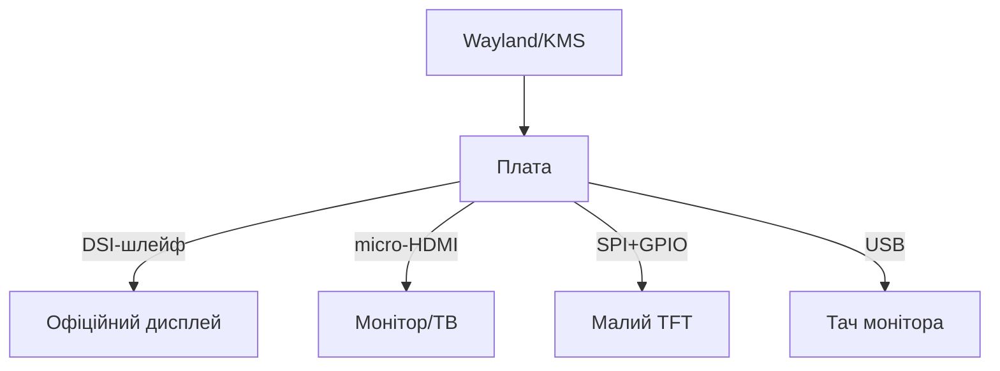

# Дисплеї Raspberry Pi - DSI, HDMI і тач-панелі

![[assets/img/rpi-dsi-hdmi-displeyi-scheme.png|600]]
*Рис. Три шляхи картинки: DSI-шлейфом, HDMI-кабелем, SPI-модулем - вибір за розміром і задачею.*

> [!tip] Що це за нота
> Екран для плати: офіційні DSI-панелі, будь-який HDMI-монітор і маленькі SPI-дисплейчики. Тач, кіоск-режим, поворот. Камера-пара: [[10-Sensori/06-Kamera-CSI|камера CSI]], система: [[09-Proshivka/03-OS-Nalashtuvannya|налаштування ОС]].

## 1. Мета

Обрати і запустити дисплей:

- DSI: офіційні 7" і 5" з тачем - працюють з коробки;
- HDMI: монітори і телевізори, включно з 4K;
- SPI: крихітні TFT для приладів;
- тач-калібрування, поворот, кіоск-режим.

| Дисплей | Підключення | Роздільність | Тач |
| --- | --- | --- | --- |
| Official 7" DSI | DSI + живлення з плати | 800×480 | є |
| Official 5" DSI | DSI | 800×480 | є |
| HDMI-монітор | micro-HDMI | до 4Kp60 | окремо USB |
| SPI TFT 2-3.5" | SPI + GPIO | 320×480 | резистивний |
| E-paper | SPI | різна | немає |

## 2. Архітектура виводу



Bookworm: Wayland за замовчуванням, старі `display_rotate` не працюють - поворот через `wlr-randr` або KMS-параметри.

## 3. DSI-панелі детально

- живлення йде шлейфом + окремими дротами з плати (за мануалом!);
- тач - USB-лінія в тому самому шлейфі, окремо не підключати;
- яскравість підсвітки - програмно (`backlight` клас);
- два DSI на Pi 5 - два дисплеї одночасно;
- корпуси SmartiPi тримають плату за дисплеєм.

## 4. HDMI нюанси

- HDMI0 - основний (звук, CEC, 4Kp60);
- `hdmi_force_hotplug=1` для безмоніторного VNC;
- CEC: пульт телевізора керує Kodi;
- довжина кабелю до 3 м на 4K без підсилювача;
- micro-HDMI перехідники з екраном, не фольга.

## 5. Робочий код: кіоск

```bash
#!/bin/bash
# kiosk.sh — браузер на весь екран після входу
export DISPLAY=:0
export XDG_RUNTIME_DIR=/run/user/1000
chromium-browser \
  --noerrdialogs \
  --disable-infobars \
  --kiosk http://localhost:8080 \
  --incognito \
  --disable-translate \
  --overscroll-history-navigation=0 &
```

```ini
[Unit]
Description=Kiosk browser
After=graphical.target
Wants=graphical.target

[Service]
User=pi
Environment=DISPLAY=:0
Environment=XDG_RUNTIME_DIR=/run/user/1000
ExecStart=/home/pi/kiosk.sh
Restart=always

[Install]
WantedBy=graphical.target
```

Автологін у графічну сесію через `raspi-config` (Boot → Desktop Autologin). Сторінку віддає локальний сервер дашборда.

## 6. Тач-калібрування

- ємнісний (DSI/HDMI-USB) - зазвичай точний з коробки;
- резистивний (SPI) - калібрування `xinput_calibrator` або evdev-параметри;
- поворот екрана + поворот тача - двома різними командами!;
- мультитач - жести у Wayland-композиторі;
- рукавички - тільки резистивний або спеціальний ємнісний.

## 7. SPI-дисплейчики

- драйвери fbtft в ядрі (ili9341, st7735 та інші);
- оверлей `dtoverlay=piscreen` (+ параметри швидкості/повороту);
- частота SPI 30-60 МГц - оновлення плавне;
- фреймбуфер `/dev/fb1` - консоль або X-сервер на нього;
- для приладів вистачає, для відео - ні.

## 8. Типові помилки

| Симптом | Причина | Лікування |
| --- | --- | --- |
| DSI чорний | немає живлення панелі | дроти живлення за мануалом дисплея |
| Тач дзеркалить | поворот екрана без тача | повернути матрицю трансформації |
| Старі команди не працюють | `display_rotate` мертвий | KMS/wlr-randr під Wayland |
| HDMI немає сигналу | кабель/не той порт | HDMI0, якісний кабель |
| SPI білий екран | не той драйвер/швидкість | оверлей за чипом дисплея |
| Кіоск показує помилку | сервер ще не піднявся | `After` + retry в скрипті |

## 9. Швидка шпаргалка дисплеїв

- DSI: живлення за мануалом + шлейф;
- HDMI0 - основний для 4K і звуку;
- поворот: екран і тач окремо;
- кіоск: автологін + systemd + chromium;
- SPI - для приладів, не відео.

## 10. Суміжні ноти

- [[10-Sensori/06-Kamera-CSI|камера CSI]] - пара око+екран.
- [[11-Vivid/02-NeoPixel-Servo-Rele|NeoPixel і серво]] - світлодіодний вивід.
- [[09-Proshivka/03-OS-Nalashtuvannya|налаштування ОС]] - автологін і сервіси.
- [[02-Zhivlennya/01-USB-C-PD|живлення USB-C]] - дисплей їсть струм.
- [[Home|головна карта]] - повна навігація.

## 9.1 Другий екран: коли треба

- статусна панель приладу - SPI TFT;
- великий дашборд - HDMI-монітор;
- два екрани: DSI + HDMI одночасно;
- консоль на малому, графіка на великому;
- яскравість за датчиком світла.

## Офіційні джерела

- [Touch Display (Raspberry Pi)](https://www.raspberrypi.com/products/raspberry-pi-touch-display/) - DSI-панель, живлення, тач.
- [Getting Started (Raspberry Pi docs)](https://www.raspberrypi.com/documentation/computers/getting-started.html) - дисплеї і конфігурація.
- [Raspberry Pi OS (Raspberry Pi)](https://www.raspberrypi.com/software/) - кіоск і Wayland.
