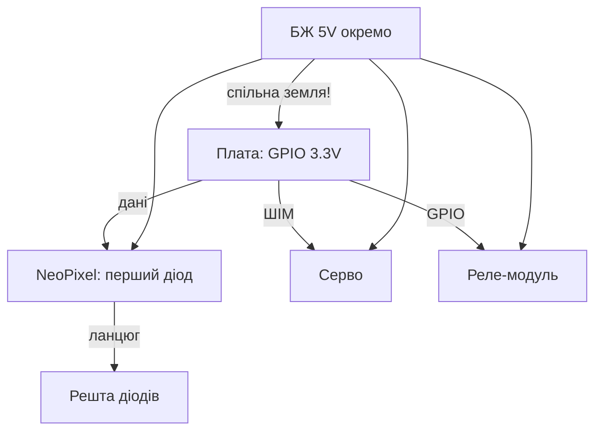

# NeoPixel, серво і реле на Raspberry Pi - сила через GPIO

![[assets/img/rpi-neopixel-servo-rele-scheme.png|600]]
*Рис. Слабкий пін керує сильним світом: NeoPixel - даними, серво - імпульсами, реле - через транзистор.*

> [!tip] Що це за нота
> Силова периферія: світло, рух, комутація 220V. GPIO лише керує - струм дає окреме живлення. База: [[03-GPIO/02-PWM-Pererivannya|ШІМ і переривання]], живлення: [[02-Zhivlennya/01-USB-C-PD|живлення USB-C]].

## 1. Мета

Рухати реальним світом безпечно:

- NeoPixel: сотні діодів одним піном;
- серво: кути без тремтіння;
- реле: 220V через опторозв'язку;
- живлення силової частини окремо від плати.

| Навантаження | Керування | Живлення |
| --- | --- | --- |
| NeoPixel-стрічка | 1 пін даних 800 кГц | 5V, 60 мА на діод |
| Серво SG90/MG996R | ШІМ 50 Гц | 5-6V окремо |
| Реле-модуль 5V | GPIO + транзистор на модулі | 5V, котушка 70 мА |
| MOSFET-навантаження | ШІМ на затвор | за навантаженням |

## 2. Архітектура сили



Спільна земля обов'язкова: без неї сигнали плавають і все поводиться дивно. Живлення плати і сили - з одного БЖ, але різними дротами.

## 3. NeoPixel детально

- бібліотека `rpi_ws281x`: DMA-driven, без джитера;
- пін даних: GPIO18 (ШІМ-канал) - найстабільніше;
- перший діод - не далі 1 м від плати, далі - підсилювач сигналу;
- яскравість 255 на сотні діодів = ампери: рахуємо (60 мА × N);
- конденсатор 1000 мкФ на живлення стрічки + резистор 300 Ом в дані.

## 4. Серво детально

- gpiozero Servo: кути -1..1, калібрування min/max;
- живлення окремо: ривок струму скидає плату через спільний БЖ;
- MG996R - метал-редуктор, SG90 - пластик для іграшок;
- більше 2 серво - PCA9685 по I2C (16 каналів);
- стартове положення - в коді до подачі живлення на серво.

## 5. Робочий код

```python
import time
import board
import neopixel
from gpiozero import Servo, OutputDevice
from gpiozero.pins.lgpio import LGPIOFactory

factory = LGPIOFactory()
pixels = neopixel.NeoPixel(board.D18, 30, brightness=0.3, auto_write=False)
servo = Servo(12, pin_factory=factory, min_pulse_width=0.001, max_pulse_width=0.002)
relay = OutputDevice(23, pin_factory=factory, active_high=True)

def set_strip(r, g, b):
    pixels.fill((r, g, b))
    pixels.show()

def alarm():
    for _ in range(3):
        set_strip(255, 0, 0)
        relay.on()
        time.sleep(0.3)
        set_strip(0, 0, 0)
        relay.off()
        time.sleep(0.3)

if __name__ == '__main__':
    servo.mid()
    set_strip(0, 255, 0)
    time.sleep(3600)
```

Яскравість 0.3 - захист очей і БЖ. Реле клацає тільки в аварії, не в циклі (ресурс контактів!).

## 6. Реле і 220V: безпека

- модулі з опторозв'язкою: керування 3.3V ок;
- комутація 220V - тільки в корпусі, клемники Wago;
- snubber (RC) на індуктивне навантаження;
- запобіжник у фазу перед реле;
- маркування: що вимикає кожне реле - на корпусі.

## 7. Живлення силової

| Навантаження | Струм | Джерело |
| --- | --- | --- |
| 30 NeoPixel, яскравість 0.3 | ~0.5A | БЖ плати вистачить |
| 300 NeoPixel, повна | ~18A | окремий БЖ 5V 20A |
| 2×SG90 | ~1A пік | БЖ 5V 2A |
| Реле 4 канали | ~0.3A | з плати через USB-БЖ |

## 8. Типові помилки

| Симптом | Причина | Лікування |
| --- | --- | --- |
| Перші діоди горять, далі ні | просадка живлення стрічки | підживити кожні 50 діодів |
| Серво смикається | спільний слабкий БЖ | окреме живлення серво |
| Реле клацає само | плаваючий вхід | pull-down, екранований дріт |
| Кольори не ті | порядок GRB vs RGB | параметр pixel_order бібліотеки |
| Плата ребутиться при старті | пусковий струм | soft-start: яскравість наростає |
| Згорів пін | 5V на GPIO | перетворювач рівнів, пін уже не врятувати |

## 9. Швидка шпаргалка сили

- земля спільна завжди;
- сила живиться окремо;
- NeoPixel: конденсатор + резистор;
- серво: калібрування + окремий БЖ;
- 220V: корпус, клеми, запобіжник.
- маркування дротів: кольори і бирки.
- фото збірки до закриття корпусу.

## 10. Суміжні ноти

- [[03-GPIO/02-PWM-Pererivannya|ШІМ і переривання]] - сигнали керування.
- [[11-Vivid/01-DSI-HDMI-Displeyi|дисплеї DSI/HDMI]] - візуальний вивід.
- [[11-Vivid/03-Audio-HAT|аудіо і HAT]] - звук до світла.
- [[02-Zhivlennya/01-USB-C-PD|живлення USB-C]] - бюджет струмів.
- [[Home|головна карта]] - повна навігація.

## Офіційні джерела

- [NeoPixel Uberguide (Adafruit Learn)](https://learn.adafruit.com/adafruit-neopixel-uberguide) - живлення, таймінги, топології.
- [gpiozero docs (Read the Docs)](https://gpiozero.readthedocs.io/en/stable/) - Servo, PWMLED, реле.
- [Getting Started (Raspberry Pi docs)](https://www.raspberrypi.com/documentation/computers/getting-started.html) - піни і живлення.
