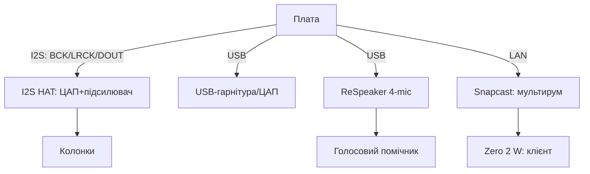

# Аудіо на Raspberry Pi - I2S HAT, USB-звук і мультирум

![[assets/img/rpi-audio-hat-scheme.png|600]]
*Рис. Три тракти звуку: I2S-HAT-плата для якості, USB - для простоти, мікрофонний масив - для голосу.*

> [!tip] Що це за нота
> Вбудованого звуку в Pi немає (ШІМ-пищалка не рахується): якість дають I2S-HAT-плати і USB. Медіацентр, сповіщення, голосовий помічник, мультирум. Дисплеї: [[11-Vivid/01-DSI-HDMI-Displeyi|дисплеї DSI/HDMI]], шини: [[04-Shini/01-I2C-SPI-UART|шини I2C/SPI/UART]].

## 1. Мета

Отримати звук під задачу:

- I2S HAT (HiFiBerry/DAC+): музика без компромісів;
- USB-аудіо: гарнітура, колонка, мікрофон - plug-and-play;
- мікрофонні масиви: ReSpeaker для голосових команд;
- мультирум: синхронний звук по кімнатах.

| Тракт | Якість | Латентність | Ціна |
| --- | --- | --- | --- |
| I2S HAT ЦАП | відмінна | низька | середня |
| USB-аудіо | добра | середня | низька |
| HDMI-аудіо | добра | низька | нуль (у монітор) |
| BT-аудіо | стиснена | висока | зручність |

## 2. Архітектура трактів



I2S-HAT-плата сідає на гребінку як HAT: overlay в config.txt, далі - звичайна ALSA-карта.

## 3. I2S HAT детально

- HiFiBerry DAC+ / DAC2 HD: стандарт де-факто;
- overlay: `dtoverlay=hifiberry-dacplus` + ребут;
- перевірка: `aplay -l` показує карту;
- підсилювачі Amp2/Amp+: колонки безпосередньо, без ресивера;
- живлення: чисте 5V, шуми БЖ чути у паузах.

## 4. USB-аудіо і мікрофони

- USB-гарнітури і ЦАП - без драйверів (UAC1/UAC2);
- вибір карти: `pavucontrol` або `raspi-config` (аудіо);
- ReSpeaker 4-Mic: DOA (напрям звуку) + шумодав;
- правило udev - фіксований індекс карти при двох USB;
- рівні: `alsamixer -c N`, зберегти `alsactl store`.

## 5. Робочий код: сповіщення і мультирум

```bash
#!/bin/bash
# announce.sh — голосове сповіщення поверх музики
CARD="plughw:0,0"
MP3="$1"
mpg123 -a "$CARD" -q "$MP3"
```

```python
import subprocess
import paho.mqtt.client as mqtt

def on_message(client, userdata, msg):
    text = msg.payload.decode()
    subprocess.run(['espeak-ng', '-v', 'uk', '-s', '150', text])

cl = mqtt.Client()
cl.connect('broker.local', 1883, 60)
cl.subscribe('home/say')
cl.on_message = on_message
cl.loop_forever()
```

Snapcast: сервер на Pi 4/5 (`snapserver`), клієнти на Zero 2 W (`snapclient`) - синхронність мілісекунди по LAN.

## 6. Голосовий помічник мінімум

- wake-word: openWakeWord на ReSpeaker;
- STT: Vosk офлайн (українська модель!);
- наміри: прості правила або Home Assistant;
- TTS: Piper українським голосом офлайн;
- усе локально - хмара не чує кухню.

## 7. HDMI-аудіо і BT

- звук у монітор/ТВ по HDMI - нуль заліза;
- перемикання виходу: правий клік по гучності;
- BT-колонка: спарювання раз, автопідключення;
- затримка BT ~200 мс - відео розсинхронізується, аудіо ок.

## 8. Типові помилки

| Симптом | Причина | Лікування |
| --- | --- | --- |
| HAT мовчить | немає overlay | dtoverlay за моделлю + ребут |
| Хрипить на піках | слабке живлення | окремий БЖ, не USB-хаб |
| USB-карта зникає | індекс плаває | udev-правило за VID:PID |
| Мікрофон шумить | AGC + дешевий БЖ | вимкнути AGC, чисте живлення |
| BT заїкається | WiFi і BT на одній антені | рознести канали, провід для музики |
| Snapcast розсинхрон | WiFi-лаг клієнта | провід клієнтам, буфер більший |

## 9. Швидка шпаргалка аудіо

- I2S HAT: overlay + `aplay -l`;
- USB: udev-фіксація індексу;
- рівні зберегти `alsactl store`;
- голос: ReSpeaker + Vosk + Piper;
- мультирум: Snapcast по дроту.

## 10. Суміжні ноти

- [[11-Vivid/01-DSI-HDMI-Displeyi|дисплеї DSI/HDMI]] - картинка до звуку.
- [[11-Vivid/02-NeoPixel-Servo-Rele|NeoPixel і серво]] - світломузика.
- [[04-Shini/01-I2C-SPI-UART|шини I2C/SPI/UART]] - керування HATами.
- [[03-GPIO/03-HAT-EEPROM|HAT і EEPROM]] - механіка HAT-плат.
- [[Home|головна карта]] - повна навігація.

## 9.1 Тиха кімната: боротьба з шумами

- земля зіркою від однієї точки;
- USB-аудіо подалі від WiFi-антени;
- ферити на кабелях живлення колонок;
- нічний режим: лімітер гучності в софті;
- тест тиші: вухо до динаміка без сигналу.
- кабелі L/R не поруч із силовими.
- гучність старту - 50 %, не 100 %.
- друга кімната - другий клієнт Snapcast.
- резервна копія asound.state після налаштування.

## Офіційні джерела

- [MAX98357A I2S Amp (Adafruit)](https://www.adafruit.com/product/3006) - I2S-підсилювач 3W.
- [Raspberry Pi Configuration (Raspberry Pi docs)](https://www.raspberrypi.com/documentation/computers/configuration.html) - аудіо і оверлеї.
- [Getting Started (Raspberry Pi docs)](https://www.raspberrypi.com/documentation/computers/getting-started.html) - HAT і розширення.
