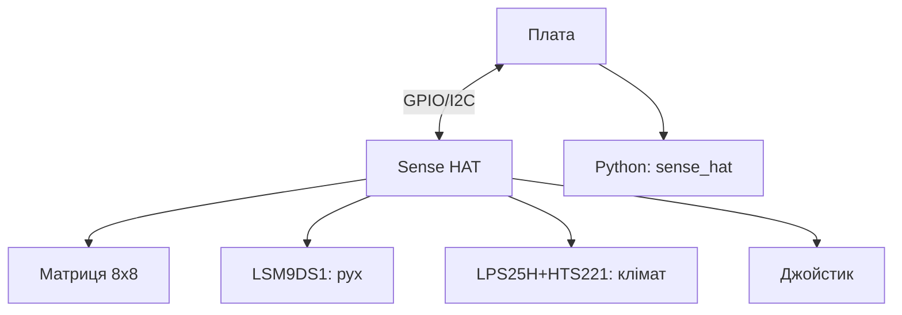

# Sense HAT на Raspberry Pi - LED-матриця, датчики і джойстик

![[assets/img/rpi-sense-hat-scheme.png|600]]
*Рис. Sense HAT поверх гребінки: матриця 8x8, гіроскоп/акселерометр/магнітометр, барометр, вологість, міні-джойстик.*

> [!tip] Що це за нота
> Легенда екосистеми (літала на МКС!): одна плата дає вивід, сенсори і ввід одразу. Ідеальна для навчання і метеостанцій. Стандарт HAT: [[03-GPIO/03-HAT-EEPROM|HAT і EEPROM]], живлення: [[02-Zhivlennya/01-USB-C-PD|живлення USB-C]].

## 1. Мета

Вичавити з Sense HAT усе:

- матриця 8x8 RGB: текст, піктограми, графіки;
- IMU (гіроскоп+акселерометр+магнітометр): нахил і компас;
- тиск, вологість, температура: міні-метеостанція;
- джойстик: 5 напрямків як кнопки;
- бібліотека `sense_hat` - усе в три рядки.

| Блок | Чип | Що вміє |
| --- | --- | --- |
| Матриця | LED 8x8 (ATtiny) | текст, RGB 0-255 |
| IMU | LSM9DS1 (гіро+аксель+магніт) | нахил, курс |
| Тиск/волога | LPS25H + HTS221 | 260-1260 гПа, %RH |
| Джойстик | 5 напрямків | події як кнопки |

## 2. Архітектура плати



Єдина плата, що закриває вивід+ввід+сенсори разом. Споживання - міліампери, живлення з гребінки вистачає.

## 3. Встановлення і перший запуск

- сідає на гребінку 40 через подовжувач (вентиляція SoC!);
- бібліотека: `pip install sense-hat` (системна - через apt);
- емулятор на ПК: `sense-emu` - код без плати;
- тест: приклад `rainbow.py` з бібліотеки;
- Astro Pi: ті ж плати літали на МКС - місії для шкіл.

## 4. Матриця: текст і графіка

- `show_message("Hi", scroll_speed=0.1)` - бігучий рядок;
- `set_pixel(x, y, r, g, b)` - точкове малювання;
- `set_pixels(список 64)` - кадр цілком;
- яскравість: `low_light=True` для ночі;
- орієнтація: `set_rotation(0/90/180/270)`.

## 5. Робочий код: метеостанція з компасом

```python
from sense_hat import SenseHat
import time

sense = SenseHat()
sense.low_light = True
sense.set_rotation(180)

def show_temp():
    t = sense.get_temperature_from_pressure()
    h = sense.get_humidity()
    p = sense.get_pressure()
    msg = f"{t:.0f}C {h:.0f}% {p:.0f}"
    sense.show_message(msg, scroll_speed=0.08, text_colour=[0, 255, 0])
    return t, h, p

def show_compass():
    o = sense.get_orientation()
    yaw = o['yaw']
    dirs = ['N', 'NE', 'E', 'SE', 'S', 'SW', 'W', 'NW']
    d = dirs[int((yaw + 22.5) / 45) % 8]
    sense.show_letter(d, text_colour=[255, 255, 0])
    return yaw

while True:
    t, h, p = show_temp()
    time.sleep(2)
    yaw = show_compass()
    print(f"T={t:.1f} H={h:.0f} P={p:.0f} yaw={yaw:.0f}")
    time.sleep(2)
```

Температуру беремо з датчика тиску (точніша - подалі від CPU). Калібрування: відняти саморозігрів плати 3-5 °C.

## 6. Джойстик як кнопки

- події: `pressed`, `held`, `released` + напрямки;
- меню на матриці: вгору/вниз - пункти, втиснути - вибір;
- гра «змійка» 8x8 - класика гуртка;
- дебаунс вбудований у бібліотеку.

## 7. Точність і межі

- термометр бреше через тепло плати - виносьте або компенсуйте;
- магнітометр калібруємо вісімкою;
- тиск - як у барометра, висоту рахуємо від QNH;
- 8x8 - символи 3x5, кирилиця малюється вручну;
- для серйозної метео - зовнішні BME280/DS18B20.

## 8. Типові помилки

| Симптом | Причина | Лікування |
| --- | --- | --- |
| Матриця темна | яскравість/rotація? - код без `show` | викликати show після малювання |
| Температура +5 °C | тепло плати | компенсація або зовнішній датчик |
| Джойстик не реагує | читаємо стан замість подій | колбеки pressed/held/released |
| IMU пливе | немає калібрування | вісімка для магнітометра |
| Емулятор ≠ залізо | таймінги на ПК інші | фінальний тест на платі |
| HAT гріє плату | немає вентиляції | подовжувач гребінки + потік |

## 9. Швидка шпаргалка Sense HAT

- емулятор `sense-emu` - код без плати;
- температура - з датчика тиску;
- матриця: текст, пікселі, low_light;
- джойстик - події, не опитування;
- калібрування магнітометра вісімкою.

## 10. Суміжні ноти

- [[03-GPIO/03-HAT-EEPROM|HAT і EEPROM]] - стандарт плат.
- [[10-Sensori/01-BME280-Klimat|клімат BME280]] - точніший клімат.
- [[10-Sensori/02-MPU6050-Rukh|рух MPU6050]] - IMU окремо.
- [[11-Vivid/02-NeoPixel-Servo-Rele|NeoPixel і серво]] - великий вивід.
- [[Home|головна карта]] - повна навігація.

## 9.1 Польоти Sense HAT: що було на МКС

- Astro Pi: дві плати на станції з 2015 року;
- місії Zero Robotics і Mission Zero для шкіл;
- код учнів реально виконувався на орбіті;
- сенсори ті ж, що в магазині;
- наступна місія - привід зібрати свою програму.

## Офіційні джерела

- [Sense HAT (Raspberry Pi)](https://www.raspberrypi.com/products/sense-hat/) - характеристики і датчики.
- [Getting Started (Raspberry Pi docs)](https://www.raspberrypi.com/documentation/computers/getting-started.html) - HAT і налаштування.
- [gpiozero docs (Read the Docs)](https://gpiozero.readthedocs.io/en/stable/) - піни і скрипти.
