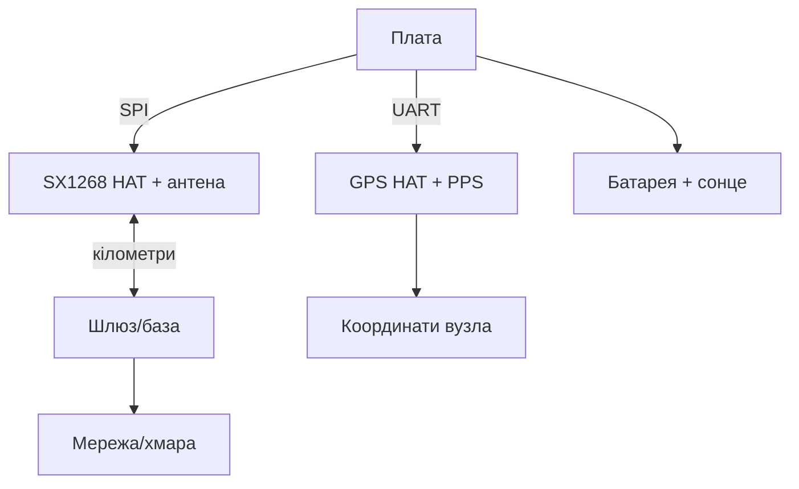

# LoRa і GPS HAT для Raspberry Pi - дальній зв'язок і координати

![[assets/img/rpi-gps-lora-hat-scheme.png|600]]
*Рис. Дальній вузол: LoRa-шляпка говорить на кілометри, GPS-HAT-плата знає де, плата керує обома.*

> [!tip] Що це за нота
> Коли WiFi не дістає: кілометри в полі (LoRa) плюс координати (GPS). Шлюз, трекер, дачні датчики. Бортове радіо: [[05-Radio/01-WiFi-BT-Bort|бортове радіо]], GPS окремо: [[10-Sensori/05-GPS-NEO|GPS-модулі]].

## 1. Мета

Побудувати далекобійний вузол:

- LoRa HAT (SX1268/SX1276): точка-точка і LoRaWAN-шлюз;
- GPS HAT: координати + PPS + годинник;
- разом: трекер з передачею координат по радіо;
- антени, живлення, законність діапазонів.

| Модуль | Діапазон | Дальність | Швидкість |
| --- | --- | --- | --- |
| SX1268 HAT | 433 МГц | до 5 км прямої | 0.3-62 кбіт/с |
| SX1262 HAT | 868 МГц (EU) | до 5 км | LoRaWAN-ready |
| GPS HAT (NEO) | L1 | світ | 9600 бод NMEA |

Діапазон і потужність - за місцевим законодавством: 433 МГц/10 мВт і 868 МГц/25 мВт для EU - орієнтири, перевірити норми.

## 2. Архітектура вузла



Шлюз - та сама зв'язка на Pi 4 з інтернетом: приймає пакети вузлів, віддає в MQTT.

## 3. LoRa HAT детально

- чип SX1268 (433) або SX1262 (868): SPI + DIO1/BUSY/RST;
- параметри: SF7-SF12 (швидкість проти дальності), BW 125-500 кГц, CR 4/5-4/8;
- потужність +22 дБм максимум, для батареї - мінімум достатній;
- антена обов'язкова до вмикання TX (див. узгодження);
- бібліотеки: `pySX127x`/`RadioLib` (порт), або SPI вручну.

## 4. GPS HAT детально

- NEO-6M/8M на платі + роз'єм антени (активна!);
- UART 9600, PPS на GPIO;
- RTC-батарейка на HATі - теплий старт за секунди;
- зовнішня антена з магнітом - на дах/капот;
- NMEA-парсинг той же, що в ноті GPS-модулів.

## 5. Робочий код: трекер P2P

```python
import time
import serial
from SX126x import SX126x

lora = SX126x(spi_bus=0, cs_pin=8, reset_pin=22, busy_pin=23, irq_pin=24)
lora.begin(freq=433000000, bw=125000, sf=9, cr=5, power=14)
gps = serial.Serial('/dev/serial0', 9600, timeout=1)

def gps_pos():
    for _ in range(20):
        line = gps.readline().decode('ascii', errors='ignore')
        if line.startswith('$GPGGA'):
            p = line.split(',')
            if p[6] not in ('', '0'):
                return p[2] + p[3] + ',' + p[4] + p[5]
    return None

while True:
    pos = gps_pos()
    msg = pos if pos else "NOFIX"
    lora.send(msg.encode())
    print("TX:", msg)
    time.sleep(60)
```

SF9 - золота середина: кілометри є, ефір не забиваємо. Потужність 14 дБм вистачає місту, 22 - полю.

## 6. LoRaWAN-шлюз (спрощено)

- single-channel шлюз на HATі - для своїх вузлів (не TTN);
- повноцінний шлюз - concentrator SX1302 (окрема плата);
- пакет: ID вузла + дані + CRC, підтвердження з бази;
- шифрування корисного - AES ключем прошивки;
- етика ефіру: duty-cycle і мінімальна потужність.

## 7. Антени і дальність

- штир 433 МГц ~17 см, 868 МГц ~8 см - чвертьхвильові;
- висота важливіша за потужність: дах б'є далі за вати;
- VSWR перевіряємо вимірювачем, не «на око»;
- без антени НЕ передавати - згорить вихід;
- грозозахист на стаціонарних щоглах.

## 8. Типові помилки

| Симптом | Причина | Лікування |
| --- | --- | --- |
| Тиша в ефірі | різні SF/BW/частота вузлів | єдиний профіль на всіх |
| GPS без фікса | антена в приміщенні | вікно/дах, активна антена |
| Мала дальність | антена всередині корпусу | винести, висота вирішує |
| Згорів TX | передача без антени | антена першою, потім живлення |
| Конфлікт SPI | дисплей на тій самій шині | окремі CS, чергування |
| PPS немає | пін не підключений | PPS на GPIO + оверлей |

## 9. Швидка шпаргалка LoRa/GPS

- SF9/BW125 - стартовий профіль;
- антена до вмикання TX завжди;
- GPS: небо + активна антена;
- шлюз приймає, вузли сплять;
- ефір ділити чесно (duty-cycle).

## 10. Суміжні ноти

- [[05-Radio/01-WiFi-BT-Bort|бортове радіо]] - ближній зв'язок.
- [[10-Sensori/05-GPS-NEO|GPS-модулі]] - NMEA детально.
- [[03-GPIO/03-HAT-EEPROM|HAT і EEPROM]] - механіка HAT-плат.
- [[04-Shini/01-I2C-SPI-UART|шини I2C/SPI/UART]] - SPI і UART.
- [[Home|головна карта]] - повна навігація.

## 9.1 Етика ефіру для LoRa-вузлів

- мінімальна потужність, що закриває дистанцію;
- duty-cycle: мовчати 99 % часу;
- не глушити чужі шлюзи своїми пакетами;
- частота і SF - за місцевим планом діапазонів;
- позивний/ID вузла в кожному пакеті.

## Офіційні джерела

- [SX1268 433M LoRa HAT (Waveshare)](https://www.waveshare.com/wiki/SX1268_433M_LoRa_HAT) - підключення, параметри.
- [NEO-6 series (u-blox)](https://www.u-blox.com/en/product/neo-6-series) - NMEA і PPS.
- [Getting Started (Raspberry Pi docs)](https://www.raspberrypi.com/documentation/computers/getting-started.html) - HAT і шини.
