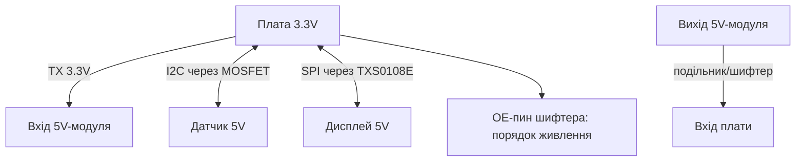

# Узгодження рівнів 3.3V - перетворювачі рівнів, подільники і толерантність

![[assets/img/rpi-level-shift-3v3-scheme.png|600]]
*Рис. Міст між світами: 5V сигнали вниз через перетворювач рівнів/подільник, 3.3V вгору - часто безпосередньо.*

> [!tip] Що це за нота
> Головне правило виживання GPIO: плата - 3.3V, світ датчиків - часто 5V. Коли треба перетворювач рівнів, коли вистачить резисторів, а коли взагалі нічого не треба. База: [[03-GPIO/01-Header-Gpiozero|гребінка і gpiozero]], живлення: [[02-Zhivlennya/01-USB-C-PD|живлення USB-C]].

## 1. Мета

З'єднувати без диму:

- напрями: 5V→3.3V (небезпечний) і 3.3V→5V (зазвичай ок);
- інструменти: TXS0108E, MOSFET-зсув, дільник, діод;
- швидкості: що тягне кожен спосіб (I2C/SPI/UART);
- типові модулі: які вже толерантні, а які ні.

| Напрям | Спосіб | Межа швидкості |
| --- | --- | --- |
| 5V → 3.3V | дільник 1к/2к | кілогерци, UART ок |
| 5V ↔ 3.3V | TXS0108E (авто) | МГц, I2C/SPI |
| 5V ↔ 3.3V | MOSFET BSS138 попарно | МГц, I2C ідеально |
| 3.3V → 5V | безпосередньо (TTL-поріг) | див. даташит приймача |
| 1-Wire | MOSFET або дільник | працює |

## 2. Архітектура моста



Порядок вмикання: спочатку живлення обох сторін, потім сигнали. OE перетворювача рівнів - після стабілізації живлень.

## 3. TXS0108E детально

- 8 каналів, автоматичний напрям;
- два живлення: VCCA (3.3V) і VCCB (5V);
- OE на землю через резистор - увімкнення за командою;
- підтяжки на лініях - слабкі (десятки кОм), I2C тягне;
- не для великих ємностей і довгих ліній - там MOSFET.

## 4. MOSFET-зсув для I2C

- класика: BSS138 + 2×10 кОм на канал (SDA, SCL окремо);
- працює в обидва боки автоматично;
- швидкість до 400 кГц стабільно;
- готові 4-канальні платки - копійки;
- своїми руками - 10 хвилин паяння.

## 5. Робочий код: перевірка рівнів

```python
import time
from gpiozero import DigitalInputDevice, DigitalOutputDevice

tx = DigitalOutputDevice(17)
rx = DigitalInputDevice(27, pull_up=True)

errors = 0
for i in range(1000):
    bit = i & 1
    tx.value = bit
    time.sleep(0.001)
    if rx.value != bit:
        errors += 1

print(f"errors: {errors}/1000")
if errors == 0:
    print("link OK: levels compatible")
else:
    print("add level shifter!")
```

Петля TX→RX через перетворювач рівнів/модуль: 1000 біт виявляють проблему до підключення дорогого датчика.

## 6. Дільник: розрахунок за хвилину

- 5V → 3.3V: R1=1 кОм (верх), R2=2 кОм (низ) → 3.33V;
- струм дільника 1.6 мА - для входів ок, для живлення ні;
- швидкість: ємність входу × опір - межа сотні кГц;
- точність резисторів 1 % - напруга в допуску;
- дільник - тільки вхід, ніколи живлення і вихід!

## 7. Що толерантно з коробки

| Модуль | Вхід 5V | Вихід до плати |
| --- | --- | --- |
| HC-SR04 (ехо) | тригер ок | ехо через дільник! |
| DHT22 дані | живлення 3.3V - прямо | прямо |
| WS2812 DIN | треба 5V-рівень | перетворювач рівнів або перший діод поруч |
| Реле-модулі | оптопара, 3.3V вистачає | - |
| SD-карти | тільки 3.3V | прямо |

## 8. Типові помилки

| Симптом | Причина | Лікування |
| --- | --- | --- |
| Згорів пін | 5V безпосередньо на GPIO | перетворювач рівнів/подільник, пін не врятувати |
| I2C через TXS глючить | слабкі підтяжки + довга лінія | MOSFET-зсув замість TXS |
| Дільник гріється | живлять з нього модуль | дільник - тільки сигнал! |
| OE висить у повітрі | перетворювач рівнів у невизначеному стані | OE на землю/живлення явно |
| Працює, потім ні | просадка 5V сторони | стабільне живлення обох сторін |
| WS2812 перший блимає | 3.3V на межі порогу | перетворювач рівнів або діод ближче 10 см |

## 9. Швидка шпаргалка рівнів

- вхід плати: ніколи вище 3.6V;
- 5V→3.3V: дільник (повільно) або перетворювач рівнів;
- I2C: MOSFET-зсув - король;
- перевірка петлею до датчика;
- OE і живлення - за порядком.

## 10. Суміжні ноти

- [[03-GPIO/01-Header-Gpiozero|гребінка і gpiozero]] - піни і правила.
- [[04-Shini/01-I2C-SPI-UART|шини I2C/SPI/UART]] - шини через перетворювачі рівнів.
- [[13-Moduli-zhivlennya-rivniv/01-Buck-Boost-DC-DC|DC-DC модулі]] - чисті живлення.
- [[02-Zhivlennya/01-USB-C-PD|живлення USB-C]] - стабільність сторін.
- [[Home|головна карта]] - повна навігація.

## 9.1 Таблиця сумісності напрямів

- GPIO→датчик 5V вхід: перетворювач рівнів завжди;
- датчик 5V→GPIO: дільник або перетворювач рівнів;
- I2C в обидва боки: MOSFET-зсув;
- SPI швидкий: TXS0108E;
- сумніваєшся - перетворювач рівнів, не надія.
- запасні платки перетворювачів рівнів у коробці.
- маркування напрямів на шлейфах.
- осцилограф на швидких лініях після монтажу.
- живлення обох сторін до подачі сигналів.

## Офіційні джерела

- [TXS0108E (Texas Instruments)](https://www.ti.com/product/TXS0108E) - автовизначення безпосередньо, OE.
- [UPS HAT C (Waveshare Wiki)](https://www.waveshare.com/wiki/UPS_HAT_(C)) - приклад 5V/3.3V плати.
- [gpiozero docs (Read the Docs)](https://gpiozero.readthedocs.io/en/stable/) - піни і рівні.
