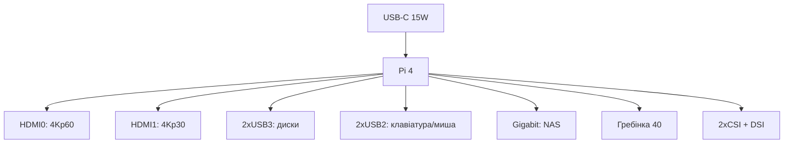

# Raspberry Pi 4 як робоча конячка - ревізії, USB-C і межі плати

![[assets/img/rpi-pi4-board-scheme.png|600]]
*Рис. Pi 4: USB-C 3A, 2×micro-HDMI, 2×USB3, Gigabit Ethernet - усе, що треба серверу і медіацентру.*

> [!tip] Що це за нота
> Мільйони плат у полях: що вміє, де межі, які ревізії брати. Старший брат описаний тут: [[14-Devboards/01-Pi5-Flagman|флагман Pi 5]], вибір: [[00-Start/03-Porivnyannya-plate|порівняння моделей]].

## 1. Мета

Вичавити максимум з масової плати:

- ревізії 1.1→1.5: що виправили і як впізнати;
- USB3 і Ethernet на повну: NAS і сервер;
- 4Kp60 тільки з одного HDMI - нюанси медіа;
- коли Pi 4 вистачить, а коли вже треба Pi 5.

| Параметр | Значення |
| --- | --- |
| SoC | BCM2711, 4×A72 1.5 ГГц |
| RAM | 1/2/4/8 ГБ LPDDR4 (1 ГБ знята) |
| USB | 2×USB3 + 2×USB2 (контролер VLI) |
| Мережа | Gigabit Ethernet, WiFi ac, BT 5.0 |
| Відео | 2×micro-HDMI, 1×4Kp60 або 2×4Kp30 |
| Живлення | USB-C 5V 3A (без PD) |

## 2. Архітектура плати



Порядок: корпус → SD → кабелі → живлення останнім. Перший boot - 30-60 секунд на розгортання.

## 3. Ревізії: що виправили

- 1.1: баг USB-C (не всі кабелі з e-marker працювали);
- 1.2: виправлений USB-C резистор;
- 1.4: новий PMIC, менше гріється;
- 1.5: косметика і заміна компонентів;
- брати 1.4+: дивитись напис біля гребінки.

## 4. USB3 і диски

- два порти USB3 - SSD-коробки без хаба (по одному на порт);
- UAS-режим увімкнений ядром, TRIM - за підтримкою коробки;
- завантаження з USB: EEPROM з 2020 року вміє, оновити завантажувач;
- система на SSD: швидше і живучіше за будь-яку SD.

## 5. Робочий код: монітор сервера

```python
from gpiozero import CPUTemperature, DiskUsage
import time
import shutil

cpu = CPUTemperature()

while True:
    t = cpu.temperature
    du = DiskUsage()
    total, used, free = shutil.disk_usage('/')
    print(f"CPU {t:.1f}C disk {used*100//total}% free {free//2**30}G")
    if t > 75.0:
        print("WARN: cooling needed")
    if used * 100 // total > 90:
        print("WARN: disk almost full")
    time.sleep(60)
```

Раз на хвилину в cron-лог - вистачить для домашнього сервера. Алерти - далі в Telegram-бота.

## 6. Медіацентр нюанси

- Kodi (LibreELEC/OSMC): 4Kp60 H.265 з HDMI0;
- звук - HDMI або USB-ЦАП, джека 3.5 немає? - є! комбінований AV-джек;
- CEC: керування з пульта телевізора працює;
- корпус з ІЧ-приймачем - пульт без USB-донгла.

## 7. Мережа і сервер

- Gigabit чесний (~940 Мбіт/с), не через USB як на Pi 3;
- Pi-hole + Unbound: реклама ріжеться, DNS свій;
- WireGuard: 100+ Мбіт/с вистачає процесора;
- статичний IP або DHCP-резервація на роутері.

## 7.1 Кластер з Pi 4: коли має сенс

- навчальний Kubernetes: 3-4 плати + PoE-HAT-плати + стійка;
- мережеве завантаження: один образ на всіх через PXE;
- розподілені задачі: черга (Celery/RQ) замість складної синхронізації;
- моніторинг: Prometheus + Grafana на окремій платі;
- живлення стійки: один потужний БЖ 5V 20A з розводкою;
- мережа: гігабітний світч, статичні IP за MAC.

Бойовий сенс - лише для навчання і резервування. Рахувати не швидше за один Pi 5, але відмовостійкість вища.

Чесні межі кластера:

- USB-диски на кожному вузлі - локальні дані;
- спільна файлова система - NFS з головного вузла;
- годинник - NTP з одного джерела;
- оновлення - по одному вузлу, не всі разом.

## 8. Типові помилки

| Симптом | Причина | Лікування |
| --- | --- | --- |
| USB3-диск відвалюється | живлення/кабель | БЖ 3A, короткий якісний кабель |
| 4K смикається | другий монітор їсть смугу | один HDMI для 4Kp60 |
| Гріється до 80 °C | пасив у корпусі-глухарі | радіатор мінімум, краще кулер |
| Не завантажується з USB | старий EEPROM | оновити bootloader |
| WiFi повільний | антена Proant, метал поруч | винести з металевого корпусу |
| Ревізія 1.1 + кабель e-marker | баг USB-C | кабель без маркера або плата 1.2+ |

## 9. Суміжні ноти

- [[14-Devboards/01-Pi5-Flagman|флагман Pi 5]] - наступний крок.
- [[02-Zhivlennya/01-USB-C-PD|живлення USB-C]] - БЖ детально.
- [[08-Pamyat/01-SD-eMMC-NVMe|носії пам'яті]] - SSD по USB.
- [[09-Proshivka/02-EEPROM-Boot|завантаження EEPROM]] - boot з USB.
- [[15-Protokoli/01-MQTT|протокол MQTT]] - серверні задачі.

## 9.1 Швидка шпаргалка Pi 4

- ревізія 1.4+ (USB-C виправлено);
- SSD по USB3 + boot з USB;
- 4Kp60 тільки з HDMI0;
- радіатор мінімум, краще кулер;
- Gigabit чесний - NAS без питань.

## Офіційні джерела

- [Raspberry Pi 4 Model B (Raspberry Pi)](https://www.raspberrypi.com/products/raspberry-pi-4-model-b/) - характеристики і ревізії.
- [Getting Started (Raspberry Pi docs)](https://www.raspberrypi.com/documentation/computers/getting-started.html) - перший запуск.
- [gpiozero docs (Read the Docs)](https://gpiozero.readthedocs.io/en/stable/) - моніторинг ресурсів.
