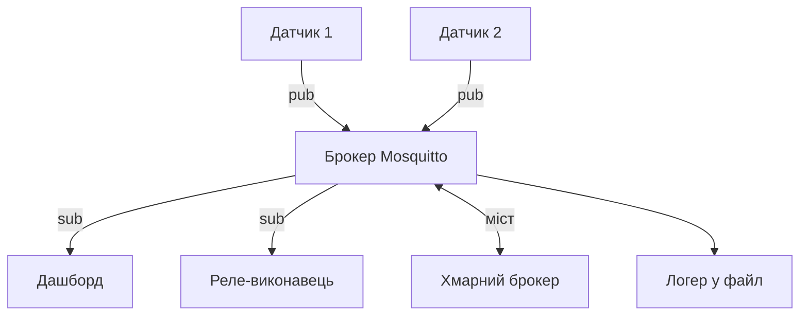

# MQTT на Raspberry Pi - брокер Mosquitto, топіки і телеметрія

![[assets/img/rpi-mqtt-broker-scheme.png|600]]
*Рис. Зірка MQTT: вузли публікують, брокер роздає, підписники забирають - плата і брокер, і клієнт.*

> [!tip] Що це за нота
> Нервова система IoT: легкі повідомлення, теми з ієрархією, робота через обриви. Брокер на самій платі - автономність без інтернету. Мережа: [[09-Proshivka/03-OS-Nalashtuvannya|налаштування ОС]], датчики: [[10-Sensori/01-BME280-Klimat|клімат BME280]].

## 1. Мета

Підняти повний цикл MQTT:

- брокер Mosquitto на платі за 10 хвилин;
- топіки: іменування, яке не болить через рік;
- QoS і retained: що коли використовувати;
- Python-клієнт paho: публікація і підписка;
- міст у хмарного брокера.

| Елемент | Роль | Приклад |
| --- | --- | --- |
| Брокер | центр зірки | Mosquitto на Pi 4 |
| Паблішер | віддає дані | датчик температури |
| Сабскрайбер | забирає дані | дашборд, реле |
| Топік | адреса | `home/kitchen/temp` |
| QoS | гарантія | 0 - швидко, 1 - точно |

## 2. Архітектура мережі



Локальний брокер працює без інтернету - автоматика дому не залежить від провайдера. Міст дзеркалить обране в хмару.

## 3. Брокер за 10 хвилин

- `apt install mosquitto mosquitto-clients`;
- конфіг: слухач 1883, анонім локально або паролі;
- паролі: `mosquitto_passwd`, окремий файл;
- автозапуск systemd увімкнений за замовчуванням;
- тест: `mosquitto_sub` в одному терміналі, `mosquitto_pub` в іншому.

## 4. Топіки, які не болять

- ієрархія: `дім/кімната/пристрій/метрика`;
- нижній регістр, без пробілів і кирилиці;
- `.../set` - команди, `.../state` - стан (retained!);
- `.../availability` - онлайн/офлайн (LWT);
- версія схеми в топіку при зміні формату (`v2/`).

## 5. Робочий код: клієнт і міст

```python
import json
import time
import paho.mqtt.client as mqtt

STATE = {'temp': 0.0, 'relay': False}

def on_connect(cl, ud, flags, rc, props=None):
    cl.subscribe('home/+/relay/set')
    cl.publish('home/node1/availability', 'online', retain=True)

def on_message(cl, ud, msg):
    topic = msg.topic
    if topic.endswith('/relay/set'):
        room = topic.split('/')[1]
        STATE['relay'] = msg.payload.decode() == 'ON'
        cl.publish(f'home/{room}/relay/state',
                   'ON' if STATE['relay'] else 'OFF', retain=True)

cl = mqtt.Client(mqtt.CallbackAPIVersion.VERSION2)
cl.on_connect = on_connect
cl.on_message = on_message
cl.will_set('home/node1/availability', 'offline', retain=True)
cl.username_pw_set('node1', 'secret')
cl.connect('localhost', 1883, 60)
cl.loop_start()

while True:
    STATE['temp'] = 23.5
    cl.publish('home/node1/temp',
               json.dumps({'t': STATE['temp'], 'ts': int(time.time())}))
    time.sleep(60)
```

LWT-повідомлення `offline` - брокер розішле сам, якщо клієнт впаде. Retained-стан переживає перезапуск підписника.

## 6. QoS і retained на пальцях

- QoS 0: вогонь і забув (телеметрія);
- QoS 1: мінімум раз (команди);
- QoS 2: рівно раз (рідко треба, дорого);
- retained: останнє значення новим підписникам;
- clean session false: черга офлайн-повідомлень.

## 7. Міст у хмару

- `connection` в `mosquitto.conf`: адреса, логін, топіки обох напрямів;
- вгору - телеметрія, вниз - команди;
- TLS для моста (сертифікати Let's Encrypt);
- при обриві - локальна робота триває, міст дожене;
- моніторинг моста: `$SYS/broker/connection/+/state`.

## 8. Типові помилки

| Симптом | Причина | Лікування |
| --- | --- | --- |
| `Connection refused` | брокер не слухає/фаєрвол | `listener 1883`, ufw-правило |
| Повідомлення губляться | QoS 0 при обривах | команди - QoS 1, черга |
| Дублікати команд | retained + перепідписка | retained лише на state, не на set |
| Клієнт викидає | однаковий client-id у двох | унікальний ID на вузол |
| Кирилиця в топіках | кодування пливе | тільки латиниця в топіках |
| Пароль у коді на GitHub | витік | окремий secrets-файл поза репо |

## 9. Швидка шпаргалка MQTT

- брокер локально - автономність;
- топіки: дім/кімната/пристрій/метрика;
- set - команди, state - retained-стан;
- LWT-повідомлення про смерть клієнта;
- паролі в окремий файл.

## 10. Суміжні ноти

- [[15-Protokoli/02-HTTP-Webhook|HTTP і вебхуки]] - альтернативний транспорт.
- [[10-Sensori/01-BME280-Klimat|клімат BME280]] - типовий паблішер.
- [[09-Proshivka/03-OS-Nalashtuvannya|налаштування ОС]] - автозапуск брокера.
- [[16-Proekti/01-Meteostantsiya|метеостанція]] - перший видавець.
- [[Home|головна карта]] - повна навігація.

## Офіційні джерела

- [MQTT Specification (OASIS)](https://mqtt.org/mqtt-specification/) - пакети, QoS, retained.
- [paho.mqtt.python (Eclipse, GitHub)](https://github.com/eclipse/paho.mqtt.python) - клієнт і приклади.
- [Mosquitto download (Eclipse)](https://mosquitto.org/download/) - брокер і конфігурація.
