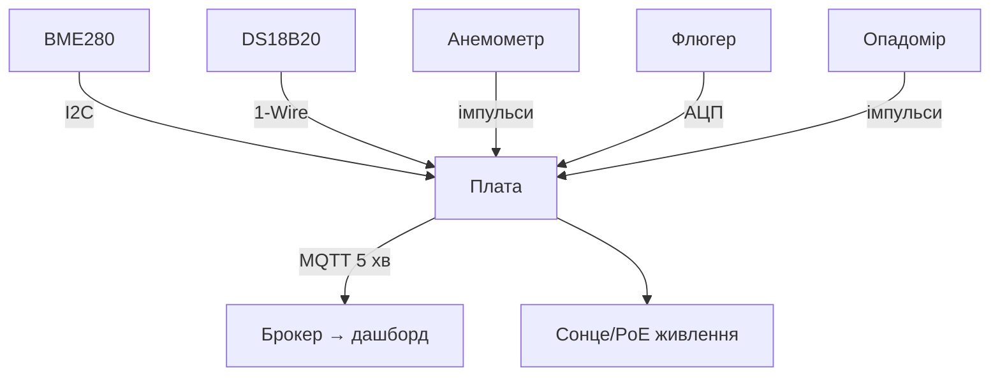

# Метеостанція на Raspberry Pi - датчики, вітер і передача даних

![[assets/img/rpi-meteostantsiya-scheme.png|600]]
*Рис. Метео-вузол: BME280 + анемометр + опадомір → плата → MQTT → дашборд; живлення з запасом.*

> [!tip] Що це за нота
> Класика жанру від А до Я: датчики, щогла, живлення, код, передача, дашборд. Збирається за вихідні, працює роками. Сенсори: [[10-Sensori/01-BME280-Klimat|клімат BME280]], [[10-Sensori/03-DS18B20-Temp|температура DS18B20]], протоколи: [[15-Protokoli/01-MQTT|протокол MQTT]].

## 1. Мета

Побудувати станцію, якій довіряєш:

- температура/вологість/тиск - BME280 + DS18B20 для звірки;
- вітер: швидкість (анемометр) і напрям (флюгер);
- опади: опадомір-перекидник;
- передача кожні 5 хвилин + дашборд;
- автономність: сонце або PoE.

| Датчик | Що міряє | Підключення |
| --- | --- | --- |
| BME280 | T/RH/P | I2C |
| DS18B20 | T для звірки | 1-Wire |
| Анемометр | імпульси/оберт | GPIO переривання |
| Флюгер | резистивний дільник | АЦП (ADS1115) |
| Опадомір | замикання на 0.2 мм | GPIO переривання |

## 2. Архітектура станції



Щогла 2-3 м над дахом: вітер чесний, температура без впливу стін. Кабель у гофрі, коробка IP65.

## 3. Вітер: анемометр і флюгер

- анемометр: геркон дає 1 імпульс/оберт, калібрування 2.4 км/год на Гц (за паспортом);
- пориви: максимум 3-секундного вікна, не середнє;
- флюгер: 8 резисторів дільника → 8 напрямків по напрузі;
- мертва зона флюгера ±5° - норма;
- підшипники анемометра живуть 2-3 роки, далі заміна.

## 4. Опади: перекидник

- лійка 0.2 мм на перекидання (за паспортом);
- геркон на перекиданні - імпульс у GPIO;
- антибрязкіт 100 мс ігноруємо;
- листя в лійці - щотижнева чистка восени;
- сніг не рахується (топиться навесні разом).

## 5. Робочий код

```python
import time
import board
import busio
import adafruit_bme280
from gpiozero import Button

i2c = busio.I2C(board.SCL, board.SDA)
bme = adafruit_bme280.Adafruit_BME280_I2C(i2c, address=0x76)
bme.sea_level_pressure = 1013.25

wind_count = 0
rain_count = 0

def wind_tick():
    global wind_count
    wind_count += 1

def rain_tick():
    global rain_count
    rain_count += 1

anem = Button(5, pull_up=True)
anem.when_pressed = wind_tick
rain = Button(6, pull_up=True, bounce_time=0.1)
rain.when_pressed = rain_tick

import paho.mqtt.client as mqtt
cl = mqtt.Client()
cl.connect('broker.local', 1883, 60)
cl.loop_start()

while True:
    time.sleep(300)
    kmh = wind_count * 2.4 / 300 * 3.6
    mm = rain_count * 0.2
    wind_count = 0
    rain_count = 0
    t = bme.temperature
    h = bme.relative_humidity
    p = bme.pressure
    cl.publish('meteo/all', f"{t:.1f},{h:.0f},{p:.0f},{kmh:.1f},{mm:.1f}")
    print(f"T={t:.1f} H={h:.0f} P={p:.0f} W={kmh:.1f} R={mm:.1f}")
```

Калібрувальна константа анемометра - з паспорта конкретної моделі. Перевірка: автомобіль 60 км/год поруч (жарт з часткою правди - краще вентилятор з відомою швидкістю).

## 6. Живлення станції

- PoE - ідеал, якщо кабель дотягується;
- сонце 20W + АКБ 12V 7Аг + buck - автономність тиждень без сонця;
- Zero 2 W замість Pi 4 - економія ват у рази;
- зимовий режим: рідші опитування, без підсвітки.

## 7. Дашборд і архів

- MQTT → Node-RED/Telegraf → InfluxDB → Grafana;
- добові мін/макс, місячні суми опадів;
- експорт CSV для агронома-сусіда;
- фото неба раз на годину (камера!) - хмарність очима.

## 8. Типові помилки

| Симптом | Причина | Лікування |
| --- | --- | --- |
| Температура +3 °C | сонце на корпус | екран Стівенсона, тінь |
| Вітер завжди 0 | геркон залип | заміна геркона, перевірка магніту |
| Опади подвоюються | брязкіт перекидника | bounce_time 100 мс |
| Провал даних вночі | батарея сідає | більша АКБ, рідші цикли |
| Тиск «не той» | QNH не оновлено | щоденне оновлення з метеослужби |
| Корозія за рік | волога в коробці | силікагель, кабельні вводи |

## 9. Швидка шпаргалка станції

- щогла 2-3 м, екран від сонця;
- калібрувальні константи - з паспортів;
- передача раз на 5 хвилин;
- живлення з запасом ×2;
- чистка лійки восени.

## 10. Суміжні ноти

- [[10-Sensori/01-BME280-Klimat|клімат BME280]] - головний датчик.
- [[10-Sensori/03-DS18B20-Temp|температура DS18B20]] - звірка.
- [[15-Protokoli/01-MQTT|протокол MQTT]] - передача даних.
- [[02-Zhivlennya/02-PoE-HAT|живлення PoE]] - живлення щогли.
- [[Home|головна карта]] - повна навігація.

## Офіційні джерела

- [BME280 (Adafruit)](https://www.adafruit.com/product/2650) - кліматичне ядро станції.
- [Raspberry Pi OS (Raspberry Pi)](https://www.raspberrypi.com/software/) - система вузла.
- [gpiozero docs (Read the Docs)](https://gpiozero.readthedocs.io/en/stable/) - імпульси вітру і дощу.
