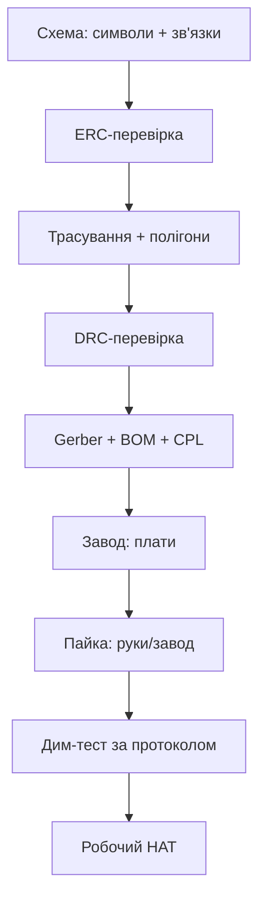

# Своя плата HAT - KiCad, виробництво і перше вмикання

![[assets/img/rpi-plata-pcb-hat-scheme.png|600]]
*Рис. Шлях плати: схема → трасування → Gerber → завод → пайка → дим-тест → робочий HAT.*

> [!tip] Що це за нота
> Від макетки до своєї плати: перший HAT за місяць вечорами. KiCad безкоштовний, завод дешевий, перше вмикання - за протоколом. Стандарт: [[03-GPIO/03-HAT-EEPROM|HAT і EEPROM]], інструменти: [[17-Lab/01-Priladi|прилади лабораторії]].

## 1. Мета

Випустити робочу плату з першого разу:

- схема: від макетки до нетліста;
- трасування: правила для двошарової плати;
- виробництво: що відправляти заводу;
- перше вмикання: протокол без диму.

| Етап | Інструмент | Результат |
| --- | --- | --- |
| Схема | KiCad Eeschema | нетліст + BOM |
| Трасування | KiCad Pcbnew | Gerber + сверловка |
| Виробництво | JLCPCB/аналоги | 5 плат за тиждень |
| Пайка | паяльник/фен/піч | зібрана плата |
| Налагодження | мультиметр + аналізатор | робочий HAT |

## 2. Архітектура процесу



ERC/DRC в нуль до відправки: завод надрукує і помилки теж. Перевірка дешевша за переробку.

## 3. Схема: правила

- ієрархія за блоками: живлення, цифра, аналог, роз'єми;
- кожен символ - з корпусом (footprint) одразу;
- живлення: символи PWR-флагів на кожній шині;
- BOM формується зі схеми - поля виробника і номери;
- ревізія на шовкографії: назва + дата + версія.

## 4. Трасування: правила двошарової

- низ - суцільна земля (не різати доріжками!);
- верх - сигнали, живлення - широкими (0.5+ мм);
- декуплювання 100 нФ біля кожного живлення мікросхем;
- I2C/SPI - коротко, паралельно, без гострих кутів;
- монтажні отвори 2.75 мм як у HAT + keepout;
- шовкографія: позначки пінів, полярність, назва.

## 5. Робочий код: генератор BOM-перевірки

```python
import csv
import sys

total = 0
missing = []
with open('bom.csv') as f:
    for row in csv.DictReader(f):
        qty = int(row.get('Qty', 1))
        total += qty
        if not row.get('Mfr_PN'):
            missing.append(row.get('Reference', '?'))
        if row.get('DNP', '').strip():
            total -= qty

print(f"parts total: {total}")
if missing:
    print("NO Mfr_PN:", ', '.join(missing))
    sys.exit(1)
print("BOM OK: all parts have manufacturer numbers")
```

Без Mfr_PN завод поставить «аналог» на свій розсуд. DNP-позиції виключаємо з підрахунку, але лишаємо в схемі.

## 6. Замовлення виробництва

- файли: Gerber RS-274X + Excellon + BOM + CPL (для монтажу);
- параметри: 2 шари, 1.6 мм, HASL/ENIG, шовкографія обидва боки;
- колір маски - будь-який, чорний гірше видно доріжки;
- 5 штук мінімум - 2 на вбити, 2 в роботу, 1 про запас;
- термін: тиждень виробництво + тиждень доставка.

## 7. Дим-тест: перше вмикання

| Крок | Дія | Критерій |
| --- | --- | --- |
| 1 | Візуал під лупою | немає перемичок і холодних паянь |
| 2 | Продзвонка живлення | немає КЗ між шинами |
| 3 | Живлення через обмеження 100 мА | струм мікроампери |
| 4 | Напруги на всіх шинах | 5V/3V3 в допуску |
| 5 | Підключення до Pi без навантаження | boot ок, HAT видно |
| 6 | Функціональний тест | усі блоки за чеклістом |

Лампа-дим-стоппер послідовно з живленням - класика: КЗ гасить лампа, не плата.

## 8. Типові помилки

| Симптом | Причина | Лікування |
| --- | --- | --- |
| КЗ між шинами | перемичка припоєм | флюс + оплітка, перевірка лупою |
| Дзеркальний футпринт | символ без прив'язки | перевірка 1:1 роздруківкою |
| Немає землі під чипом | розрізаний полігон | суцільний низ, зшивка via |
| Завод «поліпшив» плату | файли без revision | версія в назві архіву і на шовку |
| Не сів роз'єм | крок/ряд не той | даташит роз'єму до трасування |
| Працює, але шумить | довгі аналогові траси | коротше, екран, RC на вході |

## 9. Швидка шпаргалка плати

- ERC/DRC в нуль до відправки;
- земля суцільна, живлення широке;
- BOM з Mfr_PN на кожну позицію;
- дим-тест за протоколом, не «в розетку»;
- 5 штук: 2 вбити, 2 в роботу, 1 запас.

## 10. Суміжні ноти

- [[03-GPIO/03-HAT-EEPROM|HAT і EEPROM]] - стандарт плати.
- [[17-Lab/01-Priladi|прилади лабораторії]] - чим міряти.
- [[04-Shini/02-Logic-Analyzer|логічний аналізатор]] - відладка шин плати.
- [[02-Zhivlennya/01-USB-C-PD|живлення USB-C]] - живлення вузла.
- [[Home|головна карта]] - повна навігація.

## 9.1 Версіонування заліза

- git-репозиторій на проєкт плати;
- теги версій v1.0, v1.1 - як у софта;
- Gerber-архів кожної відправки на завод;
- журнал змін: що і чому перероблено;
- стара ревізія лишається в архіві назавжди.

## Офіційні джерела

- [HAT+ Specification (Raspberry Pi)](https://datasheets.raspberrypi.com/hat/hat-plus-specification.pdf) - механіка, EEPROM, живлення.
- [Getting Started (Raspberry Pi docs)](https://www.raspberrypi.com/documentation/computers/getting-started.html) - HAT і розширення.
- [Raspberry Pi OS (Raspberry Pi)](https://www.raspberrypi.com/software/) - утиліти eepmake/eepdump.
