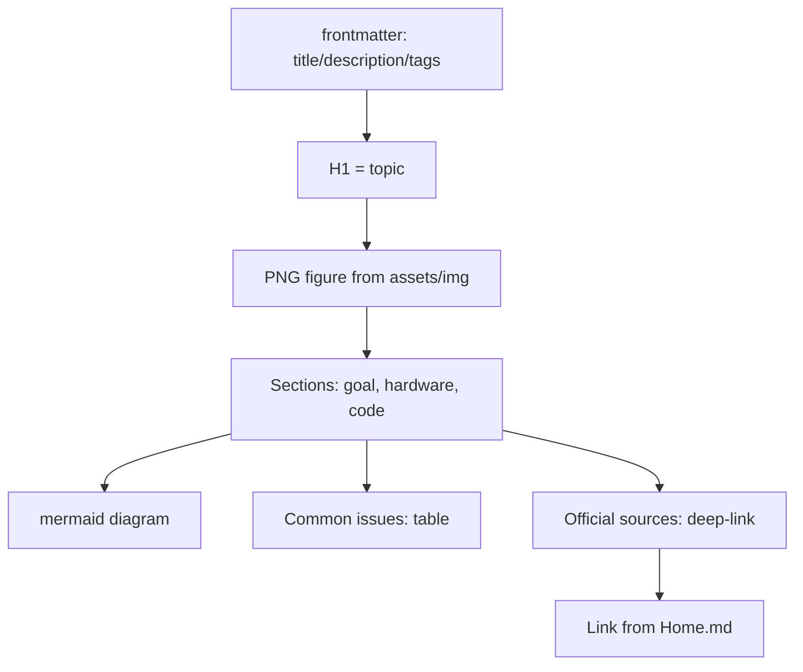

# How to use the RaspberryPi-Reference - routes and standard

![[assets/img/rpi-start-map-scheme.png|600]]
*Fig. Three paths: newcomer (board to OS to first LED), maker (GPIO to buses to HAT), IoT (network to cloud).*

> [!tip] What this note is
> Entry point of the base: how to read notes, where to go for your goal, what validators mean. The note standard is single for all sections. Map: [[Home.en|home map]], board comparison: [[00-Start/03-Porivnyannya-plate|board comparison]].

## 1. Goal

Orient the reader in 15 minutes:

- which board fits the task - see board comparison;
- which path to take: newcomer, maker, IoT developer;
- how each note is built (section standard);
- how to check that the base is intact (three validators).

| Who you are | Path | First action |
| --- | --- | --- |
| Newcomer, no board yet | Comparison to purchase to Imager | [[00-Start/03-Porivnyannya-plate| board comparison]] |
| Have a Pi, no OS | Imager to headless to SSH | [[09-Firmware/01-Imager-Headless.en | Imager flashing]] |
| Maker, need GPIO | Header to gpiozero to sensor | [[03-GPIO/01-Header-Gpiozero.en | pin header and gpiozero]] |
| IoT, need cloud | WiFi to MQTT to dashboard | [[15-Protocols/01-MQTT.en | MQTT protocol]] |

## 2. Note standard

Each content note contains:

- frontmatter: title, description (8+ words), tags, category, date;
- figure `![[assets/img/*.png|600]]` with caption - we generate schematics locally;
- mermaid diagram of architecture or flow;
- table "Common issues": symptom, cause, fix;
- "Official sources" - links to a specific model or document, not to a site home page;
- working code (Python/C), checked by section logic;
- minimum 150 lines - otherwise the note counts as a draft.

## 3. Newcomer path in detail

- Step 1: pick a board from the comparison table (for start - Pi 4/5 or Zero 2 W);
- Step 2: buy a kit - board + official PSU + SD card + case;
- Step 3: flash Raspberry Pi OS with Imager, enable SSH;
- Step 4: light an LED with gpiozero - first success in one evening;
- Step 5: connect a BME280 sensor over I2C - first measurement.

## 4. Maker path in detail

- Step 1: study the 40-pin header (3.3V logic - this is sacred!);
- Step 2: gpiozero for speed, lgpio for precision;
- Step 3: I2C/SPI/UART buses - scanners and a logic analyzer;
- Step 4: HAT boards or own sensors on a breadboard;
- Step 5: power supply and enclosure for 24/7 duty.

## 5. IoT developer path in detail

- Step 1: network - onboard WiFi or Ethernet;
- Step 2: MQTT client in Python, topics and QoS;
- Step 3: broker locally or in the cloud;
- Step 4: watchdog timers and service auto-restart;
- Step 5: backup power (UPS HAT) for the field.

## 5.1 First evening checklist

| Step | Action | Tick |
| --- | --- | --- |
| 1 | Board on the desk, PSU and SD nearby | [ ] |
| 2 | Imager: OS + SSH + WiFi + user | [ ] |
| 3 | First boot, `ping raspberrypi.local` | [ ] |
| 4 | `sudo apt update && sudo apt upgrade` | [ ] |
| 5 | LED on GPIO17 with gpiozero | [ ] |
| 6 | Button on GPIO27 with pull-up | [ ] |
| 7 | SD backup with Imager | [ ] |

If stuck on a step - see the matching section of the path above. Do not skip: each step rests on the previous one. Finished all seven - go to your path with confidence: the hardware waits for code.
The symbol of a done evening - a blinking LED and knowing where to go next.

## 6. Base validators

| Script | What it checks | Norm |
| --- | --- | --- |
| `check_style.py` | note format (9 rules) | 0 violations |
| `check_links.py` | wikilinks and PNG | broken 0, missing NONE |
| `check_home.py` | navigation and counters | 0 errors |
| `comp_inventory.py` | component registry | all with datasheet |

Run from the base root: `python3 scripts/check_style.py` and so on. The registry `COMPONENTS.md` is generated with the `--registry` key - do not edit by hand.

## 7. Conventional marks

- `3.3V!` - GPIO logic, 5V on a pin = dead board;
- `5V 3A+` - Pi 4/5 power demand, weak PSU = lightning bolt on screen;
- `HAT` - expansion board for the 40-pin header with an EEPROM schematic;
- `CSI/DSI` - camera and display flex cables (not GPIO!);
- `headless` - work without a monitor, over SSH.

## 7.1 Board status dictionary

| Signal | Meaning | Action |
| --- | --- | --- |
| PWR red steady | power supply ok | nothing |
| PWR blinks or dies | sag below 4.65V | change PSU and cable |
| ACT green blinks | reads SD, all good | nothing |
| ACT 4 flashes | no start.elf | reflash SD |
| ACT 7 flashes | no kernel.img | reflash SD |
| ACT 8 flashes | broken SDRAM setting | other SD, other image |
| Rainbow screen + lightning | weak power supply | official PSU |

## Common issues

| Symptom | Cause | Fix |
| --- | --- | --- |
| Do not know where to start | no board and no task | board comparison to bought kit to Imager |
| Lost in notes | reading off path | pick your path from section 1 and follow it |
| Code from a note fails | other board model or OS | check the note HAT board card (model, OS, kernel) |
| Needed topic missing | base grows in queues | see TODO.md - the topic queue is listed |
| Broken link in a note | outdated URL | run `check_links.py`, repair the deep-link |
| Note shorter than standard | draft, not a note | extend to 150+ lines from the template |

## 9. Related notes

- [[00-Start/02-Glosariy|glossary of terms]] - all base terms.
- [[00-Start/03-Porivnyannya-plate|board comparison]] - board choice.
- [[00-Start/04-Devkit-plati|boards and accessories]] - what to buy.
- [[00-Start/05-Vibir-seredovischa|environment choice]] - OS and languages.
- [[Home.en|home map]] - full navigation.

## Official sources

- [Getting Started (Raspberry Pi docs)](https://www.raspberrypi.com/documentation/computers/getting-started.html) - first start, Imager.
- [Raspberry Pi OS (Raspberry Pi)](https://www.raspberrypi.com/software/) - images and Imager.
- [rpi-imager (Raspberry Pi, GitHub)](https://github.com/raspberrypi/rpi-imager) - flasher sources.
- [gpiozero docs (Read the Docs)](https://gpiozero.readthedocs.io/en/stable/) - GPIO library for start.
