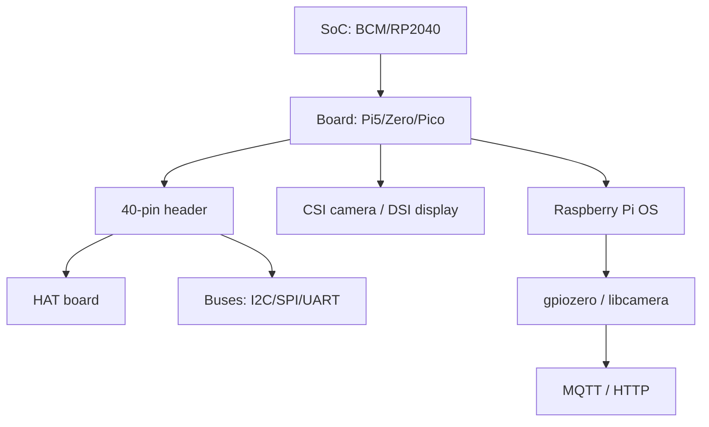

# Raspberry Pi glossary - SoC, GPIO, HAT, CSI, PIO and all reference terms

![[assets/img/rpi-glossary-scheme.png|600]]
*Fig. Term map: hardware (SoC to board to HAT), interfaces (GPIO to buses to CSI/DSI), software (OS to libraries to cloud).*

> [!tip] What this note is
> Base dictionary: each term in one paragraph linked to a note. Read it on the first meeting with an unknown word. Entry: [[00-Start/01-Yak-koristuvatis-dovidnikom|how to use]], next: [[00-Start/03-Porivnyannya-plate|board comparison]].

## 1. Goal

Give single definitions so notes do not drift in terminology:

- hardware: SoC, models, memory, power supply;
- contacts: GPIO, pin header, HAT, buses;
- cameras and displays: CSI, DSI, Picamera2;
- software: OS, Imager, EEPROM, Device Tree.

## 2. Hardware: chips and boards

| Term | Meaning | Note |
| --- | --- | --- |
| SoC | crystal with CPU+GPU+memory (BCM2712, RP2040) | [[01-Hardware/01-SoC-Oglyad| SoC overview]] |
| BCM2712 | Pi 5 chip: 4xA76 2.4 GHz, VideoCore VII | [[01-Hardware/02-BCM2712-Pi5.en | BCM2712 and Pi 5]] |
| RP2040/RP2350 | Pico microcontrollers: M0+/M33, PIO | [[01-Hardware/03-RP2040-RP2350.en | RP2040 and RP2350]] |
| Pi 5/4/Zero/Pico | board models of various classes | [[14-Devboards/01-Pi5-Flagman.en | Pi 5 flagship]] |
| CM4/CM5 | Compute Module for embedding | [[14-Devboards/05-CM4-CM5.en | CM modules]] |
| HAT | board for the 40-pin header with EEPROM | [[12-Comm-Modules/01-Sense-HAT.en | Sense sensor board]] |
| PoE HAT | power over Ethernet cable | [[02-Power-Supply/02-PoE-HAT.en | PoE power]] |

## 3. Contacts and buses

| Term | Meaning | Note |
| --- | --- | --- |
| GPIO | general purpose pin, 3.3V logic | [[03-GPIO/01-Header-Gpiozero.en | pin header and gpiozero]] |
| 3.3V logic | HIGH=3.3V, 5V on input - death | [[03-GPIO/01-Header-Gpiozero.en | pin header and gpiozero]] |
| I2C | two-wire sensor bus, 100/400 kHz | [[04-Interfaces/01-I2C-SPI-UART.en | I2C/SPI/UART buses]] |
| SPI | fast bus for displays and ADCs | [[04-Interfaces/01-I2C-SPI-UART.en | I2C/SPI/UART buses]] |
| UART | serial port, console and modems | I2C/SPI/UART buses |
| USB-CDC | virtual COM port of Pico and programmers | buses and USB |
| PWM | PWM: brightness, servo, sound | [[03-GPIO/02-PWM-Pererivannya.en | PWM and interrupts]] |
| PIO | RP2040 programmable engines (hardware bit-bang) | [[01-Hardware/03-RP2040-RP2350.en | RP2040 and RP2350]] |

## 4. Cameras, displays, sound

| Term | Meaning | Note |
| --- | --- | --- |
| CSI | camera flex cable (not USB!) | [[10-Sensors/06-Kamera-CSI.en | CSI camera]] |
| DSI | display flex cable | [[11-Vivid/01-DSI-HDMI-Displeyi.en | DSI/HDMI displays]] |
| Picamera2 | camera library of the new stack | [[10-Sensors/06-Kamera-CSI.en | CSI camera]] |
| HDMI | monitor/TV, sound too | [[11-Vivid/01-DSI-HDMI-Displeyi.en | DSI/HDMI displays]] |
| I2S | digital audio to DACs/microphones | [[11-Vivid/03-Audio-HAT.en | audio and HAT]] |

## 5. Power supply and memory

| Term | Meaning | Note |
| --- | --- | --- |
| USB-C PD | Pi 4/5 power: 5V 3A/5A | [[02-Power-Supply/01-USB-C-PD.en | USB-C power]] |
| Undervoltage | lightning on screen = weak PSU | [[02-Power-Supply/01-USB-C-PD.en | USB-C power]] |
| UPS HAT | UPS on 18650 cells | [[02-Power-Supply/03-UPS-18650.en | UPS boards]] |
| SD/eMMC/NVMe | system media by speed | [[08-Memory/01-SD-eMMC-NVMe.en | memory media]] |
| EEPROM | Pi 4/5 bootloader on board | [[09-Firmware/02-EEPROM-Boot.en | EEPROM boot]] |

## 6. Software and network

| Term | Meaning | Note |
| --- | --- | --- |
| Raspberry Pi OS | official OS (Bookworm) | [[09-Firmware/03-OS-Nalashtuvannya.en | OS setup]] |
| Imager | out of box SD flasher | [[09-Firmware/01-Imager-Headless.en | Imager flashing]] |
| Headless | no monitor, over SSH | [[09-Firmware/01-Imager-Headless.en | Imager flashing]] |
| Device Tree | hardware description for the kernel (config.txt) | [[09-Firmware/03-OS-Nalashtuvannya.en | OS setup]] |
| gpiozero | Python GPIO library | [[03-GPIO/01-Header-Gpiozero.en | pin header and gpiozero]] |
| MQTT | telemetry protocol | [[15-Protocols/01-MQTT.en | MQTT protocol]] |
| HAT EEPROM | ID chip of the expansion board | [[03-GPIO/03-HAT-EEPROM.en | HAT and EEPROM]] |

## 6.1 Network terms

| Term | Meaning |
| --- | --- |
| SSH | secure console over network, port 22 |
| VNC/RDP | remote graphical desktop |
| AP/STA | WiFi access point / client |
| DHCP | automatic IP issue by router |
| mDNS | `raspberrypi.local` name with no IP to remember |
| I2C address | 7-bit device number on the bus (`i2cdetect` scanner) |
| Baud | UART speed in baud (115200 - console standard) |
| Pull-up/down | input pull to power/ground against floating |
| Debounce | button bounce suppression (20-50 ms) |
| Duty cycle | PWM duty in percent |

## 7. How to read abbreviations on schematics

- `SDA/SCL` - I2C data/clock;
- `MOSI/MISO/SCK/CS` - SPI signals;
- `TXD/RXD` - UART (crossed!);
- `5V/3V3/GND` - header power and ground;
- `RUN` - board reset/start pin;
- `PoE` - power over twisted pair (only with HAT!).

## 7.1 Units and board marks

- `5V`, `3V3`, `GND` - header power rails;
- `RUN` - start/reset input (short to ground = reboot);
- `PoE` - twisted pair power contacts (work only with PoE HAT);
- `ACT` - green SD activity LED;
- `PWR` - red power LED (blinks on sag);
- `HDMI0/HDMI1` - primary and second outputs (first closer to USB-C);
- `CAM/DISP` - camera and display flexes (identical connectors, do not mix);
- `J2/J8` - header number on schematic (J8 - main 40-pin);
- `TP1/TP2` - power test points for a multimeter;
- `EEPROM` - bootloader chip (Pi 4/5, updated by utility).

## Common issues

| Symptom | Cause | Fix |
| --- | --- | --- |
| Term unclear | skipped the glossary | find the word here, then go to the note in the third column |
| CSI mixed with USB | both say "camera" | CSI - flex to the CAMERA socket, USB - to the port |
| HAT does not fit | 26-pin header (old Pi) | HAT needs 40 pins (B+ and newer) |
| 5V on GPIO | "Arduino allows it" | not allowed: 3.3V level, a level shifter is mandatory |
| PIO mixed with PWM | both "hardware" | PIO - Pico engines, PWM - width modulator |
| Pi EEPROM mixed with BIOS | other architecture | bootloader in SPI-flash, updated by utility |

## 9. Related notes

- [[00-Start/01-Yak-koristuvatis-dovidnikom|how to use]] - reading paths.
- [[00-Start/03-Porivnyannya-plate|board comparison]] - hardware choice.
- [[00-Start/05-Vibir-seredovischa|environment choice]] - software choice.
- [[Home.en|home map]] - full navigation.

## Official sources

- [Getting Started (Raspberry Pi docs)](https://www.raspberrypi.com/documentation/computers/getting-started.html) - first start terms.
- [Raspberry Pi OS (Raspberry Pi)](https://www.raspberrypi.com/software/) - system editions.
- [gpiozero docs (Read the Docs)](https://gpiozero.readthedocs.io/en/stable/) - GPIO object dictionary.
