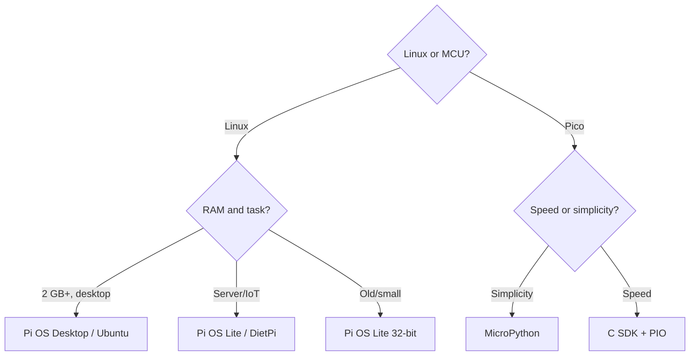

# Raspberry Pi environment choice - Pi OS, Ubuntu, DietPi and Pico SDK

![[assets/img/rpi-os-choice-scheme.png|600]]
*Fig. Choice by branches: Linux models - Pi OS/Ubuntu/DietPi, Pico - C SDK or MicroPython.*

> [!tip] What this note is
> Software for hardware: which OS for which board, when Lite with no desktop is enough, how to flash Pico. After choice - flashing: Imager flashing. Boards: [[00-Start/03-Porivnyannya-plate|board comparison]].

## 1. Goal

Install the right software on the first try:

- OS for Linux models by resources and task;
- Lite versus Desktop: when graphics is not needed;
- Pico: C SDK versus MicroPython - speed versus simplicity;
- flashing and remote work tools.

## 2. OS for Linux models

| OS | When to take | Limit |
| --- | --- | --- |
| Raspberry Pi OS Desktop | desktop, study, media | needs 2+ GB RAM |
| Raspberry Pi OS Lite | servers, IoT, Zero | no graphics (a plus) |
| Ubuntu Server/Desktop | familiar apt stack, ROS | heavier than Pi OS |
| DietPi | minimum resources, Zero/1 | less out of box |
| RetroPie/Recalbox | retro games | separate images |

Bookworm (Debian 12) - current Pi OS base: Wayland by default, NetworkManager, new libcamera camera stack.

## 3. Pico: C SDK versus MicroPython

| Criterion | MicroPython | C SDK |
| --- | --- | --- |
| Start | dragged UF2 - works | toolchain, CMake, build |
| Speed | enough for sensors | maximum, PIO, DMA |
| Libraries | modules out of box | drivers by hand |
| Debug | REPL over USB | SWD + gdb |
| Choice | study, prototypes | production, timings |

Thonny IDE - standard for MicroPython: REPL, plotter, UF2 flash in one click.

## 4. Flashing and access

- Imager: OS on SD + SSH + WiFi + user - all in one window;
- headless: `ssh` file and `wpa_supplicant` no longer needed - Imager does it all;
- SSH: keys instead of passwords, change the default port;
- VNC/wayvnc - graphical access, RDP - alternative;
- Pico: BOOTSEL + drag UF2, or `picotool` from console.

## 4.1 Remote access in detail

| Way | When | Command |
| --- | --- | --- |
| SSH keys | always, base | `ssh-copy-id user@host` |
| SSH tunnel | web UI from outside | `ssh -L 8080:localhost:80 user@host` |
| VNC/wayvnc | desktop needed | enable in `raspi-config` |
| VS Code Remote | dev on board | Remote-SSH extension |
| Tailscale | access with no public IP | single daemon, whole network |

Disable SSH password auth after key setup. Close port 22 from the world or hide it behind VPN.

## 5. Maker Python stack

- gpiozero - GPIO/PWM/sensors in three lines;
- lgpio/gpiod - when speed and interrupts are needed;
- smbus2/spidev/pyserial - buses directly;
- paho-mqtt/requests - cloud;
- venv for each project - keep system Python clean.

## 6. Advanced C stack

- kernel and Device Tree overlays (`config.txt`, `/boot/firmware/overlays/README`);
- `raspi-config` - first tool, then by hand;
- build on board - for small things, cross build - for kernel;
- Pi 4/5 EEPROM config - boot order (see [[EN/09-Firmware/02-EEPROM-Boot.en|EEPROM boot]]).

## 7. Versions and compatibility

| Board | OS | Pico environment |
| --- | --- | --- |
| Pi 5 / 400 / 500 | Pi OS Bookworm 64-bit | - |
| Pi 4 / Zero 2 W | Pi OS Bookworm 32/64-bit | - |
| Pico / Pico W | - | MicroPython / C SDK |
| Pico 2 / 2 W | - | MicroPython / C SDK (M33) |
| CM4 / CM5 | Pi OS Lite / Ubuntu Server | - |

## 7.1 System backup and rollback

| Task | Tool | Period |
| --- | --- | --- |
| Full SD image | Imager / `dd` / PiShrink | monthly |
| `/etc` configs | git repository | on each change |
| Project data | rsync to NAS | daily cron |
| Package list | `dpkg --get-selections` | before upgrade |
| Kernel rollback | previous kernel in boot | keep 2 versions |

Golden rule: an SD card will die - when, not if. A 32 GB image backup shrinks with PiShrink to 3-5 GB and sits on the shelf.

Backup check:

- deploy to a spare card each quarter;
- boot and log in - backup is alive;
- dead backup is worse than none;
- two copies in two places (home + cloud);
- date in the image file name, no spaces.

## Common issues

| Symptom | Cause | Fix |
| --- | --- | --- |
| Old OS misses Pi 5 | image older than Bookworm | fresh Imager + latest image |
| No SSH after flash | not enabled in Imager | Imager services tab: SSH + user |
| MicroPython misses a module | firmware with no module | full UF2 with modules or `mip` |
| C SDK does not build | no ARM toolchain | `arm-none-eabi-gcc` + pico-sdk from guide |
| Wayland breaks old code | display server changed | X11 session or library update |
| Python mixes packages | all in system interpreter | venv per project, `pip` only there |

## 9. Related notes

- [[EN/09-Firmware/01-Imager-Headless.en|Imager flashing]] - first flash step by step.
- [[EN/09-Firmware/03-OS-Nalashtuvannya.en|OS setup]] - system after start.
- [[EN/14-Devboards/03-Pico-W-Family.en|Pico family]] - microcontroller boards.
- [[EN/03-GPIO/01-Header-Gpiozero.en|pin header and gpiozero]] - first code.
- [[00-Start/03-Porivnyannya-plate|board comparison]] - hardware for software.

## Official sources

- [Raspberry Pi OS (Raspberry Pi)](https://www.raspberrypi.com/software/) - editions and Imager.
- [rpi-imager (Raspberry Pi, GitHub)](https://github.com/raspberrypi/rpi-imager) - headless flash options.
- [RP2040 Datasheet (Raspberry Pi)](https://datasheets.raspberrypi.com/rp2040/rp2040-datasheet.pdf) - Pico PIO and peripherals.
- [gpiozero docs (Read the Docs)](https://gpiozero.readthedocs.io/en/stable/) - first Python code.
