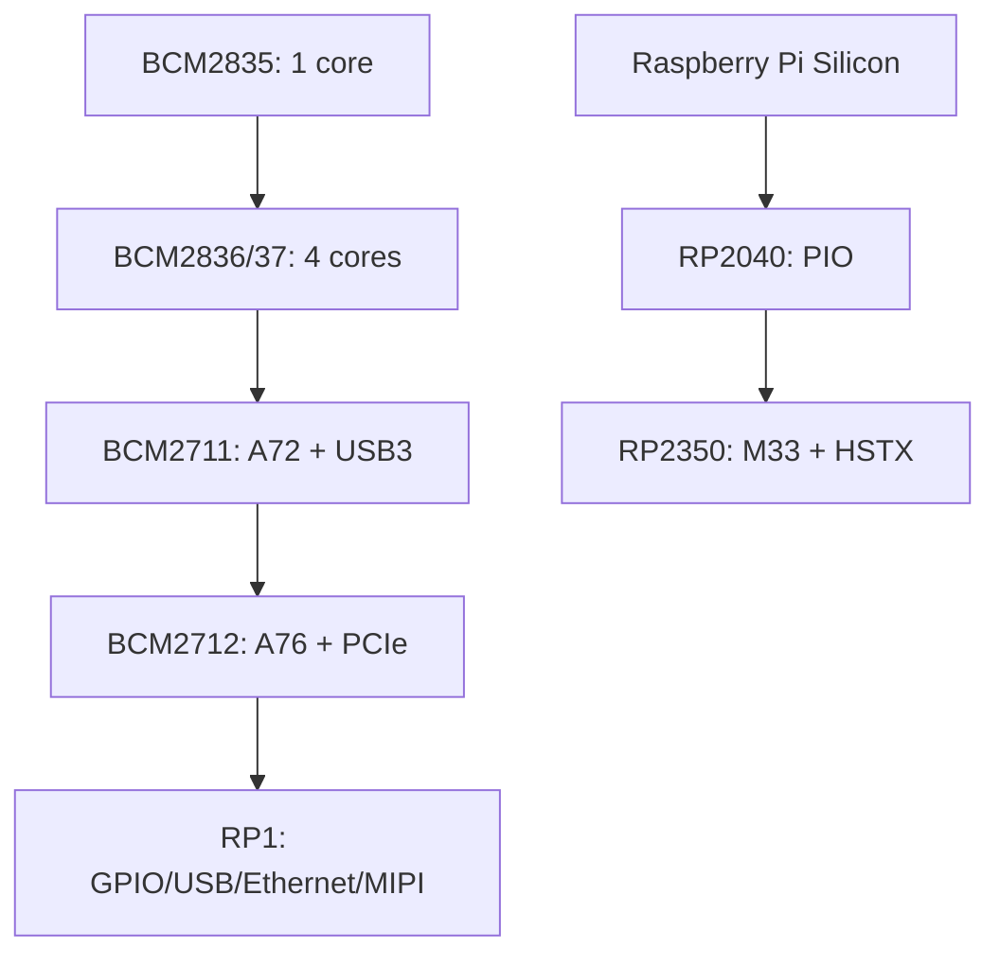

# Raspberry Pi SoC - from BCM2835 to BCM2712, VideoCore and RP1

![[assets/img/rpi-soc-oglyad-scheme.png|600]]
*Fig. SoC evolution: CPU grows from A53 to A76, VideoCore VI to VII graphics, Pi 5 peripherals moved to RP1.*

> [!tip] What this note is
> Chip map: what sits inside each board and why Pi 5 is so fast. Chip details: [[EN/01-Hardware/02-BCM2712-Pi5.en|BCM2712 and Pi 5]], [[EN/01-Hardware/03-RP2040-RP2350.en|RP2040 and RP2350]]. Board choice: [[00-Start/03-Porivnyannya-plate|model comparison]].

## 1. Goal

To understand hardware in order to choose a board consciously:

- BCM line: what changed from Pi 1 to Pi 5;
- VideoCore: graphics, codecs, cameras;
- RP1: why Pi 5 peripherals are a separate chip;
- RP2040/RP2350: another class, microcontrollers.

| Chip | Boards | CPU | Graphics |
| --- | --- | --- | --- |
| BCM2835 | Pi 1, Zero W v1 | 1×ARM1176 | VideoCore IV |
| BCM2836 (Pi 2): 4×A7; BCM2837 (Pi 3): 4×A53 | Pi 2/3 | A7/A53 | VideoCore IV |
| BCM2711 | Pi 4, CM4, 400 | 4×A72 1.5 GHz | VideoCore VI |
| BCM2712 | Pi 5, CM5, 500 | 4×A76 2.4 GHz | VideoCore VII |
| RP2040 | Pico / W | 2×M0+ 133 MHz | none |
| RP2350 | Pico 2 / 2W | 2×M33 150 MHz | none |

## 2. Evolution architecture

The Pi 5 breakthrough is not only A76: speed comes from LPDDR4X-4267, PCIe 2.0 and peripherals moved to RP1 with no bottlenecks.

## 3. VideoCore: graphics and media

- VideoCore IV (up to Pi 3): OpenGL ES 2.0, H.264 decoder;
- VideoCore VI (Pi 4): 4Kp60 H.265 decoder, two HDMI;
- VideoCore VII (Pi 5): 800 MHz, two 4Kp60, Vulkan 1.3;
- ISP (camera processing) - a separate block, works with libcamera;
- hardware H.264 encoder exists on Pi 4; on Pi 5 encoding is software (CPU).

## 4. RP1: Pi 5 south bridge

- its own Raspberry Pi Silicon die: GPIO, 2×USB3, 2×USB2, Ethernet, 2×MIPI, no ADC;
- link to BCM2712 - PCIe x4, microsecond latency;
- hence nuances: GPIO timings differ from Pi 4 (see pin notes);
- RP1 firmware updates together with EEPROM.

## 5. Memory

- LPDDR2 (old ones) -> LPDDR4 (Pi 4) -> LPDDR4X-4267 (Pi 5);
- 512 MB of Zero 2 W is enough for Lite, desktop wants 4+ GB;
- swap on SD kills the card - zram instead of swap;
- GPU memory is allocated dynamically (not `gpu_mem` as before).

## 6. Chip interfaces

| Block | Pi 4 (BCM2711) | Pi 5 (BCM2712+RP1) |
| --- | --- | --- |
| USB | 2×3.0 + 2×2.0 (VLI) | 2×3.0 + 2×2.0 (RP1) |
| Ethernet | Gigabit (VLI) | Gigabit (RP1) + PoE-HAT board |
| MIPI | 2×CSI + DSI | 2×CSI (4 lanes) + DSI |
| PCIe | USB controller | x1 for NVMe-HAT |
| RTC | none (FAKE-HWCLOCK) | present, with battery! |

Built-in RTC with a battery connector - first in the line, forget NTP dependence of time.

## 7. RP2040/RP2350 in short

- microcontrollers, not Linux: deterministic timing, sleep in microamps;
- PIO state machines: UART/SPI/I2S/DVI in software, without loading the CPU;
- RP2350 adds HSTX (high-speed output), ARM M33 + RISC-V to choose, more RAM;
- details - a separate note of the RP line.

## 7.1 Quick numbers for debate

| Test | Pi 4 | Pi 5 | Zero 2 W | Pico 2 |
| --- | --- | --- | --- | --- |
| Sysbench CPU (1 thread) | ~220 | ~580 | ~120 | - |
| Memory (MB/s) | ~4000 | ~12000 | ~1500 | - |
| GPIO toggle (MHz) | ~20 | ~30 | ~15 | PIO 62.5 |
| Boot from SD (s) | ~25 | ~15 | ~60 | instant |
| Idle (W) | 2.5 | 3 | 0.5 | 0.05 |

Numbers are rough for order-of-magnitude comparison, not for a thesis. Choice rule: if the task hits CPU limits - Pi 5, pins and timing - Pico, price and watts - Zero 2 W.

More about memory:

- LPDDR4X-4267 in Pi 5 - it feeds A76 with no starvation;
- Zero 2 W with 512 MB lives on zram: 1:2 RAM compression with no SD swap;
- Pico: all RAM is SRAM, deterministic latency, no cache surprises;
- CM versions repeat the specs of the base boards.

## Common issues

| Symptom | Cause | Fix |
| --- | --- | --- |
| Expected GPU memory as on Pi 3 | `gpu_mem` is obsolete | dynamic allocation, no settings needed |
| Pi 5 GPIO "slower" | peripherals through RP1/PCIe | direct RP1 registers or accept the latency |
| No RTC on Pi 4 | it is not there | fake-hwclock + NTP, or a HAT with DS3231 |
| PCIe does not see NVMe | old EEPROM firmware | update bootloader, enable PCIe |
| Confusing BCM numbering with pins | BCM2711 is a chip, BCM17 is a pin | chip vs GPIO number are different things |

## 9. Related notes

- [[EN/01-Hardware/02-BCM2712-Pi5.en|BCM2712 and Pi 5]] - flagship in detail.
- [[EN/01-Hardware/03-RP2040-RP2350.en|RP2040 and RP2350]] - microcontrollers.
- [[00-Start/03-Porivnyannya-plate|model comparison]] - board choice.
- [[EN/14-Devboards/01-Pi5-Flagman.en|Pi 5 flagship]] - board in detail.
- [[EN/09-Firmware/02-EEPROM-Boot.en|EEPROM boot]] - bootloader firmware.

## 9.1 Quick SoC cheat sheet

- Pi 1/Zero v1 - ARM1176, museum shelf;
- Pi 2/3 - A53/A72, VideoCore IV, USB through a hub;
- Pi 4 - A72, honest USB3 and Gigabit;
- Pi 5 - A76, PCIe, RP1, RTC;
- Pico - M0+/M33, PIO, microamps;
- in doubt - see the table in section 1.
- hardware without software understanding is a brick with a cooler;
- software without hardware understanding is brakes and the lightning icon.

## 9.2 Where to look for chip errata

- official errata-Silicon PDFs on raspberrypi.com for each chip;
- forum threads marked staff - confirmed bugs;
- kernel: `dmesg` shows the revision and applied workarounds;
- before a production run - read errata fully, not only headings;
- dubious peripheral bit - work around in software, do not wait for a revision.

## Official sources

- [Raspberry Pi 5 (Raspberry Pi)](https://www.raspberrypi.com/products/raspberry-pi-5/) - BCM2712, RP1, memory.
- [Raspberry Pi 4 Model B (Raspberry Pi)](https://www.raspberrypi.com/products/raspberry-pi-4-model-b/) - BCM2711 for comparison.
- [Getting Started (Raspberry Pi docs)](https://www.raspberrypi.com/documentation/computers/getting-started.html) - board architecture.
