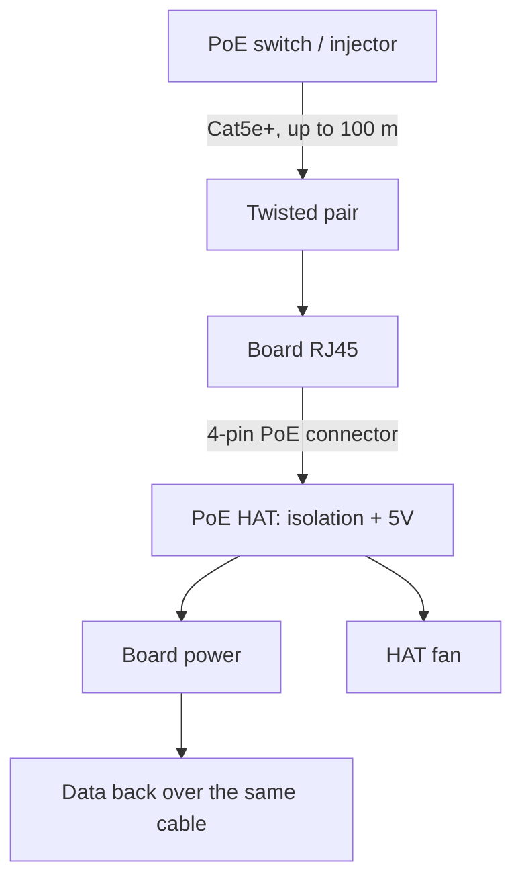

# PoE HAT for Raspberry Pi - Power and Network Over One Cable

![[assets/img/rpi-poe-hat-scheme.png|600]]
*Fig. PoE path: switch-injector → twisted pair → HAT transformer → 5V to the board + fan.*

> [!tip] What this note is
> Ceiling, cabinet, street: one cable carries both bits and watts. PoE HAT (15W) and PoE+ HAT (25W+) for Pi 3B+/4/5. Socket alternative: [[EN/02-Power-Supply/01-USB-C-PD.en|USB-C power supply]], continuity in UPS-HAT board (queue 4 note).

## 1. Goal

Hang a Pi where there is no socket:

- PoE standards: what the switch gives, what the HAT takes;
- mounting: board 4-pin PoE connector + standoffs;
- HAT fan: control and noise;
- limits: when PoE is not enough.

| Standard | Power | HAT | For boards |
| --- | --- | --- | --- |
| 802.3af | 15W | PoE HAT | Pi 3B+, Pi 4 |
| 802.3at (PoE+) | 25W+ | PoE+ HAT | Pi 4, Pi 5 |
| Passive 24V | out of standard | injectors | careful, incompatible! |

Plugging passive 12/24V injectors into a PoE HAT is forbidden - it burns the input. Only active 802.3af/at.

## 2. Path architecture



Galvanic isolation inside the HAT - network ground is not joined to board ground. This is a safety feature, not a bug.

## 3. Mounting step by step

- switch everything off, remove old standoffs;
- HAT on the 40-pin header + 4-pin PoE connector;
- kit standoffs, tighten crosswise;
- HAT fan facing out, not into a sealed case;
- Cat5e cable and up, crimped per scheme B;
- enable the PoE port on the switch (often disabled by default!).

## 4. PoE HAT fan

- controlled automatically by SoC temperature;
- noisy at maximum - no option for a bedroom;
- swap for a quieter 25x25 with the same connector;
- curve - through `dtoverlay` parameters;
- passive Flirc + PoE: quiet, but watch throttling.

## 5. Working code: PoE node monitor

```python
import subprocess
import time

def net_speed():
    with open('/sys/class/net/eth0/statistics/rx_bytes') as f:
        rx1 = int(f.read())
    with open('/sys/class/net/eth0/statistics/tx_bytes') as f:
        tx1 = int(f.read())
    time.sleep(5)
    with open('/sys/class/net/eth0/statistics/rx_bytes') as f:
        rx2 = int(f.read())
    with open('/sys/class/net/eth0/statistics/tx_bytes') as f:
        tx2 = int(f.read())
    return (rx2 - rx1) / 5, (tx2 - tx1) / 5

while True:
    rx, tx = net_speed()
    t = subprocess.check_output(['vcgencmd', 'measure_temp']).decode().strip()
    print(f"{t} RX {rx/1024:.0f} KB/s TX {tx/1024:.0f} KB/s")
```

Once per 5 seconds - a picture of channel load. A drop to zero in daytime is a reason to inspect the switch, not the board.

## 6. Power budget

- PoE HAT (af): 12W usable - Pi 4 + camera + sensors fine;
- PoE+ HAT (at): 20W+ - Pi 5 with NVMe is enough;
- USB disks and motors - out of range, only separate power;
- 100 m cable length - losses within the standard;
- split the PoE switch budget over all ports, not just ours.

## 7. Switch vs injector

| Option | When | Price/port |
| --- | --- | --- |
| PoE switch, 4-8 ports | 2+ nodes | pricier, handier |
| PoE injector | one node | cheap, +1 box |
| PoE splitter | power for a non-PoE board | for Zero/Pico in the field |

## Common issues

| Symptom | Cause | Fix |
| --- | --- | --- |
| Does not start at all | PoE port disabled on the switch | enable PoE on the port |
| Cyclic reboots | passive injector / too few watts | active af/at per the HAT class |
| Network up, no power | 2-pair cable (not all 8 wires) | Cat5e 4 pairs, re-crimp |
| Fan roars constantly | dust/heat in the cabinet | clean, ventilate the cabinet |
| Smoke from the HAT | passive 24V into an active input | only 802.3af/at sources! |
| Did not fit the case | HAT + fan taller than the walls | tall case or open stand |

## 9. PoE cheat sheet

- only active af/at, no passive volts;
- 4-pair cable, up to 100 m;
- count HAT fan noise;
- watt budget: HAT + USB + headroom for transients;
- "PoE" sticker on the node - so nobody plugs a PSU in.

## 10. Related notes

- [[EN/02-Power-Supply/01-USB-C-PD.en|USB-C power supply]] - classic power.
- [[14-Devboards/02-Pi4-Robocha|Pi 4 workhorse]] - board for the HAT.
- [[14-Devboards/01-Pi5-Flagman|Pi 5 flagship]] - PoE+ for the flagship.
- [[09-Firmware/03-OS-Nalashtuvannya|OS setup]] - node network.
- [[Home.en|main map]] - full navigation.

## 9.1 PoE mounting checklist

- HAT class matches the source class (af/at);
- 4-pair cable, crimp test with a tester;
- PoE port enabled on the switch;
- fan spins, noise acceptable;
- PoE sticker on the node and on the switch port.
- mounting photo in the node docs.
- spare HAT on the shelf for critical points.
- cable length in the node passport (up to 100 m).
- surge protection on outdoor spans.

## Official sources

- [PoE+ HAT (Raspberry Pi)](https://www.raspberrypi.com/products/poe-plus-hat/) - characteristics, compatibility.
- [Raspberry Pi 4 Model B (Raspberry Pi)](https://www.raspberrypi.com/products/raspberry-pi-4-model-b/) - board PoE connector.
- [Getting Started (Raspberry Pi docs)](https://www.raspberrypi.com/documentation/computers/getting-started.html) - HATs and expansion.
