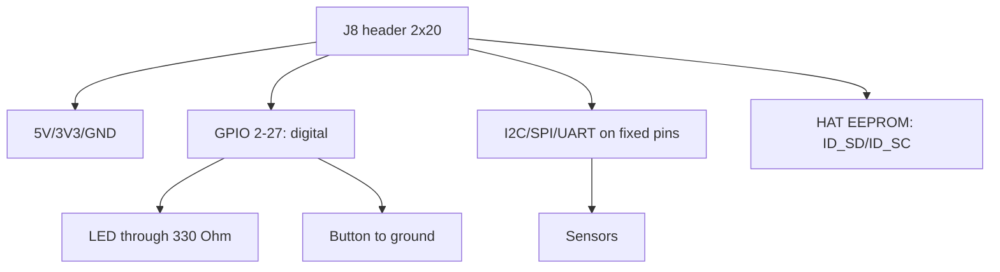

# 40-Pin Header and gpiozero - First LED, Button and Sensor

![[assets/img/rpi-header-gpiozero-scheme.png|600]]
*Fig. J8 header: 5V/3V3/GND for power, green for GPIO, blue for buses; BCM numbering, not in order!*

> [!tip] What this note is
> First hardware note: which pin is where, why the numbering looks odd, how not to kill the board. gpiozero - three lines per LED. Glossary: [[EN/00-Start/02-Glossary.en|glossary]], first code: [[EN/00-Start/01-How-to-Use-Guide.en|how to use this reference]].

## 1. Goal

Reach a working circuit in one evening:

- header map: power, ground, GPIO, buses;
- BCM numbering versus physical numbers - once and for all;
- 3.3V rules: what is allowed, what kills;
- gpiozero: LED, button, motion sensor.

| Pin group | Count | Purpose |
| --- | --- | --- |
| 5V | 2 pins (2, 4) | HAT/module power |
| 3V3 | 2 pins (1, 17) | logic, up to 500 mA total |
| GND | 8 pins | ground next to the signal! |
| GPIO | 26 pins | digital, PWM, buses |
| ID_SD/ID_SC | 2 pins | HAT EEPROM (never touch!) |

## 2. Header architecture



BCM numbering = GPIO controller number, not the place on the header. GPIO17 is pin 11 physically. BOARD vs BCM confusion is the day-one classic.

## 3. Key pin map

| BCM | Phys. pin | Functions |
| --- | --- | --- |
| 2, 3 | 3, 5 | I2C SDA/SCL (pull-ups on board!) |
| 14, 15 | 8, 10 | UART TXD/RXD, console |
| 18 | 12 | PWM0 (sound, brightness) |
| 23, 24, 25 | 16, 18, 22 | free GPIO |
| 7-11 | 26-23 | SPI0 (CE1/CE0/MISO/MOSI/SCLK) |
| 17, 27 | 11, 13 | first for LEDs/buttons |
| 5, 6, 13, 19, 26 | 29-37 | SPI1/extra |

I2C pull-ups are already on the board - never add ours. Switch the UART console off if the port must serve a modem.

## 4. 3.3V rules

- HIGH = 3.3V, LOW = 0V, threshold ~1.8V;
- 5V on GPIO - death of the pin (sometimes of the whole board);
- 5V sensors - through a level converter or a divider on input;
- pin current: 16 mA maximum, ~50 mA total;
- relays/motors - only through a transistor/driver;
- long wires - twisted pair signal+ground.

## 5. Working code: gpiozero

```python
from gpiozero import LED, Button, MotionSensor
from signal import pause

led = LED(17)
btn = Button(27, bounce_time=0.05)
pir = MotionSensor(23)

btn.when_pressed = led.on
btn.when_released = led.off
pir.when_motion = lambda: print("рух!")
pir.when_no_motion = lambda: print("тиша")

print("LED на GPIO17, кнопка на GPIO27, PIR на GPIO23")
pause()
```

`bounce_time` kills button bounce. `pause()` holds the script - callbacks work in the background. LED through a 330 Ohm resistor (without it - pin overload!).

## 6. Buttons, LEDs and motion sensors

- LED: anode through 330 Ohm to GPIO, cathode to ground;
- button: between GPIO and ground, gpiozero internal pull-up;
- PIR HC-SR501: 3.3V output - straight to GPIO, 5V power;
- reed/door: like a button, only with a magnet;
- several buttons - separate pins or a matrix (see interrupts).

## 7. Rights without sudo

- user in the `gpio`, `i2c`, `spi` groups;
- udev rules already set in Pi OS;
- `sudo python` for GPIO - an antipattern (and a security hole);
- check: `groups` shows membership after re-login.

## Common issues

| Symptom | Cause | Fix |
| --- | --- | --- |
| LED dark | BOARD/BCM numbers confused | count BCM, verify pin 11 = GPIO17 |
| Pin "died" | there was 5V on the input | level converter/divider, the pin is beyond rescue |
| Button fires 5 times | contact bounce | `bounce_time=0.05` |
| I2C misses the sensor | SDA/SCL swapped | SDA to SDA (pin 3), SCL to SCL (pin 5) |
| Works as root, not as user | missing gpio/i2c groups | `usermod -aG`, re-login |
| HAT not detected | ID_SD/ID_SC occupied | free pins 27/28 |

## 9. Header cheat sheet

- power: 5V pins 2/4, 3V3 pins 1/17;
- I2C: pins 3/5, pull-ups already there;
- UART: pins 8/10, switch console off for a modem;
- first LED: GPIO17 (pin 11) + 330 Ohm;
- first button: GPIO27 to ground + pull-up.

## 10. Related notes

- [[EN/00-Start/02-Glossary.en|glossary]] - all terms.
- [[EN/03-GPIO/02-PWM-Interrupts.en|PWM and interrupts]] - next level.
- [[04-Interfaces/01-I2C-SPI-UART|I2C/SPI/UART buses]] - bus sensors.
- [[09-Firmware/03-OS-Nalashtuvannya|OS setup]] - groups and rights.
- [[Home.en|main map]] - full navigation.

## 11. Pocket pin card

- print the header map and laminate it;
- mark the project-occupied pins with a marker;
- BCM numbers large, physical ones small;
- red for 5V, blue for ground, green for GPIO;
- card always next to the breadboard, not in the drawer.
- second card - the specific project pinout.
- refresh on occupied-pin changes.

## Official sources

- [gpiozero docs (Read the Docs)](https://gpiozero.readthedocs.io/en/stable/) - LEDs, buttons, sensors.
- [Getting Started (Raspberry Pi docs)](https://www.raspberrypi.com/documentation/computers/getting-started.html) - header map.
- [Raspberry Pi OS (Raspberry Pi)](https://www.raspberrypi.com/software/) - system with gpiozero.
