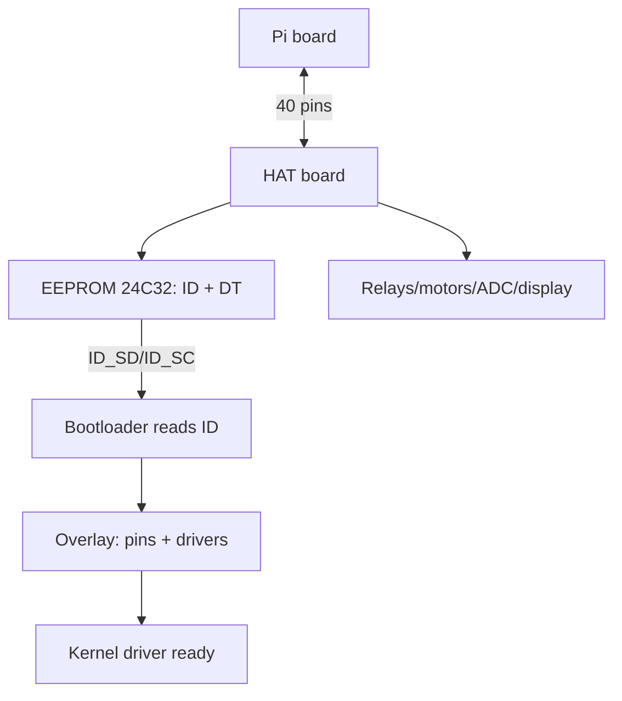

# HAT Boards and EEPROM Identification - The Pi Expansion Standard

![[assets/img/rpi-hat-eeprom-scheme.png|600]]
*Fig. HAT stack: board sits on header 40, ID_SD/ID_SC read the EEPROM, the overlay brings drivers up.*

> [!tip] What this note is
> Expansion mechanics and electronics: what makes a board a true HAT, how auto-detection works, which HATs to take for tasks. HAT practice - the modules chapter (deep in 03-GPIO/03). Base: [[EN/03-GPIO/01-Header-Gpiozero.en|pin header and gpiozero]], [[EN/03-GPIO/02-PWM-Interrupts.en|PWM and interrupts]].

## 1. Goal

Design and pick HATs consciously:

- HAT standard requirements: size, mounting, EEPROM;
- ID_SD/ID_SC: how the board presents itself to the system;
- Device Tree overlays: drivers without a kernel rebuild;
- HAT class overview: relays, motors, ADCs, PoE, displays.

| HAT requirement | Value |
| --- | --- |
| Header | 2x20, full, through (stacking) |
| EEPROM | ID + Device Tree fragment |
| Mechanics | 65x56 mm, holes like the Pi |
| Power | back-power through the header allowed |
| Pins | ID_SD (27) + ID_SC (28) - EEPROM only! |

## 2. Stack architecture



The board reads the EEPROM before the kernel: a proper HAT comes up by itself, with no manual `dtoverlay` (though nobody cancelled manual ones).

## 3. EEPROM in detail

- 24C32 chip, address over ID_SD/ID_SC (not the shared I2C bus!);
- format: board UUID, maker name, GPIO map, DT fragment;
- `eepmake/eepdump` tools - build and verify the image;
- HAT EEPROM flashing - once at manufacture;
- reading from the Pi: `eepdump` shows what the system sees.

## 4. Device Tree overlays

- fragment describes occupied pins and driver parameters;
- they live in `/boot/firmware/overlays/`, list in the README nearby;
- enabling: `dtoverlay=name,parameter=value`;
- own boards - write `.dts`, compile with `dtc`, place nearby;
- pin conflict of two HATs - read the map before buying.

## 5. Working code: HAT inspector

```python
import os
import glob

def hat_info():
    info = {}
    eep = '/proc/device-tree/hat'
    if not os.path.exists(eep):
        return {'hat': None}
    for f in ['product', 'vendor', 'product_id', 'product_ver', 'uuid']:
        p = os.path.join(eep, f)
        if os.path.exists(p):
            with open(p, errors='ignore') as fh:
                info[f] = fh.read().strip('\x00').strip()
    info['overlays'] = sorted(
        os.path.basename(x) for x in glob.glob('/proc/device-tree/__overrides__/*')
    )[:20]
    return info

if __name__ == '__main__':
    import json
    print(json.dumps(hat_info(), indent=2, ensure_ascii=False))
```

`/proc/device-tree/hat` appears only with a true HAT (there is an EEPROM). No directory means the board is "just a shield", configure by hand.

## 6. HAT classes: what to take

| Class | Examples | What to look at |
| --- | --- | --- |
| Relays | 2-4 channels, opto-isolation | contact current, snubber |
| Motors | DC + steppers, PWM | bridge current, cooling |
| ADC/DAC | 16-24 bit | reference voltage, noise |
| PoE/PoE+ | cable power | af/at class |
| Displays | TFT + touch | driver and overlay in the box |
| Audio | DAC + amplifier | I2S, not USB (latency) |
| Prototyping | Proto HAT with a field | EEPROM for own ID |

## 7. Stacking: several boards together

- through header (stacking header) - HAT on top of HAT;
- rule: different buses/addresses, only ground and power shared;
- I2C address conflicts - verify before assembly;
- standoff height for the tallest component;
- total 3.3V current - no more than 500 mA from the board.

## Common issues

| Symptom | Cause | Fix |
| --- | --- | --- |
| HAT not detected | no EEPROM (it is a shield) | manual dtoverlay per the manual |
| Two HATs conflict | same I2C addresses | address jumpers or different buses |
| Board does not boot with a HAT | short or back-power conflict | remove HAT, ring the power |
| ID_SD/ID_SC taken by a sensor | these pins are EEPROM-only | move the sensor to free GPIO |
| Overlay does not apply | typo in config.txt | `vcdbg log msg`, verify the name |
| Mechanically did not fit | case in the way | header extender |

## 9. HAT cheat sheet

- true HAT = EEPROM + auto-detection;
- ID pins 27/28 - sacred, never touch;
- read the pin map before buying;
- stacking - different addresses, shared ground;
- 3.3V current from the board - up to 500 mA.

## 10. Related notes

- [[EN/03-GPIO/01-Header-Gpiozero.en|pin header and gpiozero]] - pin base.
- [[EN/03-GPIO/02-PWM-Interrupts.en|PWM and interrupts]] - HAT signals.
- [[EN/02-Power-Supply/02-PoE-HAT.en|PoE power supply]] - PoE-HAT boards.
- [[09-Firmware/03-OS-Nalashtuvannya|OS setup]] - overlays in config.txt.
- [[Home.en|main map]] - full navigation.

## 9.1 Own HAT in a weekend

- Proto HAT + 24C32 EEPROM on the ID bus;
- `eepmake` builds the image, flash once;
- DT fragment describes pins and parameters;
- test on a spare board, not on the live one;
- docs: schematic, pin map, code example.

## Official sources

- [Getting Started (Raspberry Pi docs)](https://www.raspberrypi.com/documentation/computers/getting-started.html) - HATs and expansion.
- [Raspberry Pi OS (Raspberry Pi)](https://www.raspberrypi.com/software/) - overlays and config.txt.
- [gpiozero docs (Read the Docs)](https://gpiozero.readthedocs.io/en/stable/) - working with HAT pins.
- [HAT+ Specification (Raspberry Pi)](https://datasheets.raspberrypi.com/hat/hat-plus-specification.pdf) - HAT+ mechanics, EEPROM and power.
