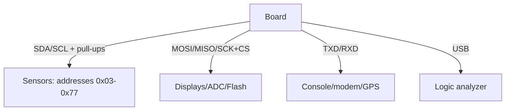

# Raspberry Pi Buses - I2C, SPI and UART with setup and code

![[assets/img/rpi-i2c-spi-uart-scheme.png|600]]
*Fig. Three buses off one header: I2C - sensors, SPI - displays, UART - console and modems; speeds and pull-ups.*

> [!tip] What this note is
> Bus practical minimum: enable, find the device, push data. I2C - sensors, SPI - displays/ADC, UART - console/modems/GPS. Base: [[03-GPIO/01-Header-Gpiozero.en | header and gpiozero]], [[09-Firmware/03-OS-Nalashtuvannya | OS setup]].

## 1. Goal

Raise all three buses in one evening:

- enabling through raspi-config / config.txt with no magic;
- scanners: who hangs on the bus and at which address;
- speeds: when the default is enough, when to turn it;
- typical pitfalls: levels, pull-ups, conflicts.

| Bus | Pins (BCM) | Default speed | Maximum |
| --- | --- | --- | --- |
| I2C-1 | SDA 2, SCL 3 | 100 kHz | 400 kHz+ |
| SPI0 | 7-11 | ~10 MHz | 60+ MHz |
| UART0 | TXD 14, RXD 15 | 115200 | 4 Mbps |

## 2. Bus architecture



I2C pull-ups sit on the board already (1.8 kOhm). SPI and UART have no pull-ups - devices hold idle levels themselves.

## 3. I2C in detail

- enabling: `raspi-config nonint do_i2c 0` or `dtparam=i2c_arm=on`;
- scanner: `i2cdetect -y 1` - address table;
- speed: `dtparam=i2c_arm_baudrate=400000`;
- length: up to 1 m at 100 kHz, then extenders or lower speed;
- address conflict - jumpers on modules or a second bus (i2c-3..6 via overlays);
- clock-stretching of slow chips - the kernel tolerates it, bit-bang does not.

## 4. SPI in detail

- enabling: `dtparam=spi=on`, devices `/dev/spidev0.0`, `/dev/spidev0.1`;
- speed is set by the driver/library (displays 20-60 MHz);
- length: up to 20 cm at full speed, then lower or buffers;
- several devices - separate CS, shared clock;
- SPI1-SPI6 - extra controllers via overlays (see the overlay README).

## 5. Working code: scanners of three buses

```python
import subprocess

def i2c_scan():
    out = subprocess.check_output(['i2cdetect', '-y', '1']).decode()
    found = []
    for line in out.splitlines()[1:]:
        for cell in line.split()[1:]:
            if cell != '--':
                found.append('0x' + cell)
    return found

def spi_loopback():
    import spidev
    spi = spidev.SpiDev()
    spi.open(0, 0)
    spi.max_speed_hz = 1000000
    resp = spi.xfer2([0x9F, 0x00, 0x00, 0x00])
    spi.close()
    return resp

def uart_echo():
    import serial
    s = serial.Serial('/dev/serial0', 115200, timeout=1)
    s.write(b'AT\r\n')
    return s.readline()

if __name__ == '__main__':
    print('I2C:', i2c_scan())
    print('SPI:', spi_loopback())
    print('UART:', uart_echo())
```

Packages: `i2c-tools`, `python3-spidev`, `python3-serial`. Turn the console off UART0 (`enable_uart=0` plus drop `console=serial0`) when a modem needs the port.

## 6. UART in detail

- `/dev/serial0` - alias for the real port (Pi 4/5 - full);
- BT takes the main UART on old boards - give BT the mini-UART;
- odd speeds - `stty` or termios;
- RS485 - through a converter with DE/RE on GPIO;
- GPS: 9600 8N1, NMEA lines, PPS - on a separate pin.

## 7. Powering bus devices

- 3.3V sensors - off pins 1/17 (up to 500 mA total);
- 5V modules - off pins 2/4, logic through a level converter;
- long cables - power on a separate wire, not the signal one;
- I2C isolation (ADuM) - for the street and storms.

## 8. Common issues

| Symptom | Cause | Fix |
| --- | --- | --- |
| `i2cdetect` empty | bus not enabled | raspi-config / dtparam |
| `UU` addresses instead of numbers | taken by the kernel (EEPROM/RTC) | normal, look for ours nearby |
| SPI garbage at speed | long wires | under 20 cm or lower speed |
| UART silent | console holds the port | drop console, turn off getty |
| Two identical sensors | one address | ADDR jumper or second bus |
| Runs, then hangs | 3.3V sag | separate module power |

## 9. Bus cheat sheet

- I2C: `i2cdetect -y 1`, 100 kHz to start;
- SPI: `/dev/spidev0.0`, speed - in code;
- UART: `/dev/serial0`, console away for a modem;
- 3.3V levels, 5V - through a level converter;
- analyzer - at the first silence.

## 10. Related notes

- [[03-GPIO/01-Header-Gpiozero.en | header and gpiozero]] - bus pins.
- [[04-Interfaces/02-Logic-Analyzer.en | logic analyzer]] - bus debugging.
- [[09-Firmware/03-OS-Nalashtuvannya | OS setup]] - config.txt and groups.
- [[10-Sensors/01-BME280-Klimat | BME280 climate]] - first I2C sensor.
- [[Home.en | main map]] - full navigation.

## 9.1 Bus address book

- I2C: 0x03-0x77 free, `UU` - taken by the kernel;
- SPI: CE0/CE1 built-in, rest - any GPIO;
- UART: `/dev/serial0` - alias, not hardware;
- write speeds down in the project README;
- raise a second bus with an overlay, not bit-bang.

## Official sources

- [Getting Started (Raspberry Pi docs)](https://www.raspberrypi.com/documentation/computers/getting-started.html) - buses and config.txt.
- [gpiozero docs (Read the Docs)](https://gpiozero.readthedocs.io/en/stable/) - work with bus pins.
- [Raspberry Pi OS (Raspberry Pi)](https://www.raspberrypi.com/software/) - i2c-tools utilities.
