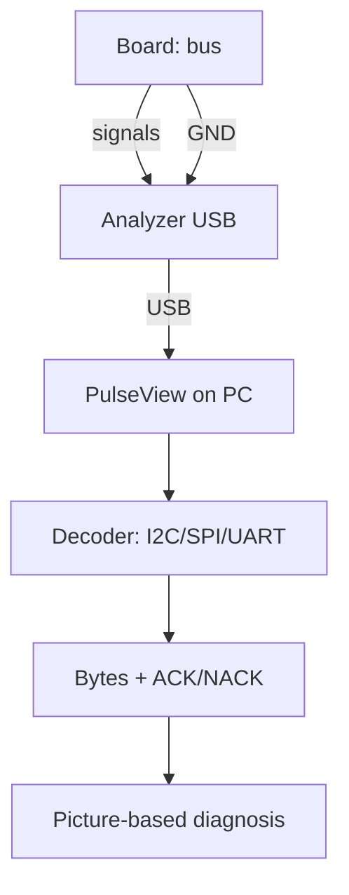

# Logic Analyzer and Bus Debugging - Saleae Clones and PulseView

![[assets/img/rpi-logic-analyzer-scheme.png|600]]
*Fig. Analyzer listens to the bus in parallel: clone ground to board ground, channels to signals, decoder shows bytes.*

> [!tip] What this note is
> Tool number 1 when "the bus stays silent": we see who is guilty - software, address, levels or wires. A 10-dollar clone plus PulseView covers 95 % of tasks. Base: [[04-Interfaces/01-I2C-SPI-UART.en | I2C/SPI/UART buses]], [[03-GPIO/01-Header-Gpiozero.en | header and gpiozero]].

## 1. Goal

Learn to see buses with your eyes:

- analyzer connection with no effect on the circuit;
- PulseView: capture, decoders, measurement;
- failure pictures: what each means;
- when the analyzer is not enough and an oscilloscope is due.

| Channel | Signal | Where to clip |
| --- | --- | --- |
| 0 | GND | board ground (mandatory!) |
| 1 | SDA / MOSI / TXD | data |
| 2 | SCL / SCK / RXD | clock/receive |
| 3 | CS / DE | chip select |
| 4+ | IRQ, extra | as needed |

## 2. Measurement architecture



The analyzer is a listener, not a party: inputs are high-impedance, the bus feels no load. Analyzer power comes from the PC USB, never from the board!

## 3. PulseView in 5 minutes

- fx2lafrankdriver driver, firmware loads itself;
- capture rate: minimum 8x the bus speed;
- trigger on the SDA/CS falling edge - catches the packet start;
- I2C decoder: address + R/W + ACK visible at once;
- capture export - attach to a forum question.

## 4. I2C failure pictures

| Picture | Diagnosis |
| --- | --- |
| SDA at zero all the time | someone holds the bus (hung slave) |
| Address there, NACK | no device / wrong address |
| Start with no stops | software never closes transactions |
| Garbage on edges | long wires, no pull-ups |
| 9th clock with no ACK | slave lags (clock-stretch ignored) |

## 5. Working code: bus self-check

```python
import subprocess

def check_i2c():
    out = subprocess.check_output(['i2cdetect', '-y', '1']).decode()
    devs = [c for line in out.splitlines()[1:]
            for c in line.split()[1:] if c not in ('--', 'UU')]
    print('I2C devices:', devs if devs else 'NONE - check wiring')
    return devs

def check_spi():
    try:
        import spidev
        s = spidev.SpiDev()
        s.open(0, 0)
        s.max_speed_hz = 1000000
        r = s.xfer2([0x00])
        s.close()
        print('SPI open OK, reply:', r)
        return True
    except Exception as e:
        print('SPI FAIL:', e)
        return False

def check_uart():
    import serial
    try:
        s = serial.Serial('/dev/serial0', 115200, timeout=1)
        s.close()
        print('UART open OK')
        return True
    except Exception as e:
        print('UART FAIL:', e)
        return False

if __name__ == '__main__':
    check_i2c()
    check_spi()
    check_uart()
```

Self-check before the analyzer: half the problems are inattention, not hardware. Reach for the analyzer when the script says "all ok" but the sensor stays silent.

## 6. SPI/UART pictures

- SPI: no clocks - wrong CS pin / wrong device;
- SPI: clocks there, MISO at zero - slave never answers;
- UART: framing errors - wrong speed;
- UART: garbage instead of AT - 5V/3.3V levels mixed up;
- general: ground first, then power, then signals.

## 7. When an oscilloscope is due

- supply sags at peak (the analyzer never sees them);
- ringing and spikes on long-line edges;
- analog levels: does HIGH reach the threshold;
- USB/Ethernet - oscilloscope with differential probes only;
- budget DSO138 - minimum, normal - 100 MHz.

## 8. Common issues

| Symptom | Cause | Fix |
| --- | --- | --- |
| PulseView sees no device | clone driver/firmware | Zadig (Windows) or fx2lafrankdriver |
| Capture - flat line | ground not connected | Analyzer GND to board ground! |
| Decoder nonsense | wrong capture speed | minimum 8x the bus |
| I2C visible, no bytes | trigger in the wrong place | trigger on the SDA fall |
| Analyzer heats/hangs | powered from the board | power from PC USB only |
| All clean, still dead | logic levels ok, power not | oscilloscope on VCC, USB tester |

## 9. Debug cheat sheet

- ground first, then power, then signals;
- script self-check - before the analyzer;
- 8x capture, trigger on the packet start;
- check the picture against the section 4/6 table;
- capture export - to a community question.

## 10. Related notes

- [[04-Interfaces/01-I2C-SPI-UART.en | I2C/SPI/UART buses]] - what we listen to.
- [[03-GPIO/01-Header-Gpiozero.en | header and gpiozero]] - where to clip.
- [[02-Power-Supply/01-USB-C-PD.en | USB-C power]] - when power is guilty.
- [[17-Lab/01-Priladi | instrument room]] - full lab bench.
- [[Home.en | main map]] - full navigation.

## Official sources

- [Getting Started (Raspberry Pi docs)](https://www.raspberrypi.com/documentation/computers/getting-started.html) - buses and debugging.
- [gpiozero docs (Read the Docs)](https://gpiozero.readthedocs.io/en/stable/) - pin test scripts.
- [Raspberry Pi OS (Raspberry Pi)](https://www.raspberrypi.com/software/) - i2c-tools and SPI utilities.
