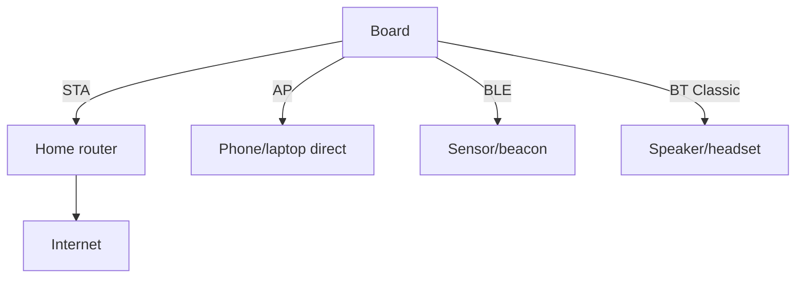

# Raspberry Pi Onboard Radio - WiFi, Bluetooth and Antennas

![[assets/img/rpi-wifi-bt-bort-scheme.png|600]]
*Fig. One radio - three roles: router client, access point, BLE beacon; the antenna decides half of it.*

> [!tip] What this note is
> WiFi and BT are already on the board: no dongles needed for 90 % of tasks. Modes, speeds, coexistence and antennas. Node network: [[EN/09-Firmware/03-OS-Setup.en|OS setup]], cloud: queue protocols 4.

## 1. Goal

Master the onboard radio fully:

- WiFi client, access point, monitor mode;
- Bluetooth Classic (audio, SPP) and BLE (beacons, GATT);
- antennas: printed, ceramic, external U.FL;
- stability: channels, power supply, dropouts.

| Board | WiFi | BT | Antenna |
| --- | --- | --- | --- |
| Pi 5 / Pi 4 | ac dual-band | 5.0, BLE | printed Proant |
| Zero 2 W | n 2.4 GHz | 4.2, BLE | printed/ceramic |
| Pico W / 2 W | 4, 2.4 GHz | 5.2 | printed on the board |
| CM4/CM5 | optional | optional | trace or U.FL |

## 2. Role architecture



At once: AP + client (repeater), BT audio + WiFi telemetry. Monitor mode - for amateur radio (legality is on you).

## 3. WiFi modes in detail

- client: NetworkManager, network priorities, auto-reconnect;
- access point: `nmcli` AP in 5 commands, built-in DHCP;
- 5 GHz: non-DFS channels for stability;
- TX power by region (country in the config!);
- monitor: `airmon-ng` compatibility by chipset.

## 4. Bluetooth in detail

- Classic: A2DP music receiver, SPP terminal;
- BLE: iBeacon/Eddystone beacons, GATT sensor server;
- BlueZ stack: `bluetoothctl` for pairing;
- coexistence with WiFi: separate channels (WiFi 1/6/11, BT adaptive);
- auto-connect of the speaker at boot - a script in systemd.

## 5. Working code: AP + monitor

```bash
#!/bin/bash
# ap-setup.sh — точка доступу за хвилину
SSID="PiField"
PASS="field12345"
nmcli device wifi hotspot ifname wlan0 ssid "$SSID" password "$PASS"
echo "AP $SSID up"
iw dev wlan0 info | grep -E "ssid|channel"
```

```python
import subprocess
import time

def wifi_rssi():
    out = subprocess.check_output(
        ['nmcli', '-t', '-f', 'SIGNAL', 'device', 'wifi', 'list', 'ifname', 'wlan0']
    ).decode().splitlines()
    vals = [int(x) for x in out if x.strip().isdigit()]
    return max(vals) if vals else 0

while True:
    s = wifi_rssi()
    print(f"best AP signal: {s}%")
    if s < 30:
        print("WARN: weak signal, move antenna")
    time.sleep(60)
```

Signal in nmcli percent is rough, but enough for orientation. Exact dBm - `iw dev wlan0 link`.

## 6. Antennas and range

- printed Proant: omnidirectional, enough for a flat;
- metal nearby kills the pattern - take the board out of the cage case;
- U.FL on CM: external gain antenna for the street;
- orientation: edge toward the peer, not flat;
- 2.4 GHz goes farther, 5 GHz is faster - choice by distance.

## 7. Link stability

- power supply: sags kill the radio first;
- watchdog: ping the gateway, on loss - restart the interface;
- 2.4 channels: 1/6/11, 20 MHz width in crowded air;
- turn off WiFi power management for 24/7;
- logs `dmesg | grep brcmfmac` - driver diagnostics.

## 8. Common issues

| Symptom | Cause | Fix |
| --- | --- | --- |
| No 5 GHz visible | no country in config | set WiFi-country |
| Drops every hour | power management | turn off PM, watchdog |
| BT stutters with WiFi | one radio path | separate channels, profile priority |
| AP does not come up | NetworkManager holds the interface | stop competing profiles |
| Slow on Zero | antenna inside metal | take out, orient by edge |
| Does not connect to WPA3 | old driver | WPA2 for compatibility |

## 9. Radio cheat sheet

- WiFi country - as the first line;
- AP: `nmcli hotspot` in a minute;
- turn off PM for 24/7;
- antenna out of metal;
- brcmfmac logs - the first source.

## 10. Related notes

- [[EN/09-Firmware/03-OS-Setup.en|OS setup]] - system network.
- [[12-Comm-Modules/02-GPS-LoRa-HAT|long-range LoRa radio]] - kilometers of link.
- [[11-Vivid/03-Audio-HAT|audio and HAT]] - BT audio.
- [[EN/02-Power-Supply/01-USB-C-PD.en|USB-C power supply]] - radio eats first.
- [[Home.en|main map]] - full navigation.

## 9.1 Flat radio planning

- point in the center, above furniture;
- 2.4 for far nodes, 5 for fast ones;
- neighbor channels checked with a WiFi scanner;
- repeater - the last resort, wire is better;
- IoT network on a separate SSID with client isolation.

## Official sources

- [Raspberry Pi Configuration (Raspberry Pi docs)](https://www.raspberrypi.com/documentation/computers/configuration.html) - WiFi, BT, country.
- [Getting Started (Raspberry Pi docs)](https://www.raspberrypi.com/documentation/computers/getting-started.html) - network and antennas.
- [Raspberry Pi OS (Raspberry Pi)](https://www.raspberrypi.com/software/) - NetworkManager and BlueZ.
