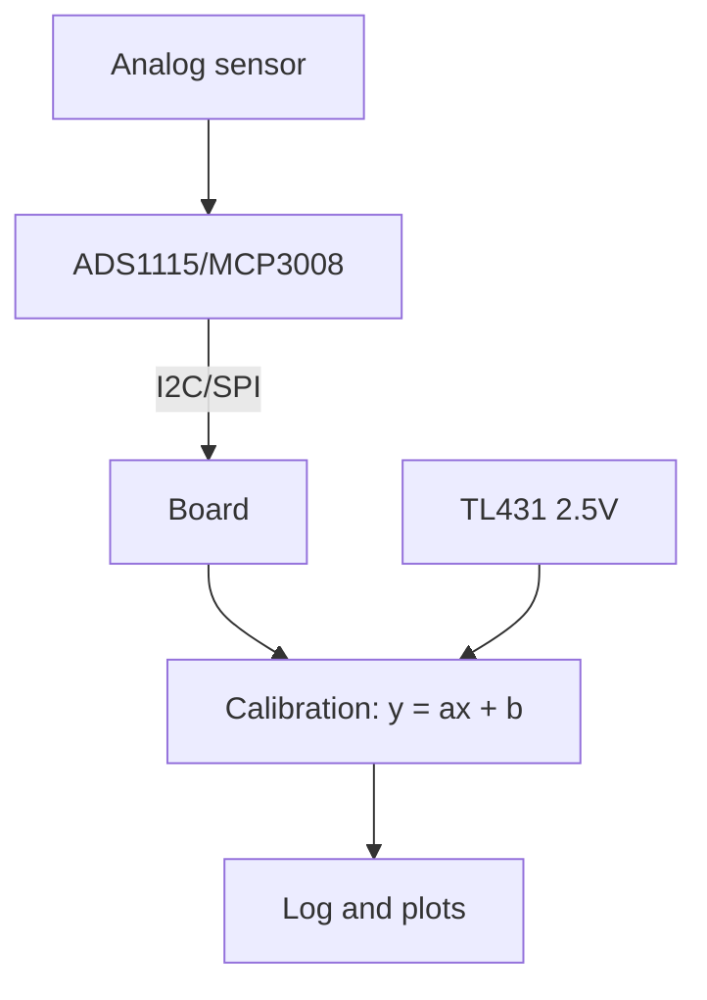

# External ADCs for Raspberry Pi - ADS1115 and MCP3008

![[assets/img/rpi-adc-zovnishnye-scheme.png|600]]
*Fig. Analog from outside: ADS1115 - precision over I2C, MCP3008 - speed over SPI; Pico has its own built-in one.*

> [!tip] What this note is
> Linux Pi boards have no analog inputs at all - we add chips. Precise slow measurements and fast signals are two different chips. Only Pico has a built-in ADC: [[EN/01-Hardware/03-RP2040-RP2350.en|RP2040 and RP2350]].

## 1. Goal

Measure the analog world:

- ADS1115: 16 bit, slow, precise (scales, pH, thermocouples through an amplifier);
- MCP3008: 10 bit, fast (potentiometers, joysticks, audio envelope);
- differential inputs and programmable amplifier;
- calibration against a reference source.

| Chip | Bits | Speed | Bus | Channels |
| --- | --- | --- | --- | --- |
| ADS1115 | 16 | up to 860 sps | I2C, 4 addresses | 4 SE / 2 diff |
| MCP3008 | 10 | up to 200 ksps | SPI | 8 SE |
| Pico built-in | 12 | fast | - | 3 + battery |

## 2. Measurement architecture



The TL431 reference source is the accuracy anchor: we measure it next to the signal and compensate power supply drift.

## 3. ADS1115 in detail

- PGA: ±6.144V to ±0.256V - gain for weak signals;
- rates 8-860 samples/s: faster means noisier;
- comparator with alert on a pin - no polling;
- 4 addresses by ADDR pin - 4 chips on the bus;
- differential mode removes common-mode noise.

## 4. MCP3008 in detail

- SPI up to 3.6 MHz clock, 200 thousand samples/s;
- protocol: start bit + config, 10-bit answer;
- reference equals chip power supply (stabilize it!);
- joysticks, volume potentiometers, fast envelopes;
- for precision - averaging in batches of 16.

## 5. Working code

```python
import time
import board
import busio
import adafruit_ads1x15.ads1115 as ADS
from adafruit_ads1x15.analog_in import AnalogIn
import spidev

i2c = busio.I2C(board.SCL, board.SDA)
ads = ADS.ADS1115(i2c, address=0x48)
ads.gain = 1
ch0 = AnalogIn(ads, ADS.P0)

spi = spidev.SpiDev()
spi.open(0, 0)
spi.max_speed_hz = 1000000

def mcp_read(ch):
    r = spi.xfer2([1, (8 + ch) << 4, 0])
    return ((r[1] & 3) << 8) | r[2]

VREF = 3.3
while True:
    v_ads = ch0.voltage
    raw = mcp_read(0)
    v_mcp = raw * VREF / 1023.0
    print(f"ADS:{v_ads:.4f}V MCP:{v_mcp:.3f}V")
    time.sleep(0.5)
```

ADS1115 gain: 2/3 (±6.144V), 1 (±4.096V), 2 (±2.048V), 4/8/16 - for the signal. MCP formula - for a 3.3V reference.

## 6. Two-point calibration

- point 1: input to ground (0V), point 2: TL431 (2.5V);
- linear correction `y = ax + b` from two measurements;
- we store coefficients in a config file;
- recalibration on power supply or temperature change;
- for pH/EC - buffer solutions instead of TL431.

## 7. Noise and precision in practice

- twisted pair signal+ground, shield - on long lines;
- RC filter 1 kOhm + 100 nF near the ADC input;
- averaging: median of 5 + mean of 16;
- digital ground on a separate wire to the board;
- 50 Hz pickup - measure in multiples of 20 ms.

## 8. Common issues

| Symptom | Cause | Fix |
| --- | --- | --- |
| Value floats | no stable reference | TL431, calibration |
| Saturation at maximum | signal above PGA range | lower gain / divider |
| MCP returns zeros | wrong channel in config byte | formula `(8+ch)<<4` |
| I2C address conflict | two ADS1115 at 0x48 | ADDR jumpers 0x49-0x4B |
| Drift with temperature | self-heating + TCO | calibrate at working temperature |
| 50 Hz noise | mains pickup | RC filter, averaging over 20 ms |

## 9. ADC cheat sheet

- precision - ADS1115, speed - MCP3008;
- calibration by TL431 in two points;
- averaging: median + mean;
- RC filter on the input always;
- ground in a star, not a chain.

## 10. Related notes

- [[EN/01-Hardware/03-RP2040-RP2350.en|RP2040 and RP2350]] - Pico built-in ADC.
- [[EN/04-Interfaces/01-I2C-SPI-UART.en|I2C/SPI/UART buses]] - buses in detail.
- [[10-Sensors/04-INA219-Strum|INA219 current]] - ready measurement on the bus.
- [[EN/02-Power-Supply/01-USB-C-PD.en|USB-C power supply]] - reference stability.
- [[Home.en|main map]] - full navigation.

## 9.1 ADC choice in one table

- slow and precise (scales, pH) - ADS1115;
- fast and rough (knobs, sound) - MCP3008;
- Pico battery - built-in, nothing else;
- current and power - ready INA219;
- in doubt - start with ADS1115.

## Official sources

- [ADS1115 (Adafruit)](https://www.adafruit.com/product/1085) - module, PGA, addresses.
- [ADS1115 (Texas Instruments)](https://www.ti.com/product/ADS1115) - registers, rates, comparator.
- [Getting Started (Raspberry Pi docs)](https://www.raspberrypi.com/documentation/computers/getting-started.html) - buses and setup.
