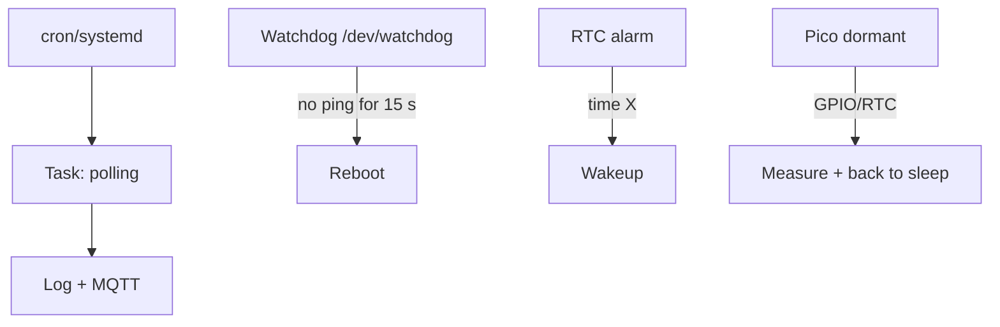

# Raspberry Pi Timers and Sleep - Watchdog, Cron and Battery Modes

![[assets/img/rpi-taimeri-son-scheme.png|600]]
*Fig. Time ladder: cron wakes tasks, watchdog guards hangs, RTC wakes hardware, Pico sleeps in microamps.*

> [!tip] What this note is
> Time as a resource: periodic tasks without loops, reboot on hang, wake by schedule, Pico sleep for battery. System: [[EN/09-Firmware/03-OS-Setup.en|OS setup]], power supply: [[EN/02-Power-Supply/03-UPS-18650.en|UPS backup]].

## 1. Goal

Set the time behavior of the node:

- cron and systemd timers: what starts when;
- watchdog: hardware reboot on hang;
- RTC alarm: wake up and shut down by schedule;
- Pico sleep: microamps between measurements.

| Mechanism | Precision | Use for |
| --- | --- | --- |
| cron | minute | sensor polling |
| systemd timer | second + dependencies | services with conditions |
| watchdog | seconds | reboot of hung node |
| RTC alarm | minute | power on by schedule |
| Pico dormant | milliseconds | battery nodes |

## 2. Time architecture



Rule: every 24/7 node has a watchdog. Without it the first hang means a trip to the site.

## 3. Cron and systemd timers

- cron: `*/5 * * * * /home/pi/read.py` - every 5 minutes;
- cron logs - in syslog, see `grep CRON`;
- systemd timer: `.timer` + `.service` units, network dependency;
- random delay `RandomizedDelaySec` - so 100 nodes do not hit together;
- flock lock against overlapping runs.

## 4. Watchdog in detail

- hardware bcm2835-wdt: `dtparam=watchdog=on`;
- `watchdog` daemon: pings the device, watches load/network;
- config: 10 s interval, 15 s threshold, gateway ping test;
- software level: systemd `WatchdogSec` in the service;
- trip check: `wdctl` and the counter in logs.

## 5. Working code: node guard

```python
import os
import time
import subprocess

WD_DEV = '/dev/watchdog'

def wd_ping():
    with open(WD_DEV, 'w') as f:
        f.write('V')

def net_ok():
    try:
        subprocess.check_output(['ping', '-c1', '-W2', '192.168.1.1'])
        return True
    except subprocess.CalledProcessError:
        return False

fails = 0
wd = open(WD_DEV, 'w')
try:
    while True:
        wd.write('V')
        wd.flush()
        if net_ok():
            fails = 0
        else:
            fails += 1
            print(f"net fail {fails}")
            if fails >= 3:
                os.system('sudo systemctl restart NetworkManager')
                fails = 0
        time.sleep(10)
finally:
    wd.write('V')
    wd.close()
```

Warning: an open `/dev/watchdog` without pings means reboot after timeout. Close it correctly or write the magic `V`.

## 6. RTC alarm and power schedule

- Pi 5: built-in RTC + battery, `wakealarm` out of the box;
- older ones: HAT with DS3231 or PCF8523;
- scenario: woke up, sent, shut down (relay/power timer);
- `rtcwake -m off -s 3600` - sleep for an hour (where supported);
- sun + timer: the node lives only by day.

## 7. Pico sleep for battery

- `machine.deepsleep(ms)` - microamps, wake by timer/GPIO;
- dormant mode in C SDK - even deeper;
- state is not kept - write critical data to flash before sleep;
- cycle: woke up - measured - sent - slept;
- average current - microamps with a period in minutes.

## 8. Common issues

| Symptom | Cause | Fix |
| --- | --- | --- |
| Cron does not start | no PATH/rights in cron | absolute paths, log to file |
| Watchdog reboots healthy node | daemon does not ping | check config and interval |
| RTC alarm does not wake | no battery/support | HAT with DS3231 or Pi 5 RTC |
| Two runs overlap | long task + frequent cron | flock lock in the script |
| Pico does not wake | wrong alarm pin | only allowed sleep GPIO |
| Time drifts without network | no RTC | HAT clock or GPS-PPS |

## 9. Time cheat sheet

- cron - minutes, systemd - seconds and dependencies;
- watchdog on always for 24/7;
- RTC alarm for the power schedule;
- Pico sleeps between measurements;
- flock against double starts.

## 10. Related notes

- [[EN/09-Firmware/03-OS-Setup.en|OS setup]] - services and cron.
- [[EN/02-Power-Supply/03-UPS-18650.en|UPS backup]] - power supply for sleep.
- [[10-Sensors/05-GPS-NEO|GPS modules]] - precise time with PPS.
- [[14-Devboards/03-Pico-W-Family|Pico family]] - microcontroller sleep.
- [[Home.en|main map]] - full navigation.

## Official sources

- [Raspberry Pi Configuration (Raspberry Pi docs)](https://www.raspberrypi.com/documentation/computers/configuration.html) - watchdog and RTC.
- [Getting Started (Raspberry Pi docs)](https://www.raspberrypi.com/documentation/computers/getting-started.html) - config.txt and services.
- [gpiozero docs (Read the Docs)](https://gpiozero.readthedocs.io/en/stable/) - alarm pins.
