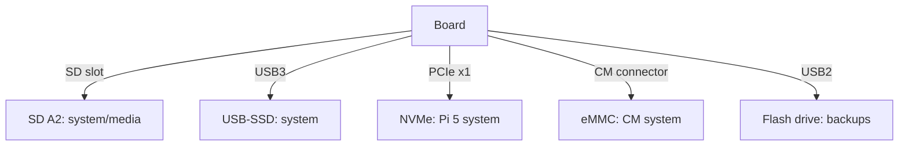

# Raspberry Pi Storage Media - SD, eMMC, NVMe and USB Disks

![[assets/img/rpi-sd-emmc-nvme-scheme.png|600]]
*Fig. Ladder of speed and endurance: SD to USB-SSD to NVMe to eMMC; choice by budget and task.*

> [!tip] What this note is
> Full disk subsystem: what to put where, how not to kill an SD in half a year, when to move to NVMe. Flashing: [[EN/09-Firmware/01-Imager-Headless.en|Imager flashing]], boot order: [[EN/09-Firmware/02-EEPROM-Boot.en|EEPROM boot]].

## 1. Goal

Pick the media for the task and extend its life:

- honest numbers comparing media;
- SD: classes, fakes, wear and the fight against it;
- NVMe on Pi 5: HAT boards, disks, system without SD;
- USB disks: when an enclosure is enough.

| Media | Speed | Endurance | Price |
| --- | --- | --- | --- |
| SD A2 | ~40 MB/s | low (wears out) | pennies |
| USB-SSD SATA | ~350 MB/s | high (TRIM) | medium |
| NVMe (Pi 5) | ~500 MB/s (x1) | high | higher + HAT board |
| eMMC (CM) | ~200 MB/s | high | in module price |

## 2. Option architecture



Golden rule: system on the most enduring media, media files on the largest, backup separate.

## 3. SD cards: maximum survival

- class A2 mandatory (random OS operations);
- 50 % volume headroom - the controller has room to spread wear;
- `f3`/`H2testw` over the full volume before the first flash;
- logs in RAM, swap off or zram;
- monitoring: sudden read-only - a pre-death symptom;
- replacement every 1-2 years on 24/7 - scheduled, not on failure.

## 4. NVMe on Pi 5

- official M.2 HAT+ (2230/2242) or third-party for 2280;
- `dtparam=pciex1` + fresh EEPROM, else no disk;
- Imager writes the system straight to NVMe;
- SSD without DRAM buffer - heats less;
- Gen3 disks run in Gen2 line mode - no problem.

## 5. Working code: disk health

```bash
#!/bin/bash
# disk-health.sh — щотижнева перевірка
echo "== usage =="
df -h / /boot/firmware | awk '{print $1, $5, $6}'
echo "== SD wear (approx) =="
dmesg | grep -i "mmc.*error" | tail -3 || echo "mmc errors: none"
echo "== NVMe temp =="
if [ -e /dev/nvme0 ]; then
  sudo nvme smart-log /dev/nvme0 | grep -E "temperature|percentage_used"
else
  echo "no nvme"
fi
echo "== USB resets =="
dmesg | grep -c "usb.*reset" || true
echo "== largest dirs =="
du -sh /var/log /tmp 2>/dev/null
```

USB resets in logs are the first sign of weak disk power supply. NVMe temperature over 70 C - add a heatsink or airflow.

## 6. USB disks and flash drives

- SATA SSD in a USB3 enclosure - the sweet spot for Pi 4;
- UAS on by the kernel, TRIM by `fstrim -a` weekly;
- power supply: enclosure with a separate input for 3.5 inch HDD;
- flash drives - only for backups and transfer, not the system;
- NTFS/exFAT for exchange with Windows, ext4 - for the system.

## 7. Filesystems

| FS | When | Note |
| --- | --- | --- |
| ext4 | system always | journal, reliability |
| FAT32 | boot partition, flash drives | compatibility |
| exFAT | large files for Windows | exfat-fuse package |
| btrfs | snapshots (advanced) | compression + rollback |
| overlayfs | read-only kiosks | system unchanging |

## 8. Common issues

| Symptom | Cause | Fix |
| --- | --- | --- |
| Suddenly read-only | SD died | backup, new A2, restore |
| NVMe not visible | no pciex1/old EEPROM | both together + reboot |
| USB disk drops | power supply | powered hub, short cable |
| Slow after half a year | full disk + no TRIM | `fstrim`, 30 % free headroom |
| No boot from USB/NVMe | order in EEPROM | BOOT_ORDER 0xf416 (6 = NVMe) |
| btrfs does not mount | crash without clean stop | `btrfs rescue`, backup in advance |

## 9. Media cheat sheet

- system - on the most enduring media;
- SD only A2 + f3 check;
- NVMe: pciex1 + fresh EEPROM;
- TRIM weekly for SSD;
- backup before, not after.

## 10. Related notes

- [[EN/09-Firmware/01-Imager-Headless.en|Imager flashing]] - writing images.
- [[EN/09-Firmware/02-EEPROM-Boot.en|EEPROM boot]] - media order.
- [[EN/08-Memory/02-Backup-Clone.en|backups and clones]] - copy strategy.
- [[14-Devboards/01-Pi5-Flagman|Pi 5 flagship]] - NVMe HAT boards.
- [[Home.en|main map]] - full navigation.

## 11. Media choice in one table

- system on SD: only A2 + backups;
- system on USB-SSD: the Pi 4 sweet spot;
- system on NVMe: the Pi 5 maximum;
- data separate from the system always;
- measure speed with `hdparm -t`, never trust labels.
- check NVMe temperature in smart logs.
- take a USB enclosure with UAS support.
- keep system and data on different media.
- label on every card: node and date.
- USB3 card reader for fast cloning.

## Official sources

- [Getting Started (Raspberry Pi docs)](https://www.raspberrypi.com/documentation/computers/getting-started.html) - media and boot.
- [Raspberry Pi OS (Raspberry Pi)](https://www.raspberrypi.com/software/) - images for media.
- [rpi-imager (Raspberry Pi, GitHub)](https://github.com/raspberrypi/rpi-imager) - writing to any media.
