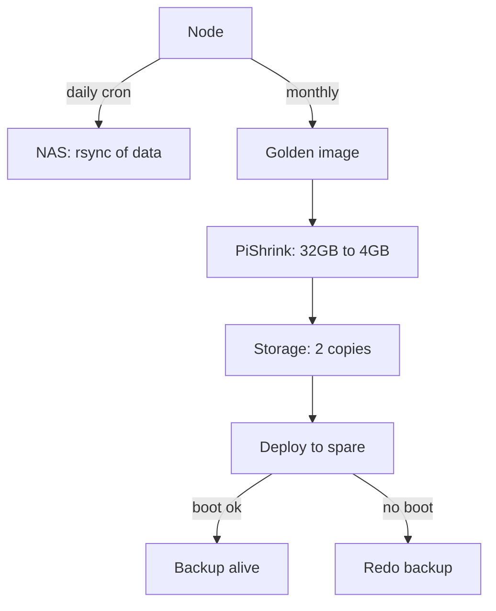

# Raspberry Pi Backups - Images, Clones and One-Hour Recovery

![[assets/img/rpi-backup-clone-scheme.png|600]]
*Fig. Three copy levels: golden image, daily data, restore check - a backup without a check is no backup.*

> [!tip] What this note is
> An SD card will die - it is a matter of time. Three-level strategy: system image, data separate, verified restore. Media: [[EN/08-Memory/01-SD-eMMC-NVMe.en|storage media]], system: [[EN/09-Firmware/03-OS-Setup.en|OS setup]].

## 1. Goal

Sleep well with a fleet of boards:

- backup levels: what, where and how often;
- tools: dd, PiShrink, rsync, restic;
- golden image of the batch;
- restore check - a mandatory part.

| Level | What | Where | Period |
| --- | --- | --- | --- |
| Golden image | clean tuned system | NAS + cloud | on change |
| Data | /home, /etc, databases | NAS/rsync daily | daily |
| Fast clone | working card 1:1 | spare SD nearby | weekly |

## 2. Strategy architecture



An unchecked backup is self-deception. A test deploy once a quarter is part of the routine.

## 3. Tools in detail

- `dd if=/dev/sdX of=backup.img bs=4M status=progress` - full copy;
- PiShrink: squeezes free space, the image shrinks several times;
- `rsync -a --delete` - data increment without extra;
- restic/borg - versioned backups with encryption;
- SD Card Copier (graphical, from Pi OS) - clone in two clicks;
- `dpkg --get-selections` - package list for reproduction.

## 4. Golden image of the batch

- clean system + all settings + needed packages;
- hostname and keys - templates, not hardcoded;
- version in the file name: `gold-2026-10-06-v3.img`;
- sha256 checksum nearby;
- deploy to a new board - 10 minutes instead of a day.

## 5. Working code: data auto-backup

```bash
#!/bin/bash
# backup-data.sh — щодня з cron
SRC="/home/pi/project/data /etc/nginx /etc/mosquitto"
DST="nas:/backups/node-01"
LOG="/var/log/backup.log"

rsync -a --delete $SRC $DST/current/ >> $LOG 2>&1
if [ $? -eq 0 ]; then
  rm -rf $DST/prev.7
  for i in 6 5 4 3 2 1; do
    [ -d $DST/prev.$i ] && mv $DST/prev.$i $DST/prev.$((i+1))
  done
  cp -al $DST/current $DST/prev.1
  echo "$(date): OK" >> $LOG
else
  echo "$(date): FAIL" >> $LOG
fi
```

Hardlink copies (`cp -al`) - 7 daily slices for the price of one plus deltas. Rollback to any day with one command.

## 6. Restore step by step

- burnt SD: take the spare with the golden image;
- flash with Imager or `dd`, insert, boot;
- roll data from the latest rsync slice;
- change hostname and keys for the node;
- check services: `systemctl --failed` empty;
- norm: an hour from diagnosis to work.

## 7. Typical pitfalls

| Mistake | Consequence | Rule |
| --- | --- | --- |
| Backup without check | does not deploy in trouble | test every quarter |
| One copy | burnt together with the node | minimum two, different places |
| Back up everything | terabytes of junk | data separate, no caches |
| No package versions | "it updated itself" | freeze the package list |
| Passwords in backup open | leak on theft | restic/borg encryption |

## 8. Common issues

| Symptom | Cause | Fix |
| --- | --- | --- |
| Image does not fit the card | card smaller by a sector | target card of same or larger volume |
| rsync crawls for hours | a million small files | exclude caches and logs |
| Restore does not boot | old image version | update golden image with the system |
| NAS is full | backups without rotation | rotation of 7 daily + 4 weekly |
| Cron is silent | no PATH/rights in cron | absolute paths, log to file |
| Forgot encryption password | written nowhere | password manager, paper copy in safe |

## 9. Backup cheat sheet

- 3 levels: image, data, check;
- 2 copies in different places;
- restore test every quarter;
- image name with date, no spaces;
- automation in cron, not "when I remember".

## 10. Related notes

- [[EN/08-Memory/01-SD-eMMC-NVMe.en|storage media]] - what we back up.
- [[EN/09-Firmware/01-Imager-Headless.en|Imager flashing]] - writing images back.
- [[EN/09-Firmware/03-OS-Setup.en|OS setup]] - what goes into the golden image.
- [[15-Protocols/01-MQTT|broker config backup]] - what to store.
- [[Home.en|main map]] - full navigation.

## 9.1 Backup calendar

- daily: data rsync to NAS;
- weekly: fast clone of the working card;
- monthly: golden image + sha256;
- quarterly: test restore;
- reminder in the calendar, not in the head.
- encryption password - in the password manager.
- restore journal: date, result, notes.
- keep the encryption password separate from the backup.
- media shelf life: SD - 2 years on 24/7.

## Official sources

- [Getting Started (Raspberry Pi docs)](https://www.raspberrypi.com/documentation/computers/getting-started.html) - images and restore.
- [rpi-imager (Raspberry Pi, GitHub)](https://github.com/raspberrypi/rpi-imager) - writing and cloning.
- [Raspberry Pi OS (Raspberry Pi)](https://www.raspberrypi.com/software/) - SD Card Copier.
