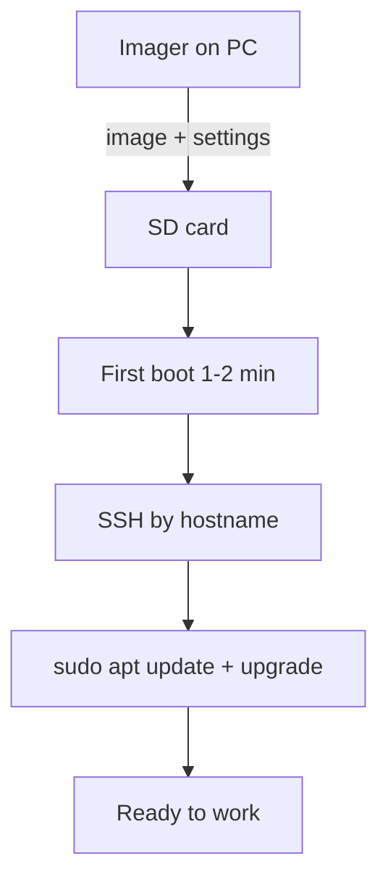

# Raspberry Pi Imager and Headless - Flashing SD with SSH and WiFi

![[assets/img/rpi-imager-headless-scheme.png|600]]
*Fig. Imager writes the image and sets up at once: user, SSH, WiFi, hostname - the board starts ready.*

> [!tip] What this note is
> The zero step of Pi ownership: correct flashing saves hours. Everything in one Imager window, no manual files. OS choice: [[EN/00-Start/05-Environment-Choice.en|environment choice]], next: [[EN/09-Firmware/03-OS-Setup.en|OS setup]].

## 1. Goal

Flash and start Pi without a monitor:

- image choice for the board and the task;
- settings in Imager: user, SSH, WiFi, locale;
- first boot check by LEDs and network;
- typical pitfalls of the Etcher era and old guides.

| Image | When | Size |
| --- | --- | --- |
| Pi OS Desktop 64-bit | desktop, media, learning | ~3 GB |
| Pi OS Lite 64-bit | servers, IoT, Zero | ~500 MB |
| Pi OS Lite 32-bit | Zero W v1, old boards | ~500 MB |
| Ubuntu Server | ROS, familiar stack | ~1 GB |

## 2. Process architecture



Old `ssh` and `wpa_supplicant.conf` files are no longer needed - Imager writes everything itself to the first partition.

## 3. Imager wizard step by step

- Choose Device - exact model (Pi 5 / Pi 4 / Zero 2 W);
- Choose OS - by the table above;
- Choose Storage - card (data will be erased!);
- settings dialog (former Imager v1 "gear"): hostname, user+password, WiFi+password+country, SSH with key;
- Write to Yes to wait for verification;
- SD into the board, power - and do not touch for 2 minutes.

## 4. First connection

- `ssh user@raspberrypi.local` (mDNS) or IP from the router;
- password from Imager, not `raspberry` (it is gone);
- `sudo raspi-config`: expand FS, locale, timezone;
- `sudo apt update && sudo apt full-upgrade -y && sudo reboot`;
- keys: `ssh-copy-id` - no passwords further.

## 5. Working code: first-boot script

```bash
#!/bin/bash
# first-boot.sh — прогнати один раз по SSH
set -e
sudo raspi-config nonint do_hostname my-node-01
sudo raspi-config nonint do_wifi_country UA
sudo apt update && sudo apt full-upgrade -y
sudo apt install -y git vim htop i2c-tools python3-pip
sudo raspi-config nonint do_i2c 0
sudo raspi-config nonint do_spi 0
sudo raspi-config nonint do_ssh 0
echo "reboot now: sudo reboot"
```

`nonint` is the non-interactive raspi-config mode for scripts. Turn on I2C/SPI at once - sensors will need them.

## 6. WiFi nuances

- country UA/yours - without it 5 GHz does not work;
- 5 GHz DFS channels - the router can stay silent for minutes;
- static IP - reservation on the router by MAC;
- `nmcli` - the new tool (NetworkManager instead of dhcpcd);
- WiFi drop - watchdog script with `ping` and interface restart.

## 7. Health check after install

| Test | Command | Norm |
| --- | --- | --- |
| Power supply | `vcgencmd get_throttled` | `0x0` |
| Temperature | `vcgencmd measure_temp` | < 60 C |
| Disk | `df -h /` | < 70 % |
| Memory | `free -h` | swap ~ 0 |
| Uptime services | `systemctl --failed` | empty |

`throttled=0x50000` means a power supply sag happened: swap the PSU even if it works now.

## 7.1 Batch flashing of a fleet

- one "golden" image: tuned once, cloned to all;
- Imager CLI: `rpi-imager --cli --sd-card` in a script;
- hostname and SSH keys - unique per board (template + serial);
- write verification on always;
- MAC/serial sticker on the case right after flashing;
- first boot of the batch - one board at a time, not all together;
- journal: which card in which board, date, image version;
- spare cards with the golden image - 10 % of the batch.

Parallel flashing - through a powered USB hub with 4+ readers. Serial is more reliable, parallel is faster: choice by deadline.

## 8. Common issues

| Symptom | Cause | Fix |
| --- | --- | --- |
| No boot at all | bad SD or image not for the board | f3 check, fresh image |
| SSH rejects | not turned on in Imager | reflash with SSH or monitor+keyboard |
| WiFi does not connect | no country or 5 GHz DFS | country, 2.4 GHz point to start |
| `raspberrypi.local` does not resolve | no mDNS on PC | IP from router, nmap scan |
| Old password fails | `pi/raspberry` removed | user from Imager |
| Imager does not see the card | reader/adapter | other reader, direct slot |

## 9. Related notes

- [[EN/00-Start/05-Environment-Choice.en|environment choice]] - which OS for what.
- [[EN/09-Firmware/03-OS-Setup.en|OS setup]] - system after start.
- [[EN/09-Firmware/02-EEPROM-Boot.en|EEPROM boot]] - boot order.
- [[EN/08-Memory/01-SD-eMMC-NVMe.en|storage media]] - SD in detail.
- [[EN/02-Power-Supply/01-USB-C-PD.en|USB-C power supply]] - no power bolt.

## 10. Imager cheat sheet

- model + image + card - three clicks;
- settings dialog: hostname, user, SSH, WiFi, country;
- never turn off verification;
- first boot - do not touch for 2 minutes;
- `throttled=0x0` - all good.

## Official sources

- [Raspberry Pi OS (Raspberry Pi)](https://www.raspberrypi.com/software/) - images and Imager.
- [Getting Started (Raspberry Pi docs)](https://www.raspberrypi.com/documentation/computers/getting-started.html) - headless process.
- [rpi-imager (Raspberry Pi, GitHub)](https://github.com/raspberrypi/rpi-imager) - options and customization.

## 10. Mass deployment testing

- After imaging check `throttled=0x0` on every board (temperature control).
- If `0x50000` - overheat or weak PSU, do not start production.
- Save `lsusb -t` and `dmesg | grep -i "usb\|mmc\|nvme"` for every serial number.
- Check the log with `journalctl -u ssh` before handing the node to operation.
- Refresh the image once a quarter (Bookworm to next LTS) to avoid piling up CVE entries.
