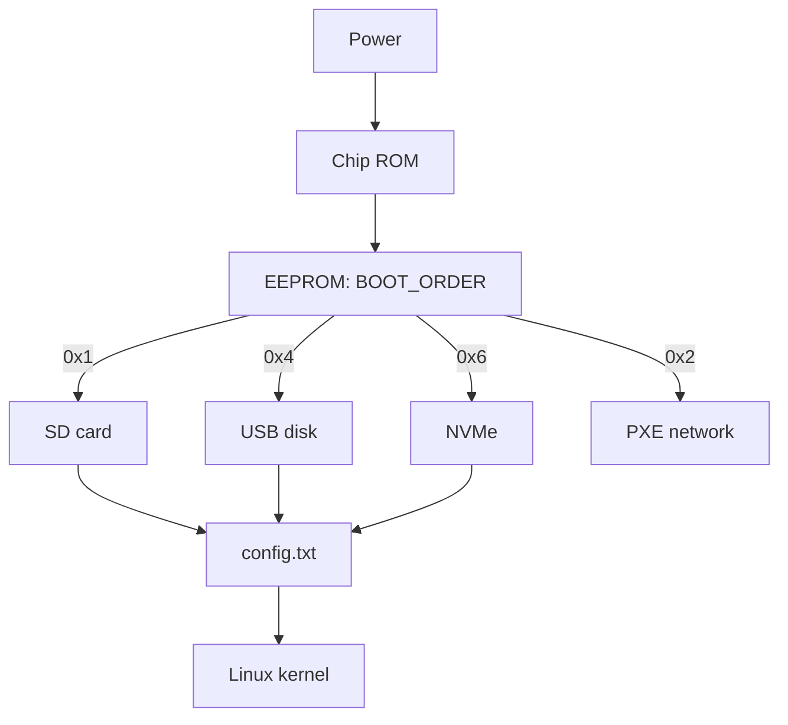

# Raspberry Pi Boot - EEPROM, Boot Order and USB/NVMe

![[assets/img/rpi-eeprom-boot-scheme.png|600]]
*Fig. Boot chain: ROM to EEPROM to config.txt to kernel; media order set by BOOT_ORDER.*

> [!tip] What this note is
> Pi 4/5 boot not from BIOS but from EEPROM on the board: media order, USB, network - all there. Understanding the chain saves bricks. System flashing: [[EN/09-Firmware/01-Imager-Headless.en|Imager flashing]], media: storage media.

## 1. Goal

Control boot consciously:

- boot chain from button to kernel;
- BOOT_ORDER: SD to USB to NVMe to network;
- EEPROM update without fear;
- recovery after a failed update.

| Stage | Where it lives | What it does |
| --- | --- | --- |
| ROM (fixed) | chip | looks for EEPROM |
| EEPROM | board SPI flash | media order, USB, network |
| config.txt | boot partition | overlays, clocks, UART |
| start.elf/kernel | boot partition | kernel and initramfs |

## 2. Chain architecture



BOOT_ORDER values read right to left: `0xf461` means try NVMe, USB, SD, then loop. `0xf14` is the classic "SD, then USB".

## 3. EEPROM config

- read: `rpi-eeprom-config` (current);
- edit: `rpi-eeprom-config --edit` - opens an editor;
- key fields: `BOOT_ORDER`, `BOOT_UART`, `POWER_OFF_ON_HALT`, `PCIE_PROBE`;
- apply: reboot;
- firmware update: `rpi-eeprom-update -a` + reboot.

## 4. Order scenarios

| Task | BOOT_ORDER | Note |
| --- | --- | --- |
| Plain SD | `0xf1` | by default |
| System on SSD | `0xf14` | SD as spare |
| NVMe on Pi 5 | `0xf461` | needs dtparam pciex1 |
| Network boot | `0xf21` | TFTP + NFS (class/farm) |
| USB gadget (Zero) | N/A | OTG mode separate |

## 5. Working code: boot inspector

```bash
#!/bin/bash
# boot-inspect.sh — що і звідки завантажилось
echo "== EEPROM =="
rpi-eeprom-update 2>/dev/null | head -5 || vcgencmd bootloader_version
echo "== BOOT_ORDER =="
rpi-eeprom-config 2>/dev/null | grep BOOT_ORDER || echo "legacy Pi"
echo "== root device =="
findmnt -n -o SOURCE /
echo "== boot files =="
ls -la /boot/firmware/start.elf /boot/firmware/kernel8.img 2>/dev/null
echo "== throttled =="
vcgencmd get_throttled
```

On Zero and old Pi boards there are no EEPROM tools - boot is SD only there. The script covers it with the `legacy Pi` branch.

## 6. Brick recovery

- symptom: ACT never blinks - broken EEPROM (rare) or power supply;
- recovery: SD with a `recovery.bin` image (rpi-eeprom tool) - green screen means success;
- Pi 4 without EEPROM: always starts if the SD is alive;
- rule: never update EEPROM remotely without a KVM spare.

## 7. Network boot

- Pi 4/5: PXE out of the box (after enabling in EEPROM);
- server: dnsmasq (DHCP+TFTP) + NFS root;
- a class of 20 Pi boards without SD cards - one image for all;
- CM4 without eMMC: network or SD on the carrier only.

## 7.1 UART console as a lifeline

- 3-pin header on Pi 5 or GPIO14/15 on old boards - 115200 8N1;
- USB-TTL converter 3.3V (not 5V!): TX to RX crossed;
- we see the whole boot including EEPROM messages;
- `BOOT_UART=1` in EEPROM config - early boot log;
- console cable in the admin bag - mandatory;
- through the console we fix config.txt when no network exists;
- autologin on the console - only in the lab, not in the field.

Monitor-free brick diagnostics start with UART: the screen is silent while the console tells everything.

## 8. Common issues

| Symptom | Cause | Fix |
| --- | --- | --- |
| ACT 4 blinks | no start.elf | reflash the media |
| USB disk ignored | old EEPROM / wrong ORDER | update, set 0xf14 |
| NVMe silent | no pciex1 / old firmware | both together, then reboot |
| Looped on rainbow | broken config.txt | edit on PC, drop overlays |
| PXE does not start | no TFTP server | dnsmasq by guide |
| Brick after EEPROM update | power cut mid-write | recovery SD with green screen |

## 9. Related notes

- [[EN/09-Firmware/01-Imager-Headless.en|Imager flashing]] - images on media.
- [[EN/08-Memory/01-SD-eMMC-NVMe.en|storage media]] - SD/USB/NVMe in detail.
- [[EN/09-Firmware/03-OS-Setup.en|OS setup]] - system after boot.
- [[14-Devboards/05-CM4-CM5|CM modules]] - eMMC and rpiboot.
- [[EN/02-Power-Supply/01-USB-C-PD.en|USB-C power supply]] - stability at boot.

## 8.1 Boot cheat sheet

- `0xf1` - SD, `0xf14` - SD+USB, `0xf461` - NVMe;
- `rpi-eeprom-update -a` - update the bootloader;
- ACT 4/7/8 blinks - read the section 8 table;
- UART console - sees all the screen keeps silent;
- recovery SD rescues a broken EEPROM.

## 8.1 Boot cheat sheet

- `0xf1` - SD, `0xf14` - SD+USB, `0xf461` - NVMe;
- `rpi-eeprom-update -a` - update the bootloader;
- ACT 4/7/8 blinks - read the section 8 table;
- UART console sees all the screen keeps silent;
- recovery SD rescues a broken EEPROM.

## Official sources

- [Getting Started (Raspberry Pi docs)](https://www.raspberrypi.com/documentation/computers/getting-started.html) - boot modes.
- [rpi-imager (Raspberry Pi, GitHub)](https://github.com/raspberrypi/rpi-imager) - images and recovery.
- [Raspberry Pi OS (Raspberry Pi)](https://www.raspberrypi.com/software/) - current images.
