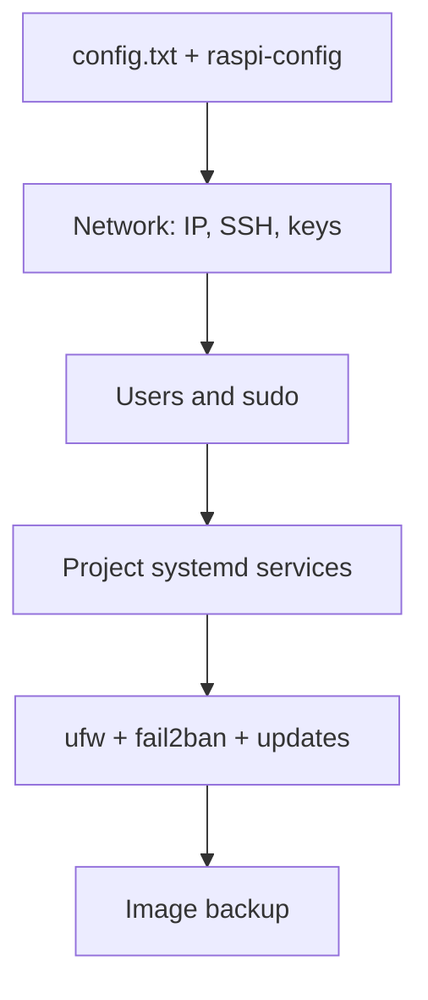

# Raspberry Pi OS Setup - Config, Services, Security and Autostart

![[assets/img/rpi-os-nalashtuvannya-scheme.png|600]]
*Fig. System path: config.txt to network to users to autostart to backup - one pass, then only maintenance.*

> [!tip] What this note is
> A "did once - forgot" checklist: fresh Pi OS turns into a stable node in 30 minutes. Flashing: [[EN/09-Firmware/01-Imager-Headless.en|Imager flashing]], boot: [[EN/09-Firmware/02-EEPROM-Boot.en|EEPROM boot]].

## 1. Goal

Get a reproducible system:

- config.txt without magic: what to touch, what not to touch;
- network and access: SSH keys, static IP, VPN;
- project autostart through systemd, not rc.local;
- minimum security: users, firewall, updates;
- backup before "what if".



## 2. config.txt: required minimum

| Parameter | When | Example |
| --- | --- | --- |
| `dtparam=i2c_arm=on` | I2C sensors | + `dtparam=spi=on`, `enable_uart=1` |
| `dtparam=pciex1` | NVMe on Pi 5 | Pi 5 only |
| `hdmi_force_hotplug=1` | headless VNC | virtual display |
| `gpu_mem` | obsolete, do not touch | dynamic split |
| `over_voltage/dfreq` | overclock (careful!) | cooling only |

Hardware overlays - in `/boot/firmware/overlays/README`: read before enabling.

## 3. Network and access

- unique hostname: `raspi-config nonint do_hostname node-01`;
- WiFi country and network priorities through `nmcli`;
- SSH keys instead of passwords, default port - fine inside LAN;
- Tailscale/WireGuard for outside access without a white IP;
- mDNS `.local` - enough for a home network.

## 4. Users and security

- own sudo-group user, no default one (and good);
- root password locked - leave it so;
- `ufw`: allow SSH and needed ports, close the rest;
- `fail2ban` on SSH for internet access;
- automatic security updates - `unattended-upgrades`.

## 5. Working code: systemd service

```ini
[Unit]
Description=Climate publisher
After=network-online.target
Wants=network-online.target

[Service]
Type=simple
User=pi
WorkingDirectory=/home/pi/climate
ExecStart=/home/pi/climate/venv/bin/python main.py
Restart=always
RestartSec=10
StandardOutput=journal
StandardError=journal

[Install]
WantedBy=multi-user.target
```

```bash
sudo cp climate.service /etc/systemd/system/
sudo systemctl daemon-reload
sudo systemctl enable --now climate.service
journalctl -u climate.service -f
```

`Restart=always` survives script crashes and reboots. Logs go to the journal, not to handwritten files.

## 6. Node Python environment

- `python3-venv` per project, do not touch system Python;
- `pip install` only in venv (Bookworm forbids global pip - rightly so);
- gpiozero/lgpio/smbus - system packages through apt;
- GPIO/I2C rights - `gpio`/`i2c` group, not root and no sudo;
- freeze requirements.txt with `pip freeze` after setup.

## 7. Health monitoring

| Metric | Source | Threshold |
| --- | --- | --- |
| Temperature | `vcgencmd measure_temp` | > 75 C - act |
| Throttling | `vcgencmd get_throttled` | not 0x0 - power/heat |
| Disk | `df -h` | > 85 % - clean |
| Memory | `free -h` | swap grows - add RAM/zram |
| Services | `systemctl --failed` | empty |

## 7.1 Log rotation and tmpfs

- `/var/log` on SD: journald limit `SystemMaxUse=100M`;
- project logs - in RAM (`/run`), only the day archive to disk;
- tmpfs for caches and peaks: `/etc/fstab` with `size=100M`;
- `log2ram` package - a ready fix for Pi boards;
- swap off or zram: classic swap kills SD;
- wear check: `mmc extcsd read` shows eMMC/SD state.

## 8. Common issues

| Symptom | Cause | Fix |
| --- | --- | --- |
| Service does not start | path/venv wrong | absolute paths, `journalctl -u` |
| No GPIO access | user not in group | `usermod -aG gpio,i2c user` |
| pip refuses | PEP 668 system protection | venv, no `--break-system-packages` |
| WiFi drops | power management | turn off PM, watchdog script |
| No boot after upgrade | kernel + overlays | keep a working kernel, rollback |
| Logs ate the SD | journal without rotation | `journald` limits, logs in RAM |

## 9. Related notes

- [[EN/09-Firmware/01-Imager-Headless.en|Imager flashing]] - clean install.
- [[EN/09-Firmware/02-EEPROM-Boot.en|EEPROM boot]] - boot order.
- [[EN/03-GPIO/01-Header-Gpiozero.en|header and gpiozero]] - first code on the system.
- [[15-Protocols/01-MQTT|MQTT protocol]] - telemetry service.
- [[EN/08-Memory/01-SD-eMMC-NVMe.en|storage media]] - protect the SD.

## 10. OS cheat sheet

- `raspi-config nonint` - everything by scripts;
- systemd service + `Restart=always`;
- venv per project, system Python is holy;
- ufw + SSH keys outward;
- image backup before trouble, not after.

## Official sources

- [Getting Started (Raspberry Pi docs)](https://www.raspberrypi.com/documentation/computers/getting-started.html) - config.txt and raspi-config.
- [Raspberry Pi OS (Raspberry Pi)](https://www.raspberrypi.com/software/) - system editions.
- [gpiozero docs (Read the Docs)](https://gpiozero.readthedocs.io/en/stable/) - GPIO rights and groups.
