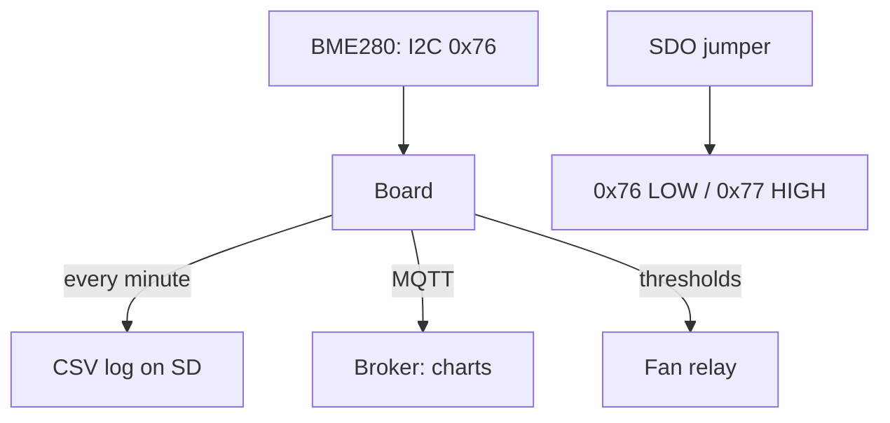

# Climate on Raspberry Pi - BME280: Pressure, Humidity and Temperature

![[assets/img/rpi-bme280-klimat-scheme.png|600]]
*Fig. BME280 on I2C: three measurements with one chip - temperature, humidity, pressure; address set by the SDO jumper.*

> [!tip] What this note is
> Every maker's first sensor: one chip covers a weather station. I2C, ready libraries, accuracy out of the box. Bus: [[EN/04-Interfaces/01-I2C-SPI-UART.en|I2C/SPI/UART buses]], start: [[EN/03-GPIO/01-Header-Gpiozero.en|header and gpiozero]].

## 1. Goal

Launch a climate node in one evening:

- wiring the BME280: 4 wires, address 0x76/0x77;
- libraries: Adafruit/CircuitPython and plain smbus;
- altitude above sea level from pressure;
- dew point and absolute humidity - formulas;
- logging to a file + chart.

| Parameter | Range | Accuracy |
| --- | --- | --- |
| Temperature | -40...+85 °C | ±1 °C |
| Humidity | 0-100 % | ±3 % |
| Pressure | 300-1100 hPa | ±1 hPa |
| Power supply | 1.8-3.6V (modules - 5V with LDO) | - |

## 2. Node architecture



Two identical sensors on the bus - split SDO: one LOW, the other HIGH. More than two - a TCA9548A multiplexer.

## 3. Wiring

| BME280 module | Board | Note |
| --- | --- | --- |
| VIN | 3V3 (pin 1/17) | GY modules - 5V ok, but 3V3 is cleaner |
| GND | ground (pin 6/9/14) | next to SDA/SCL |
| SCL | GPIO3 (pin 5) | shared bus |
| SDA | GPIO2 (pin 3) | shared bus |
| SDO | GND/VCC | address 0x76/0x77 |
| CSB | VCC | I2C mode (not SPI!) |

GY-BME280/Purple modules: built-in LDO and level converter - feed even 5V. Bare chips - only 3.3V.

## 4. Libraries: three paths

- Adafruit Blinka + `adafruit-circuitpython-bme280` - fastest start;
- `RPi.bme280` (Python smbus2) - light, no dependencies;
- plain smbus2 by hand - for learning and minimum;
- C (`bme280` Bosch API) - when Python is slow;
- all read the calibration coefficients from the chip EEPROM themselves.

## 5. Working code

```python
import time
import math
import board
import busio
import adafruit_bme280
import paho.mqtt.client as mqtt

i2c = busio.I2C(board.SCL, board.SDA)
bme = adafruit_bme280.Adafruit_BME280_I2C(i2c, address=0x76)
bme.sea_level_pressure = 1013.25

cl = mqtt.Client()
cl.connect("broker.local", 1883, 60)
cl.loop_start()

def dew_point(t, h):
    a, b = 17.27, 237.7
    g = (a * t) / (b + t) + math.log(h / 100.0)
    return (b * g) / (a - g)

while True:
    t = bme.temperature
    h = bme.relative_humidity
    p = bme.pressure
    alt = bme.altitude
    dp = dew_point(t, h)
    line = f"{time.strftime('%F %T')},{t:.1f},{h:.0f},{p:.1f},{alt:.0f},{dp:.1f}\n"
    with open('/home/pi/climate.csv', 'a') as f:
        f.write(line)
    cl.publish("home/climate", f"{t:.1f},{h:.0f},{p:.1f}")
    time.sleep(60)
```

We compute altitude relative to `sea_level_pressure`: update QNH from the weather service once a day, otherwise it "drifts" with the weather.

## 6. Dew point and comfort

- Magnus formula (in the code above) - enough for home;
- dew point above 16 °C - stuffy, above 20 °C - mold is near;
- absolute humidity: `216.7 × (h/100 × 6.112 × e^(17.67t/(243.5+t)) / (273.15+t))` g/m3;
- control a dehumidifier/humidifier - by absolute, not relative!;
- ventilate - when outside absolute is lower than indoors.

## 7. Sensor placement

- not above a radiator, not in the sun, not by a draughty window;
- height 1-1.5 m, shade, ventilation around;
- louvered housing (Stevenson screen from bowls - a classic);
- chip self-heating +1-2 °C: forced mode, polling once a minute;
- cross-check: a second sensor nearby for a week, temperature delta up to 0.5 °C - normal.

## 8. Common issues

| Symptom | Cause | Fix |
| --- | --- | --- |
| `IOError: [Errno 121]` | no device on the bus | `i2cdetect -y 1`, check SDA/SCL |
| Wrong address | SDO jumper | LOW=0x76, HIGH=0x77, compare with code |
| Temperature +2 °C | self-heating + frequent polling | forced mode, once a minute |
| Pressure "wrong" | QNH not updated | update sea_level_pressure |
| Humidity 100 % all the time | condensate in the housing | ventilation, silica gel |
| Works, then hangs | long I2C wires | shorter than 30 cm or lower speed |

## 9. BME280 quick cheat sheet

- SDA/SCL: pins 3/5, pull-ups already present;
- address: SDO to ground = 0x76;
- update sea_level_pressure daily;
- forced mode for battery;
- CSV + MQTT - log and charts at once.

## 10. Related notes

- [[EN/04-Interfaces/01-I2C-SPI-UART.en|I2C/SPI/UART buses]] - bus in detail.
- [[EN/03-GPIO/01-Header-Gpiozero.en|header and gpiozero]] - pins.
- [[16-Projects/01-Meteostantsiya|ready weather station]] - full project.
- [[15-Protocols/01-MQTT|telemetry over MQTT]] - protocol and broker.
- [[Home.en|main map]] - full navigation.

## Official sources

- [BME280 (Adafruit)](https://www.adafruit.com/product/2650) - module, SDO addressing.
- [gpiozero docs (Read the Docs)](https://gpiozero.readthedocs.io/en/stable/) - pins and scripts.
- [Getting Started (Raspberry Pi docs)](https://www.raspberrypi.com/documentation/computers/getting-started.html) - I2C and raspi-config.
