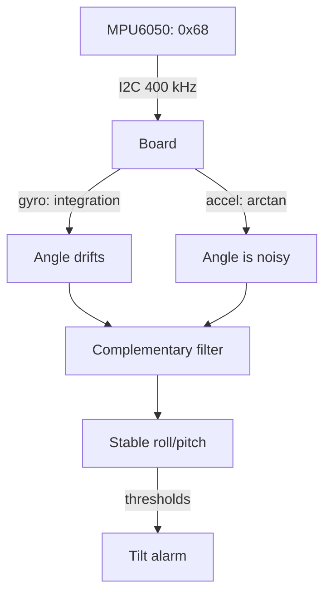

# Motion on Raspberry Pi - MPU6050: Gyroscope, Accelerometer and Angles

![[assets/img/rpi-mpu6050-rukh-scheme.png|600]]
*Fig. MPU6050: the gyroscope measures rotation speed, the accelerometer - the down direction; together they give angles.*

> [!tip] What this note is
> Base of inertial measurements: platform tilt, motion detector, first step to IMU filters. No Kalman needed - a complementary filter is enough. Bus: [[EN/04-Interfaces/01-I2C-SPI-UART.en|I2C/SPI/UART buses]], power supply: [[EN/02-Power-Supply/01-USB-C-PD.en|USB-C power]].

## 1. Goal

Get stable tilt angles:

- raw gyroscope and accelerometer data over I2C;
- why each of them lies alone (drift and noise);
- complementary filter in three lines;
- zero calibration and motion detector.

| Sensor | What it measures | Problem alone |
| --- | --- | --- |
| Gyroscope | angular speed °/s | zero drift integrates |
| Accelerometer | g vector (tilt) | noise + sensitive to acceleration |
| Together (filter) | roll/pitch angle | stable when static |

## 2. Measurement architecture



Formula: `angle = 0.98 × (angle + gyro×dt) + 0.02 × accel`. Gyro - fast, accel - honest: the filter takes the best of both.

## 3. Wiring and registers

| MPU6050 pin | Board | Note |
| --- | --- | --- |
| VCC | 3V3 | GY module - 5V ok |
| GND | ground | nearby |
| SCL/SDA | pins 5/3 | I2C-1 bus |
| AD0 | GND/VCC | address 0x68/0x69 |
| INT | free GPIO | data-ready interrupt |

Wake-up: register PWR_MGMT_1 = 0 (wake from sleep). Ranges: gyro ±250 °/s, accel ±2g to start.

## 4. Zero calibration

- lay still for 10 seconds, average 500 measurements;
- always subtract gyro offsets (drift grows with temperature);
- calibrate accel with 6 positions (along axes ±g) for accuracy;
- store offsets in a file, do not calibrate every time;
- recalibration - when temperature changes by 10+ °C.

## 5. Working code

```python
import time
import math
import smbus

ADDR = 0x68
bus = smbus.SMBus(1)

def write_reg(reg, val):
    bus.write_byte_data(ADDR, reg, val)

def read_words(reg, n):
    raw = bus.read_i2c_block_data(ADDR, reg, n * 2)
    out = []
    for i in range(n):
        v = (raw[2*i] << 8) | raw[2*i+1]
        if v > 32767:
            v -= 65536
        out.append(v)
    return out

write_reg(0x6B, 0)
write_reg(0x1B, 0)
write_reg(0x1C, 0)
time.sleep(0.1)

cal = [0.0, 0.0, 0.0]
for _ in range(200):
    g = read_words(0x43, 3)
    cal[0] += g[0]; cal[1] += g[1]; cal[2] += g[2]
    time.sleep(0.005)
cal = [c / 200.0 for c in cal]

pitch = 0.0
roll = 0.0
last = time.time()
while True:
    now = time.time()
    dt = now - last
    last = now
    g = read_words(0x43, 3)
    a = read_words(0x3B, 3)
    gx = (g[0] - cal[0]) / 131.0
    gy = (g[1] - cal[1]) / 131.0
    acc_pitch = math.degrees(math.atan2(a[0], a[2]))
    acc_roll = math.degrees(math.atan2(a[1], a[2]))
    pitch = 0.98 * (pitch + gy * dt) + 0.02 * acc_pitch
    roll = 0.98 * (roll + gx * dt) + 0.02 * acc_roll
    print(f"pitch {pitch:.1f} roll {roll:.1f}")
    time.sleep(0.02)
```

Divider 131 - sensitivity at ±250 °/s. Loop at 50 Hz: Python is enough with no drops.

## 6. Motion and tilt detector

- motion: accelerometer vector magnitude deviates from 1g;
- tilt: roll/pitch beyond a 30° threshold - alarm;
- free fall: magnitude near 0g;
- shock: magnitude spike above 2g;
- threshold hysteresis - against alarm chatter.

## 7. Next: 9-DOF

- magnetometer gives azimuth (heading), missing here;
- pressure gives altitude - the third coordinate;
- GPS gives position and speed;
- together - full navigation (see the compass and GPS notes of waves 3-4);
- for a drone - loop speed 200+ Hz and an RT kernel.

## 8. Common issues

| Symptom | Cause | Fix |
| --- | --- | --- |
| Angle drifts in a minute | gyro zero not subtracted | 200-measurement calibration at start |
| Noise ±5° | accelerometer only | complementary filter |
| I2C NACK | AD0 address | 0x68 when AD0=GND, 0x69 when VCC |
| Data freezes | bus hangs | `i2cdetect`, bus restart, shorter wires |
| Jumps in motion | filter trusts accel in dynamics | raise gyro weight (0.99) |
| Int overflow | forgot signed conversion | subtract 65536 when v > 32767 |

## 9. IMU quick cheat sheet

- wake: PWR_MGMT_1 = 0;
- gyro zero - averaging at rest;
- filter: 0.98 gyro + 0.02 accel;
- 50 Hz loop is enough for Python;
- vibrations - mechanical damper.

## 10. Related notes

- [[EN/04-Interfaces/01-I2C-SPI-UART.en|I2C/SPI/UART buses]] - bus in detail.
- [[EN/03-GPIO/01-Header-Gpiozero.en|header and gpiozero]] - INT pin.
- [[EN/10-Sensors/01-BME280-Climate.en|BME280 climate]] - neighbouring sensor on the bus.
- [[EN/02-Power-Supply/01-USB-C-PD.en|USB-C power]] - measurement stability.
- [[Home.en|main map]] - full navigation.

## Official sources

- [MPU-6050 (Adafruit)](https://www.adafruit.com/product/3886) - module, AD0 addressing.
- [gpiozero docs (Read the Docs)](https://gpiozero.readthedocs.io/en/stable/) - pins and scripts.
- [Getting Started (Raspberry Pi docs)](https://www.raspberrypi.com/documentation/computers/getting-started.html) - I2C and setup.
